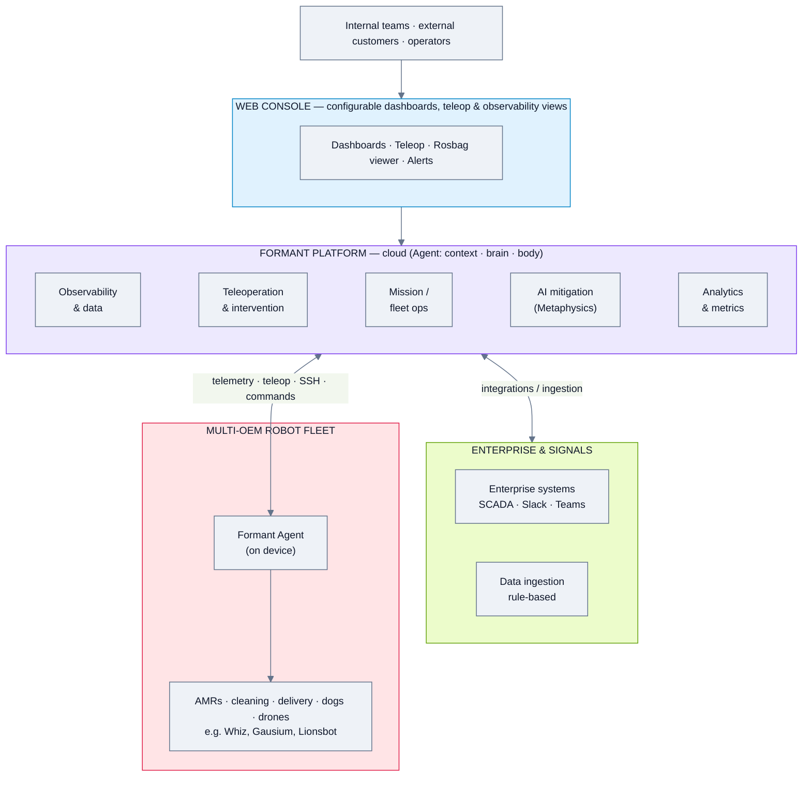
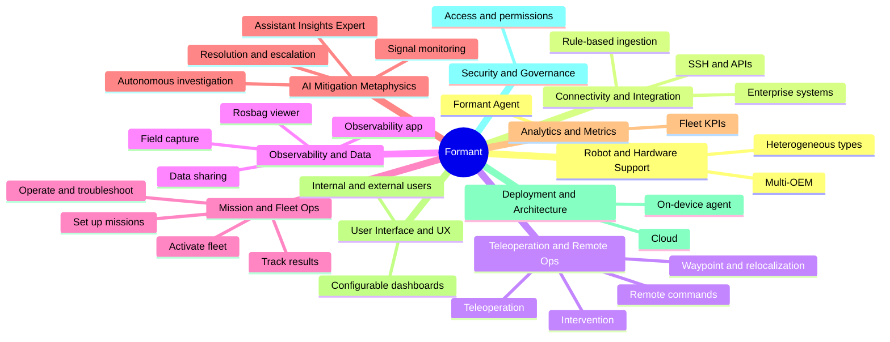
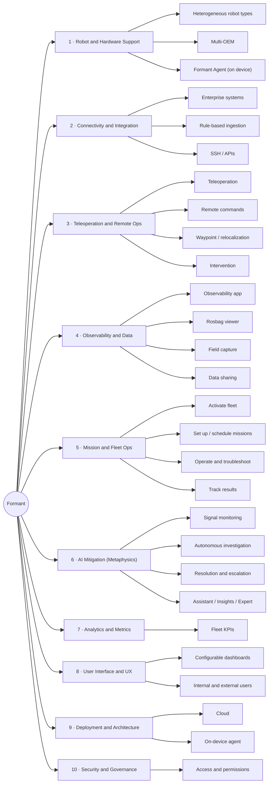
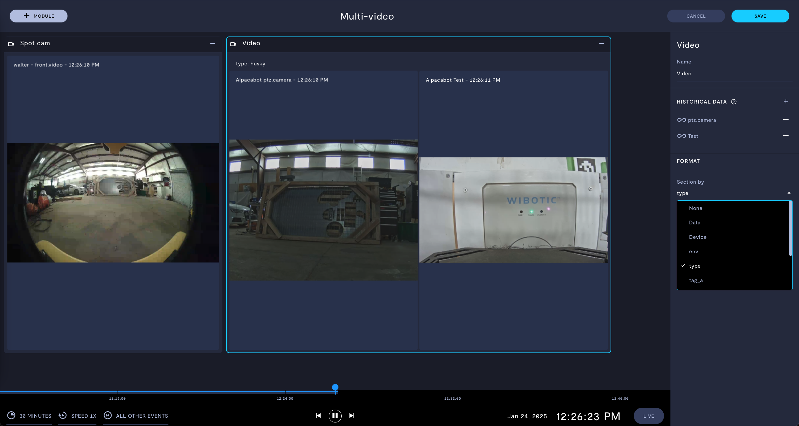
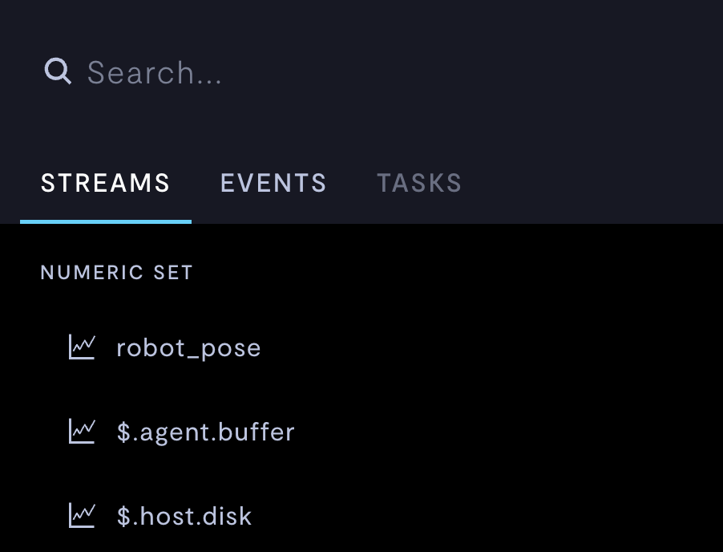
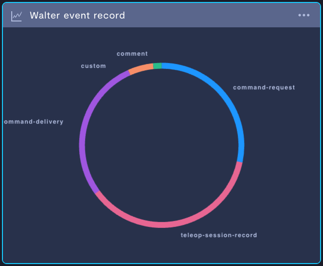
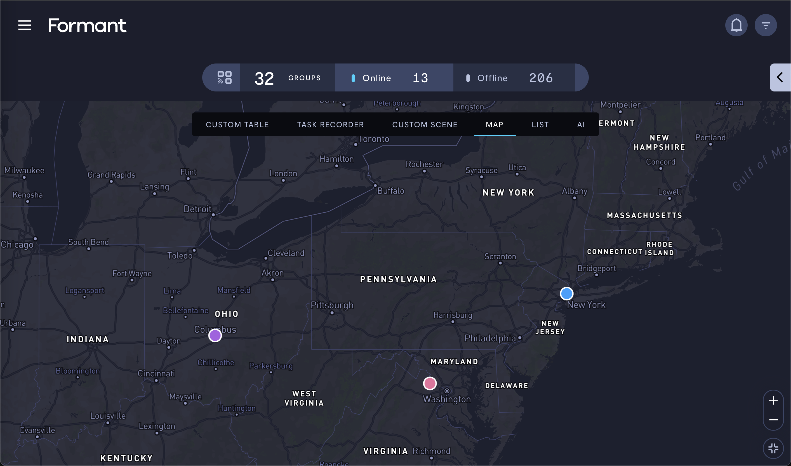
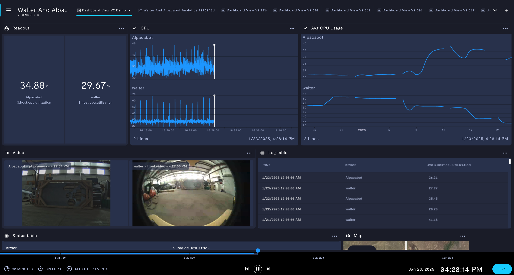

# Formant — Feature Analysis

**Product:** Formant robot management platform (incl. "Formant AI" / Metaphysics)
**Domain:** Generic / vendor-agnostic robot management & operations data platform
**Analysis date:** 2026-06-12
**Evidence legend:** **[C] Confirmed** = stated in official or vendor materials · **[L] Likely** = vendor marketing or strongly implied · **[I] Inferred** = deduced / not stated.

---

## Research & Summary

Formant calls itself "the industry leader in robot management software" and powers some of the world's largest fleets — tens of thousands of units across a **multi-OEM** base (Whiz, Gausium, Lionsbot, etc.) deployed in campuses, offices, hotels, airports, and hospitals. The platform pairs a long-standing **operations stack** (out-of-the-box Teleoperation, Observability, Intervention, data sharing, Field Capture, SSH, Rosbag Viewer, Remote Commands, Relocalization, Waypoint manipulation, event-triggered workflows, rule-based ingestion) with a fleet-ops lifecycle (activate fleet → set up & schedule missions → operate/troubleshoot → track results/metrics) and a newer **AI mitigation layer** ("Metaphysics" / Formant AI) that autonomously triages signals, runs investigations, and resolves or escalates incidents (Assistant / Insights / Expert). Its value story is consolidating fragmented signals, cutting alert overload, and reducing time-to-resolution, with documented deployments in mushroom harvesting, semiconductor manufacturing, and agricultural logistics. Evidence here is strong (Confirmed): vendor materials enumerate the apps, the mission workflow, and the metrics explicitly. The public website now foregrounds the AI/Metaphysics framing, while the broader fleet-management substance is what this analysis reflects.

---

## System Architecture

---

## Feature Map (top 2 levels)

### Alternative layout — grouped tree (cleaner)

---

## Feature List

### 1. Robot & Hardware Support
- **1.1 Heterogeneous robot types** — AMRs, cleaning, delivery, drones, dogs, humanoids [C]
- **1.2 Multi-OEM platform** — manage many brands together [C]
  - 1.2.1 Proven at "tens of thousands of units" scale [C]
- **1.3 On-device Formant Agent** — sees across people, machines, enterprise systems [C]

### 2. Connectivity & Integration
- **2.1 Integrate all devices into a single system** [C]
- **2.2 Enterprise / signal sources** — SCADA, Slack, Teams, historians [C]
- **2.3 Rule-based ingestion** [C]
- **2.4 SSH access to devices** [C]
- **2.5 APIs / programmatic access** [L]

### 3. Teleoperation & Remote Ops
- **3.1 Teleoperation** — remote driving/control [C]
  - 3.1.1 Teleop UI: full live-camera view + minimap with robot position + on-screen drive controls + telemetry side panel [C]
- **3.2 Remote commands** [C]
- **3.3 Waypoint manipulation** [C]
- **3.4 Relocalization** [C]
- **3.5 Intervention** — operator takeover on exceptions [C]
- **3.6 Display screen control** [C]

### 4. Observability & Data
- **4.1 Observability app** — telemetry, logs, metrics [C]
- **4.2 Rosbag viewer** (ROS data) [C]
- **4.3 Field capture** [C]
- **4.4 Data sharing** [C]
- **4.5 Event-triggered workflows** [C]
- **4.6 Fleet list & grouping** — device groups, online/offline counts; multiple views: **Custom Table, Task Recorder, Custom Scene, Map, List, AI** [C]
- **4.7 Multi-video view** — synchronized multi-camera feeds (e.g. Spot cam + PTZ) with **historical timeline playback** (scrubber, speed control, live), configurable video modules, section-by (data/device/type/tag) grouping [C]
- **4.8 Stream / Event / Task analytics** — telemetry stream catalog (e.g. robot_pose, $.agent.buffer, $.host.disk) with custom visualizations, data sources, event-by-type charts, time-range selection [C]
- **4.9 GPS / map view** of fleet incidents/locations [C]

### 5. Mission / Fleet Operations
- **5.1 Activate the fleet** [C]
  - 5.1.1 Assign robots to accounts & locations [C]
  - 5.1.2 Grant access & permissions [C]
  - 5.1.3 Assign devices to operators [C]
- **5.2 Set up missions** [C]
  - 5.2.1 Map new locations with job parameters [C]
  - 5.2.2 Define mission areas, tasks, behaviors [C]
  - 5.2.3 Schedule repeat missions [C]
  - 5.2.4 Re-run previously incomplete missions [C]
  - 5.2.5 Fine-tune for environment changes [C]
- **5.3 Operate & troubleshoot** [C]
  - 5.3.1 Execute missions [C]
  - 5.3.2 Issue alerts to operators / support [C]
  - 5.3.3 Resolve hardware issues / swap robots [C]
  - 5.3.4 Deactivate & reactivate robots [C]
  - 5.3.5 Control robots remotely [C]
- **5.4 Track results** [C]
  - 5.4.1 Successful missions per day, per customer [C]
  - 5.4.2 Coverage (areas cleaned / not) [C]
  - 5.4.3 Performance & efficiency tracking [C]

### 6. AI Mitigation (Metaphysics / Formant AI)
- **6.1 Continuous signal monitoring** [C]
- **6.2 Autonomous investigation** — rich-context triage of signals [C]
- **6.3 Resolution** — autonomous or human-in-the-loop (HITL) [C]
- **6.4 Escalation** with rich context / task assignment [C]
- **6.5 AI assistants** [C]
  - 6.5.1 Assistant — **conversational ops chat ("Formant Op")**: ask operational questions (e.g. "how do I change the battery in a Spot robot?") and get step-by-step, device-context-aware answers [C]
  - 6.5.2 Insights — **auto-generated analytics reports** with executive summary, per-device results tables (e.g. 24-hour uptime %, outlier flagged), and narrative "why this matters / next steps"; predictive ("know what's coming") [C]
  - 6.5.3 Expert — surfaces fixes/solutions [C]

### 7. Analytics & Metrics
- **7.1 Fleet KPIs** [C]
  - 7.1.1 Missions complete, success %, re-runs/route, avg run duration [C]
  - 7.1.2 Autonomous runtime, downtime, requested assists [C]
  - 7.1.3 MTBF, human time saved, delivery quality score [C]

### 8. User Interface & UX
- **8.1 Configurable dashboards** — deploy per internal/external user; time-series charts/widgets [C]
- **8.2 Teleop view** — camera + minimap + drive controls + telemetry panel [C]
- **8.3 Observability + Rosbag/point-cloud (3D) viewer** [C]
- **8.4 AI chat assistant + Insights report views** [C]
- **8.5 Game-engine UI** — not indicated [I]

### 9. Deployment & Architecture
- **9.1 Cloud platform** [C]
- **9.2 On-device agent** [C]
- **9.3 On-prem / data-privacy options** — addresses "cloud privacy and security concerns" [L]

### 10. Security & Governance
- **10.1 Access & permission management** [C]
- **10.2 Unified access management across devices** [C]

#### UI Screenshots

**Fleet overview — groups, online/offline, multi-view tabs**

**Multi-camera video wall with historical timeline**

**Analytics — telemetry stream catalog**

**Analytics dashboard — events by type**

**Incident GPS / map view**

**Fleet config template**

---

> **Gaps / to verify:** exact protocol list (ROS1/ROS2/VDA5050/MQTT not explicitly stated though Rosbag/ROS implied), on-prem vs cloud-only specifics, SSO/security certs, pricing model, and how much of the classic fleet stack remains foregrounded vs. the newer AI/Metaphysics positioning. Confirm via docs.formant.io or a demo.

## Sources
