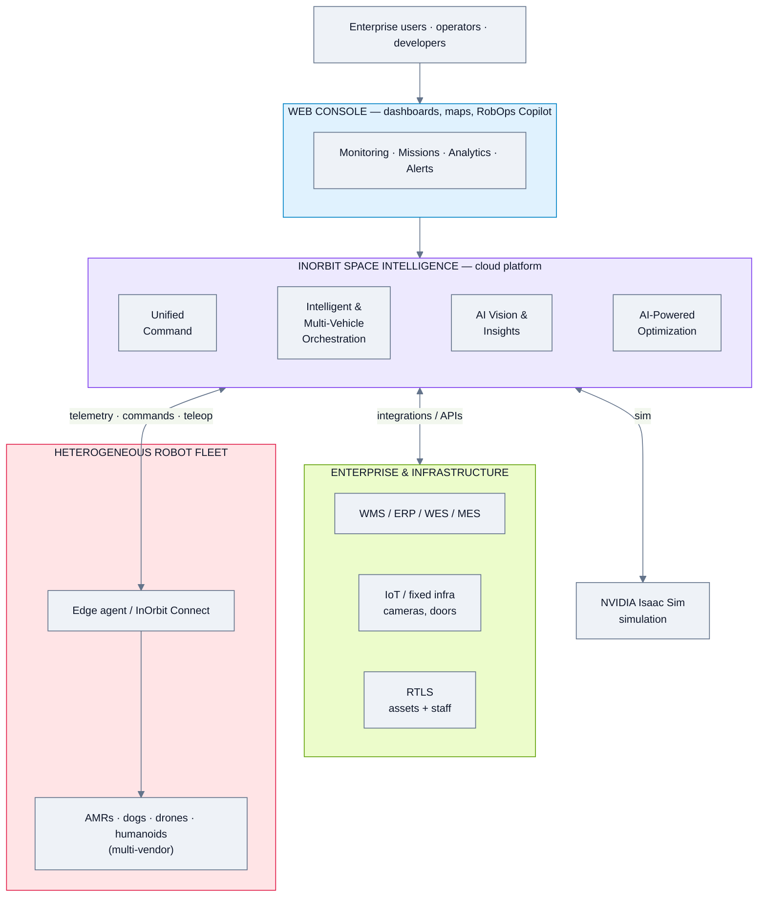
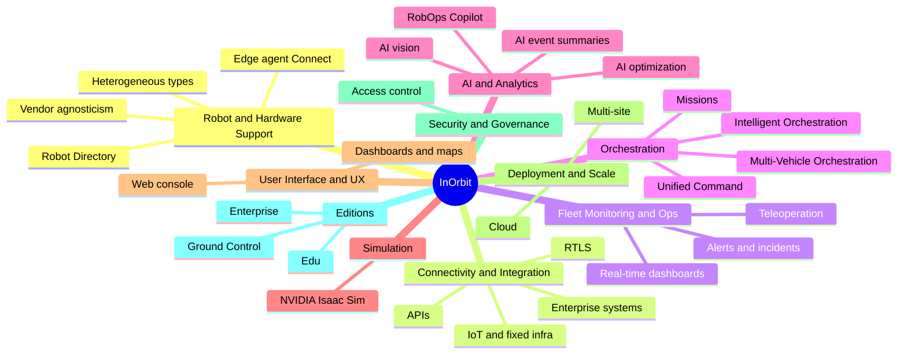
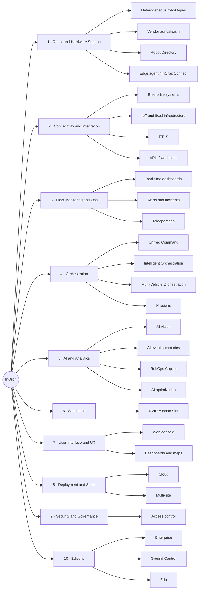
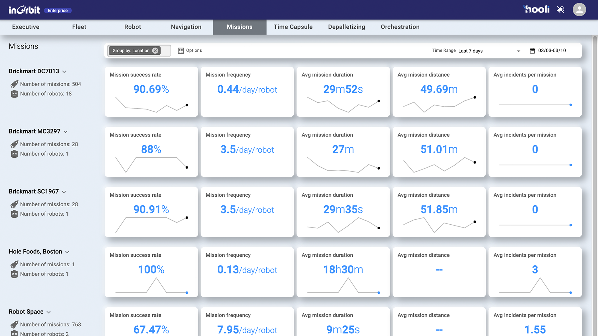
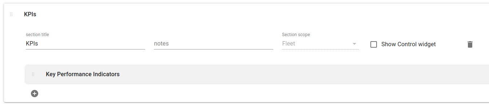
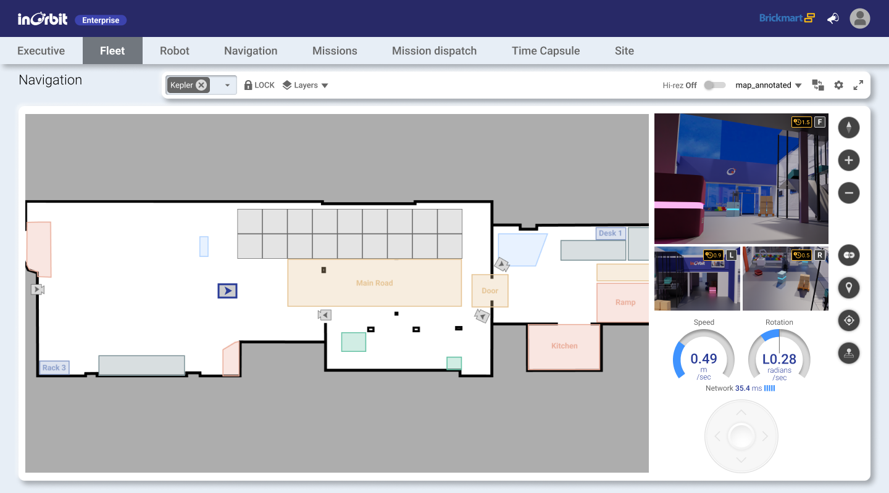
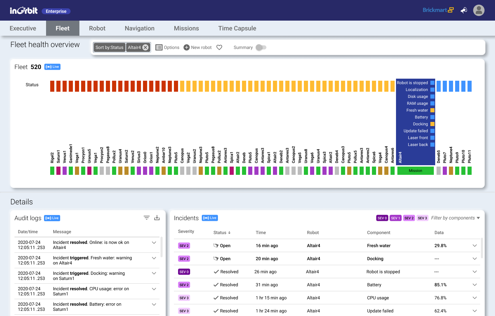
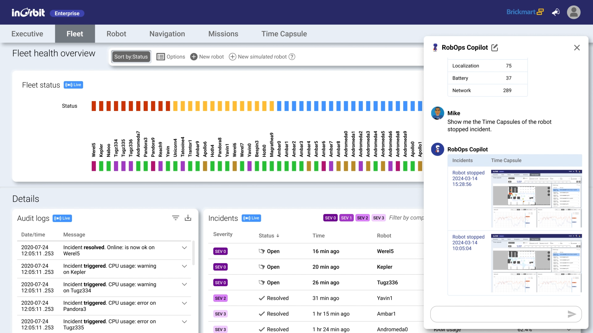
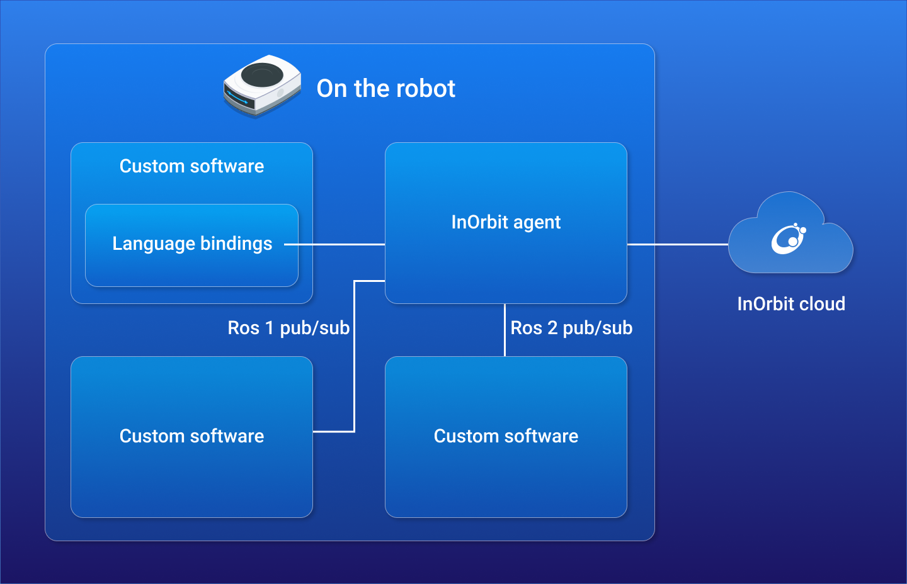

# InOrbit — Feature Analysis

**Product:** InOrbit Space Intelligence (enterprise) + InOrbit Ground Control (robot developers)
**Domain:** Generic / vendor-agnostic robot orchestration (RobOps)
**Analysis date:** 2026-06-12
**Sources:** vendor website and public product materials.
**Evidence legend:** **[C] Confirmed** = stated in official or vendor materials · **[L] Likely** = vendor marketing or strongly implied · **[I] Inferred** = deduced / not stated.

---

## Research & Summary

InOrbit is a vendor-agnostic robot orchestration platform branding itself as a "central nervous system" / "Physical AI" layer for enterprise robot operations — coordinating robots, people, fixed IoT infrastructure (cameras, doors) and enterprise systems (WMS/ERP/WES/MES) from one place. Its enterprise product, **Space Intelligence**, is presented as a set of named pillars (Unified Command, Interoperability, Multi-Vehicle Orchestration, Intelligent Orchestration, AI-driven Insights, AI-Powered Optimization), while **InOrbit Ground Control** serves robot developers with monitoring/teleoperation/data tooling. Architecturally it is a cloud platform that connects to robots via an edge agent / InOrbit Connect, aggregates telemetry, and exposes dashboards + APIs; it integrates NVIDIA Isaac Sim for simulation and RTLS for tracking non-robotic assets and staff. Stated environments are warehouses and manufacturing, so security/patrol-specific detection is not emphasized. Evidence is strong for the existence of the feature pillars (all on official pages) but thinner at the deepest configuration level, because InOrbit's public site describes capabilities more than detailed settings — those leaves are tagged Likely/Inferred. No clean public console screenshots were availablees; the UI section uses illustrative site imagery and flags where true captures are needed.

**UI quality impression (subjective):** marketing imagery suggests a modern, map-and-dashboard web console with heavy data-viz and an AI "copilot" chat; needs a live demo (inorbit.ai/in-action) to assess properly.

---

## System Architecture

---

## Feature Map (top 2 levels)

### Alternative layout — grouped tree (cleaner)

---

## Feature List

### 1. Robot & Hardware Support
- **1.1 Heterogeneous robot types** — manage mixed form factors [C]
  - 1.1.1 AMRs / mobile robots [C]
  - 1.1.2 Other form factors (drones, quadrupeds, humanoids) [L]
- **1.2 Vendor / brand agnosticism** — multiple vendors on one screen [C]
- **1.3 Robot Directory** — catalogue of supported/integrated robots [C]
- **1.4 Onboarding via on-robot InOrbit agent / InOrbit Connect** [C]
  - 1.4.1 On-robot **InOrbit agent** bridges robot ↔ cloud [C]
  - 1.4.2 **ROS1 and ROS2 pub/sub** integration [C]
  - 1.4.3 **Language bindings / SDK** for custom software on the robot [C]
  - 1.4.4 Connector framework for new models [L]

### 2. Connectivity & Integration
- **2.1 Enterprise systems** — WMS / ERP / WES / MES [C]
- **2.2 Fixed infrastructure / IoT** — cameras, doors, IoT devices [C]
- **2.3 RTLS** — real-time location systems for assets + staff [C]
- **2.4 Developer APIs** [C]
  - 2.4.1 Public APIs + docs/tutorials [C]
  - 2.4.2 Webhooks / event access [I]

### 3. Fleet Monitoring & Operations
- **3.1 Real-time monitoring** [C]
  - 3.1.1 **Fleet status matrix** — per-robot grid across attributes (Battery, ROS state, WiFi, Mode, Ping time, Localization) [C]
  - 3.1.2 Per-robot dashboards (e.g. vitals, navigation) [C]
  - 3.1.3 Live data / video views (Ground Control) [C]
  - 3.1.4 Add **simulated robots** alongside real ones [C]
- **3.2 Alerting & incident management** [C]
  - 3.2.1 **Incident list** — severity levels, open/resolved status, robot, **component**, time [C]
  - 3.2.2 Audit logs / fleet logs [C]
  - 3.2.3 AI event summaries to cut log review [C]
  - 3.2.4 Configurable alert rules [I]
- **3.3 Teleoperation & remote intervention** (Ground Control) [C]
  - 3.3.1 Map-based navigation + teleop dashboard [C]
  - 3.3.2 Tablet/iPad remote operation [C]
- **3.4 Time Capsule** — capture/replay robot state around an incident for root-cause analysis [C]

### 4. Orchestration & Workflow
- **4.1 Unified Command** — business execution system bridging orders↔robots [C]
- **4.2 Intelligent Orchestration** — map/manage/orchestrate workflows; human+robot collaboration [C]
- **4.3 Multi-Vehicle Orchestration** — coordinate robots, people, non-robotic assets via RTLS [C]
- **4.4 Missions** — define/dispatch/execute missions [C]
  - 4.4.1 **Mission KPI dashboards** (grouped by site) — success rate, mission frequency (per day/robot), avg duration, avg incidents/mission, with trend sparklines + time-range selector [C]
  - 4.4.2 Scheduling / recurring missions [I]
- **4.5 Application modules (console tabs)** — Executive, Fleet, Robot, Navigation, Missions, Time Capsule, **Depalletizing**, **Orchestration** [C]

### 5. AI & Analytics
- **5.1 AI-powered vision** — proactive incident identification [C]
- **5.2 AI-Powered Optimization** [C]
  - 5.2.1 Bottleneck identification [C]
  - 5.2.2 Resource-allocation optimization [C]
  - 5.2.3 Continuous learning / adaptive optimization [C]
- **5.3 RobOps Copilot** — AI ops assistant, in-console chat [C]
  - 5.3.1 Natural-language retrieval (e.g. "show me the Time Capsules of the stopped-robot incident") [C]
  - 5.3.2 Slack integration (Copilot in Slack) [C]
  - 5.3.3 Mission-review assistance [C]

### 6. Simulation
- **6.1 InOrbit simulations** — NVIDIA Isaac Sim integration [C]

### 7. User Interface & UX
- **7.1 Web console (tabbed)** — Executive · Fleet · Robot · Navigation · Missions · Time Capsule · Depalletizing · Orchestration [C]
- **7.2 Fleet status matrix + per-robot dashboards** [C]
- **7.3 Map-based navigation / teleop views** [C]
- **7.4 Tablet / iPad remote operation** [C]
- **7.5 3D / game-engine UI** — not evident [I]

### 8. Deployment & Scale
- **8.1 Cloud platform** [C]
- **8.2 Multi-site operations** — aggregate across sites [L]
- **8.3 Edge component** (agent on robot/site) [L]
- **8.4 On-prem option** — not confirmed [I]

### 9. Security & Governance
- **9.1 User access management** [I]
- **9.2 SSO / enterprise security** [I]

### 10. Editions / Packaging
- **10.1 Enterprise (Space Intelligence)** [C]
- **10.2 Ground Control (robot developers)** [C]
- **10.3 Edu Edition** [C]

#### UI Screenshots

**Fleet view — status matrix + incident list**

**Missions — per-site KPI dashboards** (success rate, frequency, duration, incidents)

**KPI dashboard**

**Map navigation + teleoperation**

**Per-robot dashboard**

**RobOps Copilot — in-console chat (Time Capsule retrieval)**

**Architecture — on-robot agent + ROS1/ROS2 + SDK**

---

> **Gaps / to verify:** deep config (recurrence rules, zone editors, charging), on-prem availability, SSO/security certs, mobile app, and true console UI — confirm via inorbit.ai/docs, developer.inorbit.ai, or a demo. Security/patrol detection is not a stated focus (warehouse/manufacturing orientation).

## Sources
- inorbit.ai (home), inorbit.ai/spaceintelligence; directory.inorbit.ai, connect.inorbit.ai, developer.inorbit.ai (referenced)
