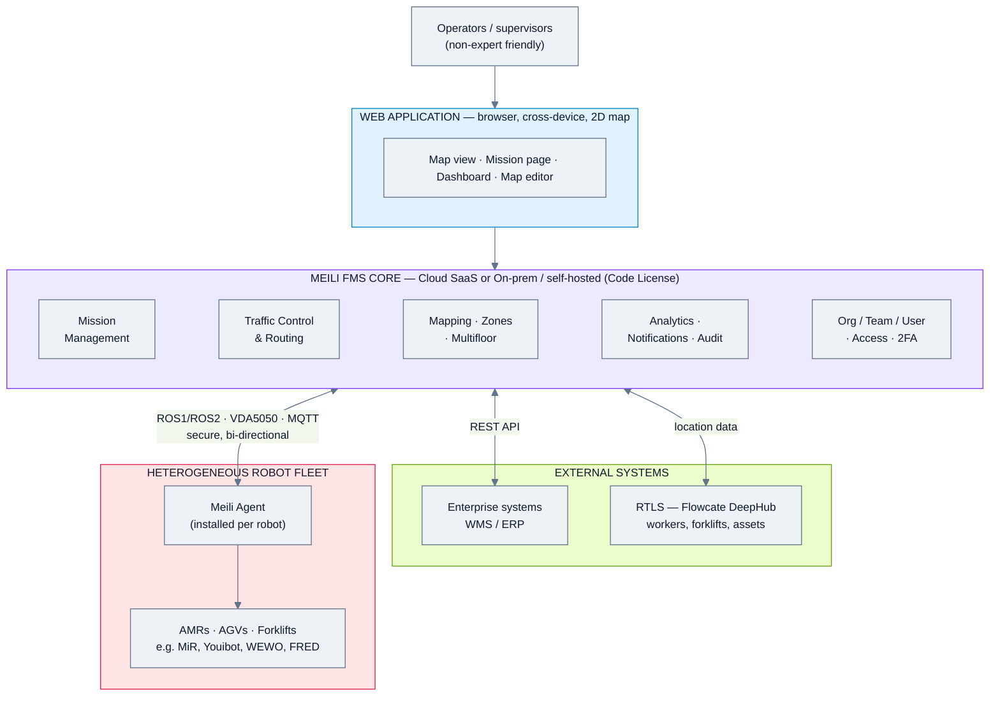
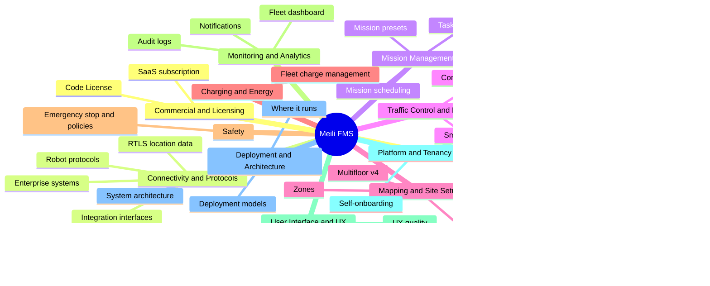
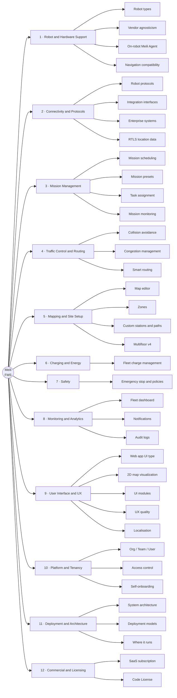
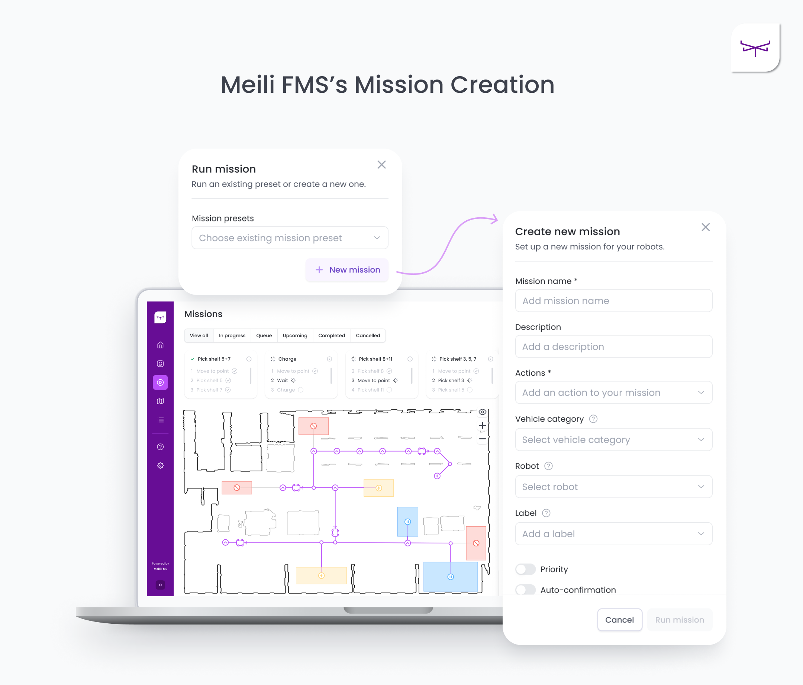
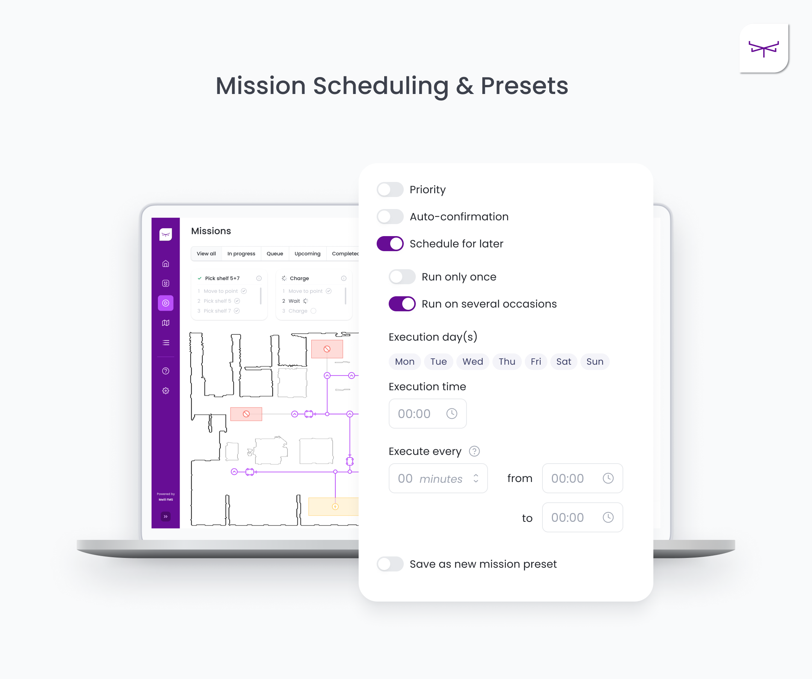
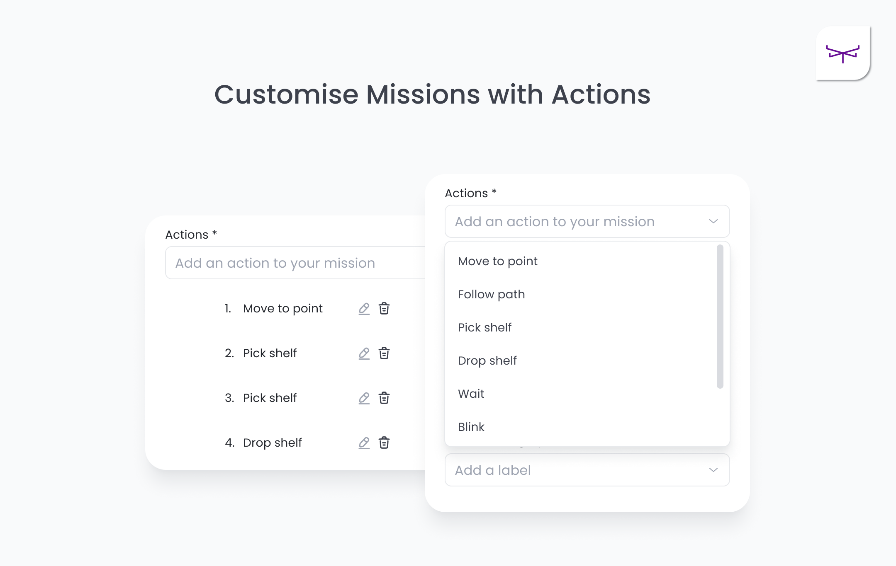
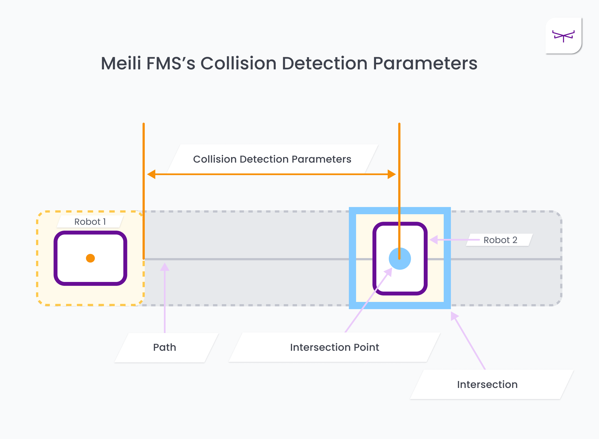
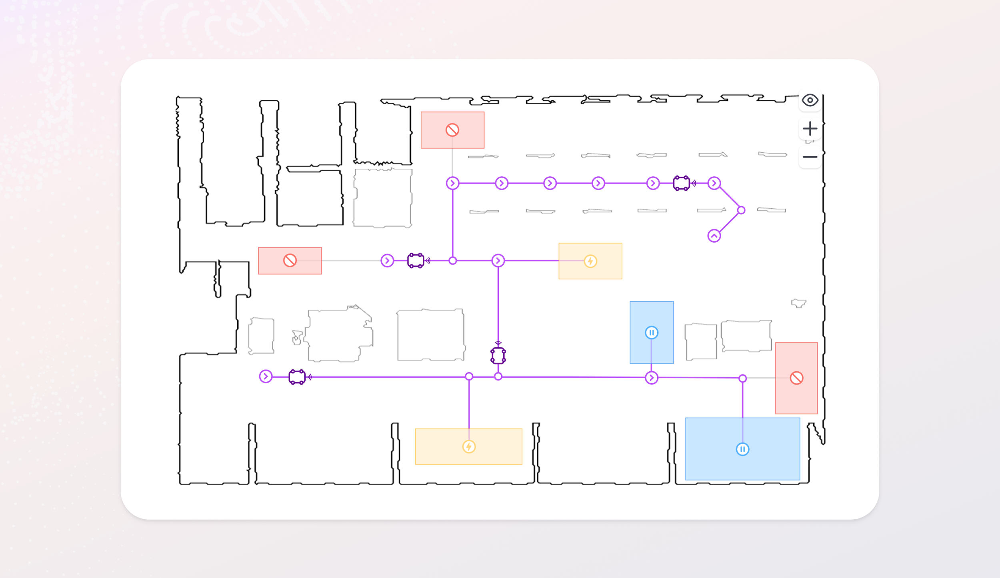
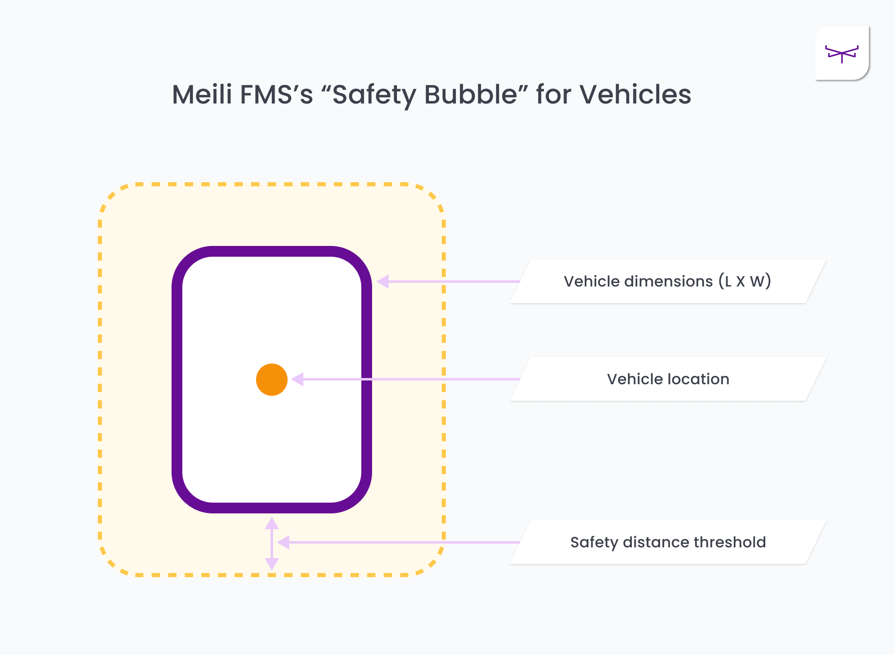
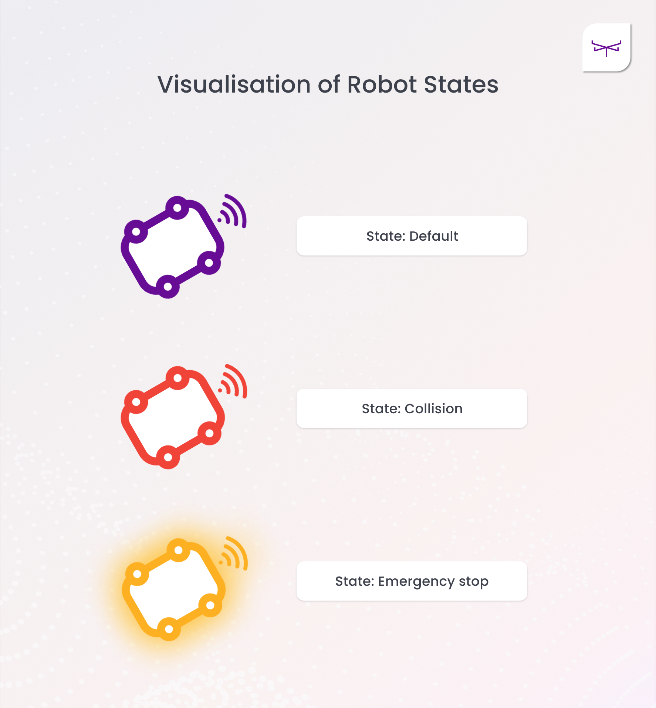

# Meili Robots — Feature Analysis

**Product:** Meili FMS (universal fleet management system) + Meili FMS Code License
**Domain:** Generic / vendor-agnostic universal fleet manager (internal-logistics focus)
**Analysis date:** 2026-06-11
**Sources:** vendor website and public product materials.

**Evidence legend:** **[C] Confirmed** = stated in official or vendor materials · **[L] Likely** = vendor marketing or strongly implied · **[I] Inferred** = deduced / not stated.

---

## Research & Summary

Meili FMS is a **cloud-based, vendor-agnostic fleet management system for mobile robots of all brands, types, and sizes**, accessed through a browser-based web application and aimed explicitly at non-robotics users ("democratise access, control and supervision"). Its scope is mainly **internal logistics** (warehouses, factories) rather than security or inspection. Architecturally it is a cloud/server core plus a lightweight **Meili Agent** installed on each robot (a few command lines, minutes to deploy) that opens a secure bi-directional link to the platform; deployment can be cloud **or** on-premise, and the **Code License** allows running the full stack on your own infrastructure with white-labeling. Interoperability is the core design principle: it speaks ROS1/ROS2 and VDA5050, integrates with SLAM/LiDAR navigation stacks, exposes a REST API, and partners with Flowcate (DeepHub RTLS) for "spatial intelligence" over robots, forklifts, workers, and assets. The three headline modules are Mission Management, Traffic Control/Routing, and Route Planning/Mapping, supported by charging, zones, multifloor (v4.0), safety, analytics, notifications, and a tenancy model (Organisation → Team → User, with Indoor/Outdoor area scoping). The UI is a 2D map-centric web app (no evidence of 3D/game-engine visualization); v4.0 added a redesigned, data-rich dashboard and reduced the learning curve. Evidence is strong across most of the tree thanks to the captured articles and docs; a few deep leaves (exact recurrence options, WebSocket transport, language localisation) are marked Likely/Inferred.

---

## System Architecture

*Architecture derived from the "Implementing Meili FMS" and "Unified Location Data" articles. Core can run as cloud SaaS or be self-hosted on-prem via the Code License; each robot runs a lightweight Meili Agent that links it to the core. Mostly **[C] Confirmed**; the per-robot agent ↔ core protocol mix is **[C]**, internal module boundaries are illustrative **[L]**.*

---

## Feature Map (top 2 levels)

*Top-2-levels overview; full 4-level detail is in the list below.*

### Alternative layout — grouped tree (cleaner)

*Same top-2-levels content as the mindmap, laid out as category cards for easier scanning.*

---

## Feature List

### 1. Robot & Hardware Support
- **1.1 Robot types supported** [C]
  - 1.1.1 Autonomous Mobile Robots (AMRs) [C]
  - 1.1.2 Automated Guided Vehicles (AGVs) [C]
  - 1.1.3 Automated forklifts / pallet trucks [L]
  - 1.1.4 Non-automated/manual vehicles (tracked via RTLS, see 2.4) [C]
  - 1.1.5 Quadruped / humanoid — **not indicated** (product is wheeled-logistics oriented) [I]
- **1.2 Vendor / brand agnosticism** — "all brands, types, or sizes" [C]
  - 1.2.1 Documented integrated makes incl. **MiR, Youibot, WEWO, FRED** [C]
  - 1.2.2 Add any robot regardless of brand/type to an organisation [C]
- **1.3 On-robot integration — "Meili Agent"** [C]
  - 1.3.1 Installed per-robot via a few command lines, in minutes [C]
  - 1.3.2 Secure, reliable, bi-directional connection to Meili cloud [C]
  - 1.3.3 Non-interfering with the robot's own operation [C]
  - 1.3.4 Remotely managed/controlled from anywhere [C]
- **1.4 Navigation-stack compatibility** [C]
  - 1.4.1 Works with SLAM-based robots [C]
  - 1.4.2 Works with LiDAR-based navigation [C]

### 2. Connectivity, Protocols & Interfaces
- **2.1 Robot communication protocols** [C]
  - 2.1.1 ROS1 [C]
  - 2.1.2 ROS2 (real-time, scalable middleware) [C]
  - 2.1.3 VDA5050 [C]
  - 2.1.4 MQTT [C]
- **2.2 Application / integration interfaces**
  - 2.2.1 REST API (api.meilirobots.com) [C]
  - 2.2.2 WebSocket / streaming for live updates [I]
  - 2.2.3 OPC UA — **not found** in sources [I]
- **2.3 Enterprise system integration** [C]
  - 2.3.1 WMS integration [C]
  - 2.3.2 ERP integration [C]
- **2.4 RTLS / unified location data** — Flowcate DeepHub partnership [C]
  - 2.4.1 "Spatial intelligence" — unify robots, forklifts, workers, assets [C]
  - 2.4.2 Track non-automated vehicles/devices for full-site traffic control [C]

### 3. Mission / Task Management
- **3.1 Mission scheduling** [C]
  - 3.1.1 One-time (ad-hoc) missions [C]
  - 3.1.2 Recurring / scheduled missions [C]
    - 3.1.2.1 Recurrence interval / calendar options [L]
  - 3.1.3 Mission prioritisation [C]
- **3.2 Mission presets / templates** [C]
  - 3.2.1 Save reusable presets [C]
  - 3.2.2 Define waypoints and specific routes per mission [C]
  - 3.2.3 Attach custom actions to mission steps [C]
  - 3.2.4 **Mission action library** — missions are ordered, editable action lists; action types: **Move to point, Follow path, Pick shelf, Drop shelf, Wait, Blink**; per-mission labels [C]
- **3.3 Task assignment logic** [C]
  - 3.3.1 Assign by robot profile / type / capability [C]
  - 3.3.2 Automated vs manual (non-automated) assignment [C]
- **3.4 Mission monitoring** [C]
  - 3.4.1 Real-time progress tracking [C]
  - 3.4.2 Conflict / delay detection & resolution [C]

### 4. Traffic Control & Routing
- **4.1 Collision avoidance** [C]
  - 4.1.1 Algorithmic monitoring of every AMR's movement [C]
  - 4.1.2 Handles multiple intersection/collision scenarios [C]
  - 4.1.3 **Configurable collision-detection distance** (look-ahead at intersection points) — tunable parameter [C]
- **4.2 Congestion management** [C]
  - 4.2.1 Intersection regulation [C]
  - 4.2.2 Dynamic rerouting [C]
  - 4.2.3 Priority-based slowdown / diversion [C]
- **4.3 Smart routing** [C]
  - 4.3.1 Route optimisation across mixed fleet [C]

### 5. Mapping & Site Setup
- **5.1 Map editor** [C]
  - 5.1.1 Upload existing facility maps [C]
  - 5.1.2 Create new locations / stations on maps [C]
  - 5.1.3 Place paths, stations, devices [C]
- **5.2 Zones** [C]
  - 5.2.1 Charging zones [C]
  - 5.2.2 Restriction zones [C]
  - 5.2.3 Speed-limit zones [C]
  - 5.2.4 Vehicle-capacity zones [C]
  - 5.2.5 Action zones [C]
- **5.3 Custom stations & paths** — custom icons/colours/routes [C]
- **5.4 Multifloor capabilities (v4.0)** [C]
  - 5.4.1 Monitor/manage/dispatch AMRs across vertical, multi-storey environments [C]
  - 5.4.2 Elevator / inter-floor transitions [I]

### 6. Charging & Energy
- **6.1 Fleet charge management** [C]
  - 6.1.1 Custom charging rules [C]
  - 6.1.2 Charging locations [C]
  - 6.1.3 Battery thresholds [C]

### 7. Safety
- **7.1 Emergency stop & safety policies** [C]
  - 7.1.1 Instant halt on fire alarm / emergency [C]
  - 7.1.2 Collision-avoidance safety protocols [C]

### 8. Monitoring, Analytics & Notifications
- **8.1 Fleet overview dashboard** [C]
  - 8.1.1 Redesigned, data-rich dashboard (v4.0) [C]
  - 8.1.2 Performance insights & bottleneck identification [C]
- **8.2 Notifications** [C]
  - 8.2.1 SMS notifications for critical updates [C]
  - 8.2.2 Email notifications [I]
- **8.3 Audit logs** — system activity / event logs [C]

### 9. User Interface & UX
- **9.1 UI type** — browser-based web application [C]
  - 9.1.1 Cross-platform / accessible from all device types [C]
  - 9.1.2 Sign-in portal (app.meilirobots.com) [C]
- **9.2 Map visualization** — 2D map-centric console [C]
  - 9.2.1 3D / game-engine (UE5) visualization — **not found** [I]
- **9.3 UI modules** [C]
  - 9.3.1 Mission/task page (with map) [C]
  - 9.3.2 Map editor [C]
  - 9.3.3 Vehicle management view [C]
  - 9.3.4 Performance dashboard [C]
- **9.4 UX design quality** [C/L]
  - 9.4.1 Modern, intuitive, low learning curve (v4.0 redesign) [C]
  - 9.4.2 Designed for non-robotics users [C]
- **9.5 Localisation / multi-language** [I]

#### UI Screenshots

**FMS dashboard / fleet view**

**Mission creation**

**Mission scheduling**

**Mission actions (action library)**

**Collision-detection parameters (config)**

**Traffic control (feature diagram)**

**Safety bubble (feature diagram)**

**Robot icons by state**

### 10. Platform / Tenancy Model
- **10.1 Hierarchy** — Organisation → Team → User [C]
  - 10.1.1 Organisation = top entity (company) [C]
  - 10.1.2 Team = users sharing an area + fleet [C]
  - 10.1.3 Team area scope: **Indoor** or **Outdoor** areas [C]
- **10.2 Access control** [C]
  - 10.2.1 User roles & permission levels [C]
  - 10.2.2 Two-factor authentication (2FA) [C]
- **10.3 Self-onboarding** — org/team setup wizard, email invites [C]

### 11. Deployment & Architecture
- **11.1 Architecture** — cloud/server core + per-robot Meili Agent [C]
- **11.2 Deployment models** [C]
  - 11.2.1 Cloud / SaaS (app.meilirobots.com) [C]
  - 11.2.2 On-premise [C]
  - 11.2.3 Self-hosted on own infrastructure via Code License [C]
- **11.3 "Runs where?"** 
  - 11.3.1 Cloud server — yes (default SaaS) [C]
  - 11.3.2 Local server / on-prem (incl. a single machine/laptop-class host) — plausible under Code License [L]
  - 11.3.3 Inside a single robot — **no**; it is a fleet server with on-robot agents, not embedded in one robot [I]

### 12. Commercial / Licensing
- **12.1 SaaS subscription** — incl. self-service sandbox trial [C]
- **12.2 Code License (full ownership)** [C]
  - 12.2.1 Full source-code access [C]
  - 12.2.2 Deploy on own cloud and/or on-premise [C]
  - 12.2.3 White-labeling / rebranding [C]
  - 12.2.4 Direct embedding into own product [C]
  - 12.2.5 Target buyers: SIs, WMS/enterprise-software vendors, large end users [C]

---

> **Gaps / to verify next:** exact recurrence-rule granularity (intervals/calendars), WebSocket vs polling transport, language localisation, elevator-integration specifics, and minimum on-prem hardware footprint. Best confirmed via docs.meilirobots.com, the sandbox trial, or a vendor demo. Quadruped/humanoid and security/inspection use cases appear out of scope for this product.

## Sources
- meilirobots.com/product · docs.meilirobots.com (terminology, supported-amrs)
