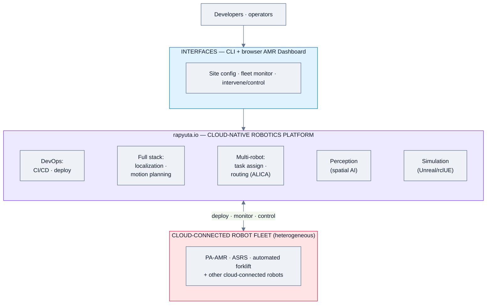
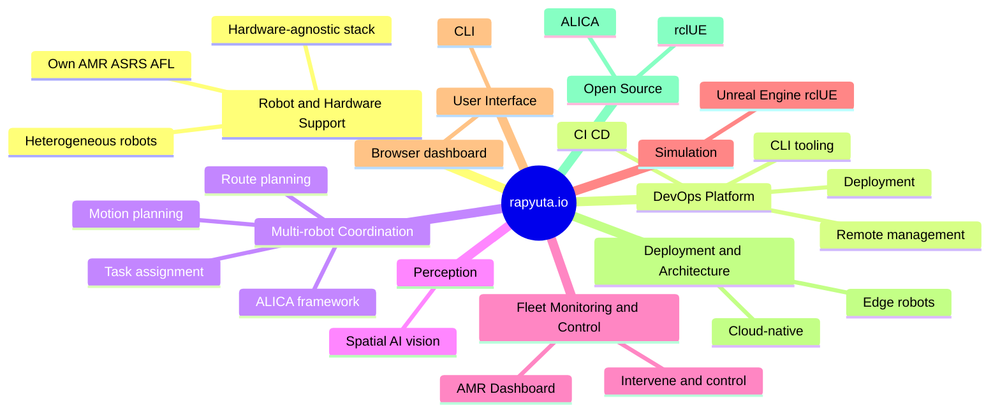
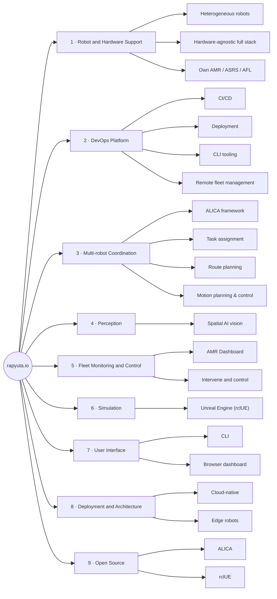
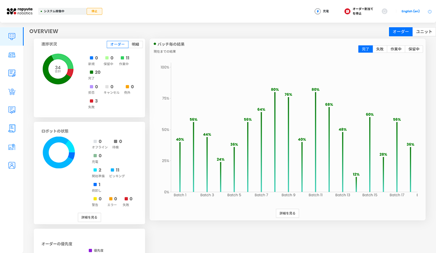
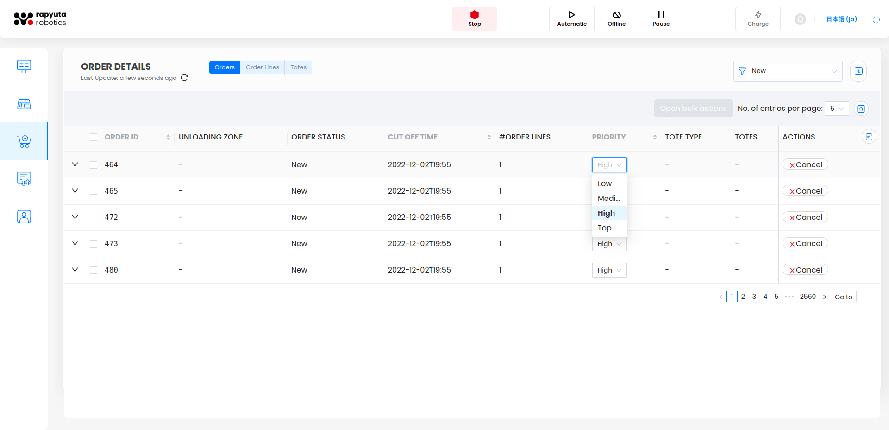
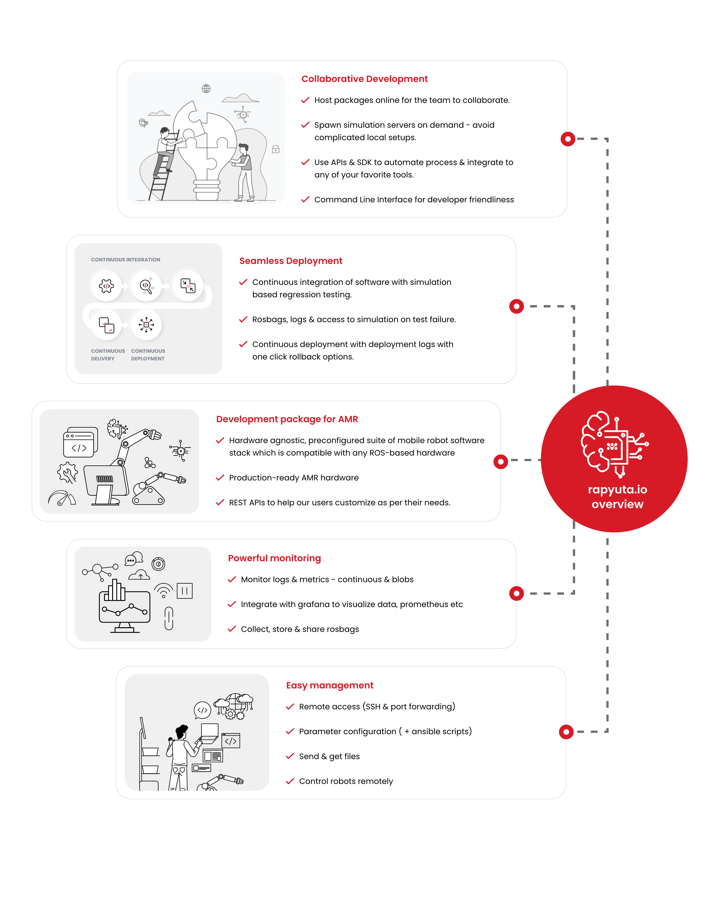
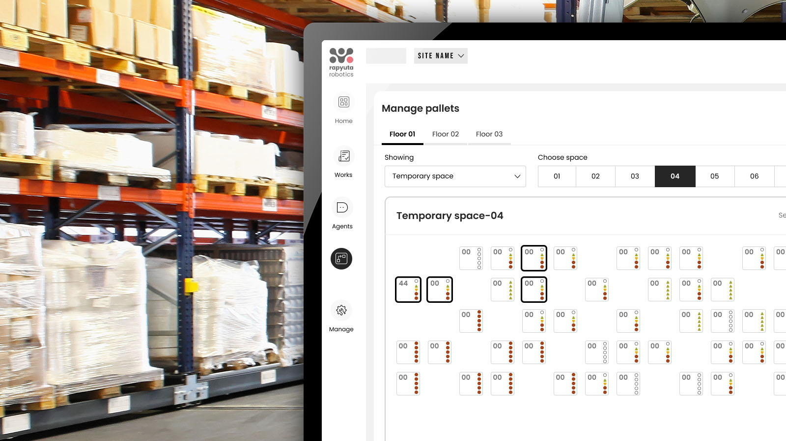
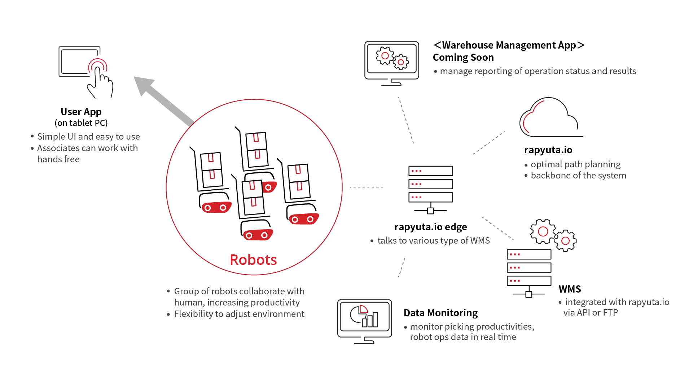
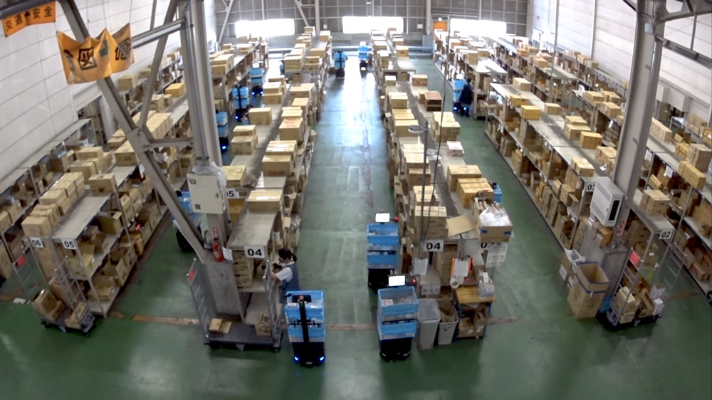

# Rapyuta Robotics — Feature Analysis

**Product:** rapyuta.io (cloud-robotics DevOps + multi-robot platform); robot solutions (ASRS, PA-AMR, AFL) built on it
**Domain:** Generic / cloud-robotics platform with multi-robot coordination
**Analysis date:** 2026-06-12
**Sources:** vendor website and public product materials.
**Evidence legend:** **[C] Confirmed** = stated in official or vendor materials · **[L] Likely** = vendor marketing or strongly implied · **[I] Inferred** = deduced / not stated.

---

## Research & Summary

Rapyuta Robotics positions **rapyuta.io** as "the world's first all-in-one DevOps platform for cloud-connected robots," covering the lifecycle from CI/CD and deployment of robotics applications to remote fleet management — with a command-line interface and a browser-based **AMR Dashboard** for site configuration, fleet monitoring, and intervention/control. Its technical philosophy is explicitly **heterogeneous multi-robot coordination**: build simpler robots that each do a subset of tasks and coordinate them, underpinned by patented multi-robot planning/control and the open-source **ALICA** coordination framework. The full-stack software spans single-robot localization & motion planning up to multi-robot task assignment and route planning, plus award-winning spatial-AI **perception** and **large-scale simulation** on Unreal Engine (rclUE). Commercially, Rapyuta is also a warehouse-robot solution vendor (pick-assist AMR, ASRS, automated forklift) — those are logistics solutions built on the platform; the FMS-relevant layer is rapyuta.io itself. Evidence is Confirmed for the platform pillars (home + technology pages) but the deepest operational settings (mission scheduling specifics, traffic rules) aren't enumerated publicly and are tagged Likely/Inferred. Orientation is developer/DevOps + warehouse, not security/inspection.

**UI quality impression (subjective):** developer-leaning — a CLI plus a browser AMR Dashboard; likely more engineer-oriented than the turnkey security consoles. Needs a live look to judge.

---

## System Architecture

---

## Feature Map (top 2 levels)

### Alternative layout — grouped tree (cleaner)

---

## Feature List

### 1. Robot & Hardware Support
- **1.1 Heterogeneous robot coordination** — many simple robots coordinated vs one complex robot [C]
- **1.2 Hardware-agnostic full-stack software** [C]
- **1.3 Own robot solutions on the platform** — PA-AMR (pick-assist), ASRS, AFL (automated forklift) [C]

### 2. DevOps Platform (rapyuta.io)
- **2.1 Continuous integration / deployment** of robotics apps to fleet or cloud [C]
- **2.2 Remote management of physical robot fleet** [C]
- **2.3 Command-line tooling** — build/deploy + observe distributed resources from terminal [C]
- **2.4 Cloud-native architecture** for distributed, constantly-updated software stacks [C]

### 3. Multi-Robot Coordination & Planning
- **3.1 Distributed intelligence** — patented multi-robot planning/control [C]
  - 3.1.1 ALICA open-source coordination/control framework [C]
- **3.2 Task assignment** for multi-robot systems [C]
- **3.3 Route planning** for multi-robot systems [C]
- **3.4 Motion planning & control** (single-robot agility, dynamic obstacles) [C]

### 4. Perception
- **4.1 Spatial-AI vision** — object identification + pose estimation [C]

### 5. Fleet Monitoring & Control
- **5.1 AMR Dashboard** — browser-based [C]
  - 5.1.1 Configure site [C]
  - 5.1.2 Monitor AMR fleet [C]
  - 5.1.3 Intervene / control robots [C]
  - 5.1.4 **Overview dashboard** — order progress (new / in-progress / complete / failed / cancelled / exception), robot-status breakdown (offline / standby / charging / start-prep / picking), **per-batch completion %**, order priority; EN/JA UI [C]
  - 5.1.5 **Change order/robot priority** on the fly [C]
- **5.2 Data Monitoring** — real-time picking productivity & robot-ops data [C]
- **5.3 User App (on tablet PC)** — simple UI, associates work hands-free [C]
- **5.4 Warehouse Management App** — operation status/results reporting (**coming soon**) [C]

### 6. Simulation
- **6.1 Large-scale simulation** — evaluate robot mix, predict ROI before deployment [C]
  - 6.1.1 Built on Unreal Engine (rclUE, open source) [C]

### 7. User Interface & UX
- **7.1 CLI** [C]
- **7.2 Browser AMR Dashboard** [C]
- **7.3 3D / game-engine operator UI** — simulation uses UE; operator UI specifics not detailed [I]

### 8. Deployment & Architecture
- **8.1 Cloud-native platform** [C]
- **8.2 Edge / on-robot software stack** [C]
- **8.3 On-prem option** — not stated [I]

### 9. Open Source
- **9.1 ALICA** — multi-robot coordination framework [C]
- **9.2 rclUE** — ROS + Unreal Engine integration [C]

### 10. Connectivity & Protocols
- **10.1 ROS-based stack** (ALICA/rclUE are ROS-oriented) [L]
- **10.2 WMS integration** — rapyuta.io edge talks to various WMS via **API or FTP** [C]
- **10.3 VDA5050 / MQTT** — not explicitly stated [I]

#### UI Screenshots

**PA-AMR Overview dashboard** (orders, robot status, per-batch %)

**Changing order/robot priority**

**rapyuta.io platform overview**

**AFL remote monitor**

**Architecture — PA-AMR system design (User App · edge · cloud · WMS · monitoring)**

**Architecture — distributed intelligence (ALICA)**

---

> **Gaps / to verify:** protocol support (ROS version, VDA5050, MQTT, REST), mission scheduling/traffic-control specifics, security/tenancy model, on-prem availability, and pricing. Note: Rapyuta is both a platform and a warehouse-solution vendor — clarify which layer applies to a given engagement. Confirm via rapyuta.io docs or a demo.

## Sources
- rapyuta-robotics.com/rapyuta-io, /technology
