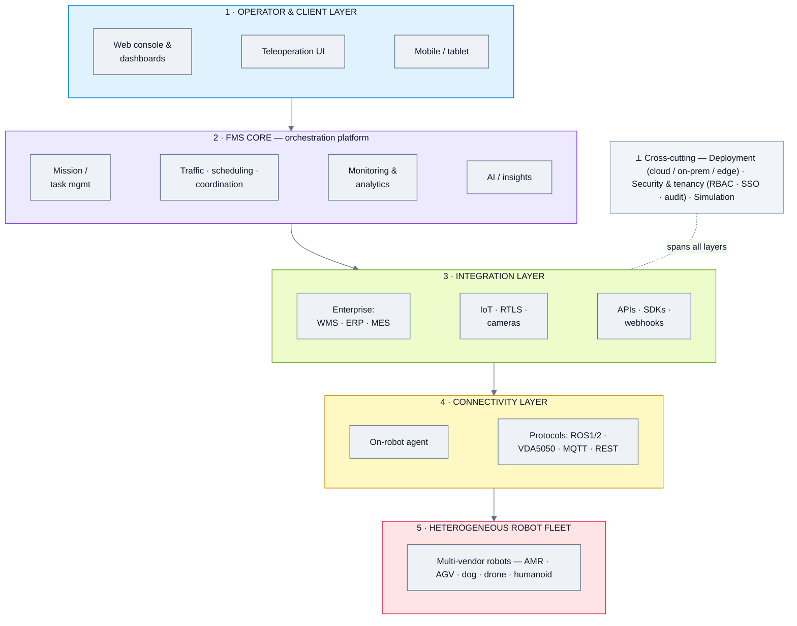
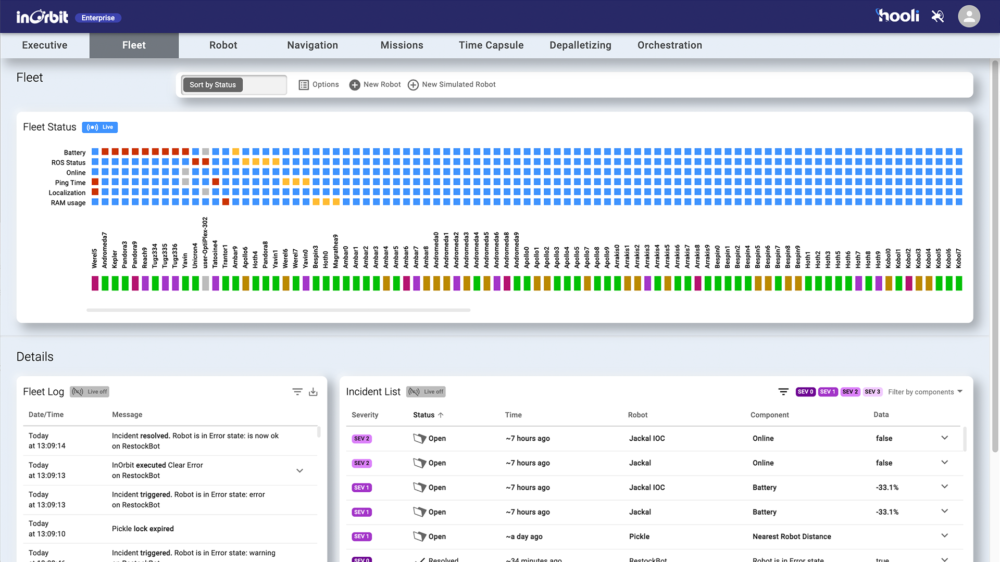
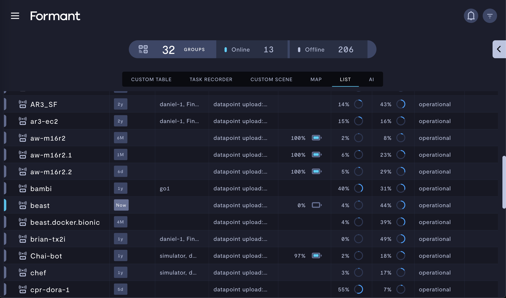
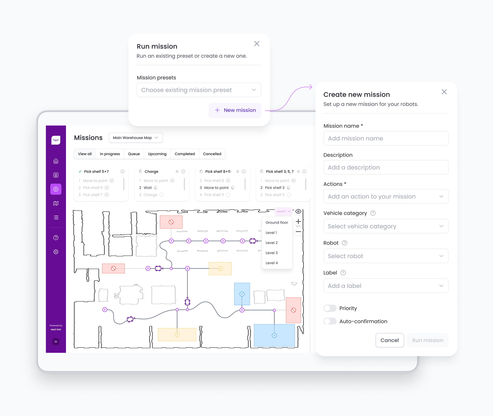

# Generic FMS - Domain Analysis

*Domain summary for the four "Generic" fleet-management platforms. For per-product depth, open each product's analysis below.*

**Analysis date:** 2026-06-12

**Products in this domain (top 4):**

| Product | Feature analysis | Folder | One-line positioning |
|---|---|---|---|
| **InOrbit** | [📄 Feature_Analysis](./InOrbit/Feature_Analysis.md) | [📁 InOrbit](./InOrbit/) | AI robot-orchestration ("RobOps") across robots, people & IoT |
| **Formant** | [📄 Feature_Analysis](./Formant/Feature_Analysis.md) | [📁 Formant](./Formant/) | Data/observability + teleop platform, now AI incident mitigation |
| **Meili Robots** | [📄 Feature_Analysis](./Meili/Feature_Analysis.md) | [📁 Meili](./Meili/) | Universal, standards-based fleet manager (cloud or source-licensed) |
| **Rapyuta Robotics** | [📄 Feature_Analysis](./Rapyuta%20Robotics/Feature_Analysis.md) | [📁 Rapyuta](./Rapyuta%20Robotics/) | Cloud-robotics DevOps + multi-robot coordination platform |

---

## 1. Domain overview

"Generic" FMS are **vendor-agnostic software platforms** whose value is managing *mixed-brand, heterogeneous* robot fleets from one place — independent of who built the robot. Unlike the security, inspection, or warehouse vendors (whose FMS is usually bundled with their own hardware), these products lead with **interoperability, data, and orchestration**. They all sit on top of robots via a lightweight **on-robot agent**, expose a **web console**, and integrate with enterprise systems.

Within this commonality, the four take noticeably different **centres of gravity**:
- **InOrbit** — orchestration-first ("central nervous system"): coordinates robots **plus people and fixed IoT**, with AI vision/copilot.
- **Formant** — data/observability-first: deep telemetry, multi-camera teleop, and (newer) AI incident mitigation.
- **Meili** — interoperability-first: standards-native (ROS, VDA5050, MQTT), with a **source-code license** option.
- **Rapyuta** — DevOps/platform-first: CI/CD for robot software + multi-robot coordination (ALICA), with its own warehouse solutions on top.

This is the domain to watch for **one console over many robot brands** rather than a single-vendor stack.

---

## 2. Domain reference architecture (reference pattern)

*A reference pattern of the stable layers virtually every generic FMS needs — not an aggregation of any one vendor's components.*

**Common architecture:** 
- a client layer 
- (1) talks to an FMS core 
- (2) that orchestrates work; the core integrates outward to enterprise/IoT systems 
- (3) and downward through a connectivity layer 
- (4) an on-robot agent speaking standard protocols - to the heterogeneous fleet 
- (5). Deployment, security/tenancy, and simulation are cross-cutting concerns.

---

## 3. Architecture differences (major approaches)

While all four fit the reference pattern, they differ on **where the weight sits**:

| Axis | InOrbit | Formant | Meili | Rapyuta |
|---|---|---|---|---|
| **Centre of gravity** | Orchestration (L2) + breadth | Data/observability (L2/L3) | Interoperability (L4) | DevOps + coordination (L2/L4) |
| **Scope of "fleet"** | Robots **+ people + IoT** | Robots + data sources | Robots (AMR/AGV) | Robots + WMS workflows |
| **Standards** | ROS; connector ecosystem | ROS (rosbag); device-agnostic | **VDA5050-native**, ROS, MQTT | ROS; WMS via API/FTP |
| **Deployment** | Cloud (edge agent) | Cloud (on-device agent) | Cloud **or on-prem / source license** | Cloud + **edge** (WMS connector) |
| **Distinctive layer** | AI/insights + RTLS | Teleop + observability depth | Source-code ownership | CI/CD + multi-robot planning (ALICA) |

Notable structural variations:
- **Meili** uniquely lets you **own and self-host** the core (Code License) — an architectural choice about control/lock-in, not just a feature.
- **InOrbit** extends the fleet definition to **non-robot assets and people** (via RTLS + IoT), widening layer 3.
- **Rapyuta** splits the core across **cloud (path planning) + edge (WMS bridge)**, and is also a robot vendor — so its "platform" and "solution" layers overlap.
- **Formant** is the most **data-plane-heavy** (telemetry pipelines, multi-video, analytics) and lightest on traffic-control/coordination.

---

## 4. Aggregated feature list (domain superset + commonality)

Legend: **✓** present · **◑** partial / implied · **✗** not evident. "Common core" = present (✓/◑) across all four.

| Feature group / sub-feature | InOrbit | Formant | Meili | Rapyuta | Common core? |
|---|:--:|:--:|:--:|:--:|:--:|
| **Robot & hardware support** | | | | | |
| &nbsp;&nbsp;— Vendor-agnostic / heterogeneous fleet | ✓ | ✓ | ✓ | ◑ | ✅ |
| &nbsp;&nbsp;— On-robot agent | ✓ | ✓ | ✓ | ✓ | ✅ |
| **Protocols, APIs & developer tools** | | | | | |
| &nbsp;&nbsp;— Robot protocols: ROS1 / ROS2 | ✓ | ✓ | ✓ | ✓ | ✅ |
| &nbsp;&nbsp;— Robot protocols: VDA5050 | ✗ | ✗ | ✓ | ✗ | — |
| &nbsp;&nbsp;— Robot protocols: MQTT | ✗ | ✗ | ✓ | ✗ | — |
| &nbsp;&nbsp;— Enterprise / REST API | ✓ | ✓ | ✓ | ✓ | ✅ |
| &nbsp;&nbsp;— SDK / developer tooling (CI-CD) | ◑ | ◑ | ◑ | ✓ | ✅ |
| **Mission & task management** | | | | | |
| &nbsp;&nbsp;— Mission / task management | ✓ | ✓ | ✓ | ◑ | ✅ |
| &nbsp;&nbsp;— Scheduling (recurring) | ◑ | ✓ | ✓ | ◑ | ✅ |
| &nbsp;&nbsp;— Mission action customization | ✓ | ✓ | ✓ | ◑ | ✅ |
| **Traffic & coordination** | | | | | |
| &nbsp;&nbsp;— Traffic control / collision avoidance | ◑ | ✗ | ✓ | ✓ | — |
| &nbsp;&nbsp;— Multi-robot coordination | ✓ | ✗ | ✓ | ✓ | — |
| **Monitoring, teleop & analytics** | | | | | |
| &nbsp;&nbsp;— Web console + real-time dashboards | ✓ | ✓ | ✓ | ✓ | ✅ |
| &nbsp;&nbsp;— Teleoperation / remote intervention | ✓ | ✓ | ◑ | ◑ | ✅ |
| &nbsp;&nbsp;— Incident management | ✓ | ✓ | ◑ | ◑ | ✅ |
| &nbsp;&nbsp;— Analytics / KPIs | ✓ | ✓ | ✓ | ✓ | ✅ |
| **AI** | | | | | |
| &nbsp;&nbsp;— AI assistant / copilot | ✓ | ✓ | ✗ | ✗ | — |
| &nbsp;&nbsp;— AI vision / insights | ✓ | ✓ | ✗ | ✗ | — |
| **Facility & enterprise integration** | | | | | |
| &nbsp;&nbsp;— Enterprise systems (WMS / ERP / MES) | ✓ | ◑ | ✓ | ✓ | ✅ |
| &nbsp;&nbsp;— IoT / fixed infrastructure (cameras, doors) | ✓ | ◑ | ◑ | ✗ | — |
| &nbsp;&nbsp;— RTLS / location of people & assets | ✓ | ✗ | ✓ | ✗ | — |
| **Simulation & modeling** | | | | | |
| &nbsp;&nbsp;— Simulation / digital twin | ✓ | ✗ | ✗ | ✓ | — |
| **Deployment & architecture** | | | | | |
| &nbsp;&nbsp;— Cloud (SaaS) | ✓ | ✓ | ✓ | ✓ | ✅ |
| &nbsp;&nbsp;— On-prem / self-host | ◑ | ◑ | ✓ | ◑ | ✅ |
| &nbsp;&nbsp;— Source-code license | ✗ | ✗ | ✓ | ✗ | — |
| **Operations & governance** | | | | | |
| &nbsp;&nbsp;— Charging / energy management | ◑ | ◑ | ✓ | ◑ | ✅ |
| &nbsp;&nbsp;— RBAC / multi-tenant (org-team-user, 2FA) | ◑ | ✓ | ✓ | ◑ | ✅ |

**Domain "common core"** (what virtually every generic FMS provides): heterogeneous fleet support via an on-robot agent, ROS connectivity + REST API, a web console with real-time dashboards, mission/task management with scheduling, teleoperation, incident management, analytics, enterprise integration, charging, RBAC, and cloud deployment.

**Differentiators** (where they diverge): VDA5050-native (Meili), AI copilot/insights (InOrbit, Formant), RTLS + IoT breadth (InOrbit), simulation (InOrbit, Rapyuta), source-code ownership (Meili), data/observability depth (Formant), multi-robot planning/CI-CD (Rapyuta).

---

## 5. Representative UI (one per product)

| InOrbit — fleet status matrix | Formant — fleet overview |
|---|---|
|  |  |

| Meili — FMS dashboard | Rapyuta — PA-AMR overview |
|---|---|
|  |  |

*(More screenshots in each product's analysis.)*

---

## 6. Takeaways

- If the goal is **one console over many robot brands**, every product here qualifies; the choice is about *emphasis*.
- **Most security/inspection-relevant** of the four: **InOrbit** (orchestration + AI vision + people/IoT) and **Formant** (teleop + observability) — both already manage dogs/drones/humanoids, not just AMRs.
- **Meili** is the pick if **standards-compliance (VDA5050) or self-hosting/ownership** matters.
- **Rapyuta** leans warehouse/DevOps; most relevant for building robot software on a platform.
- These are **software-only** (no RaaS/hardware) — they assume the robots are supplied separately.

---

*Sources: each product's feature analysis and the vendor materials cited therein.*
