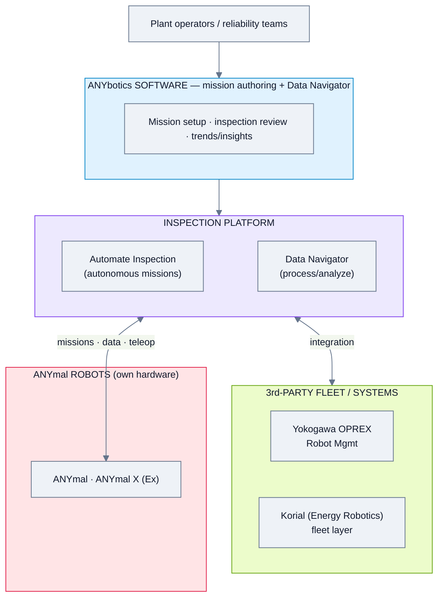
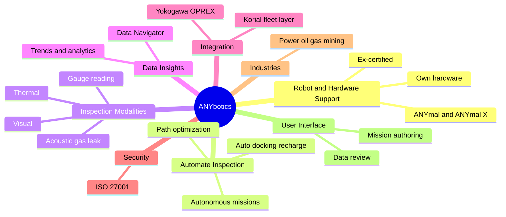
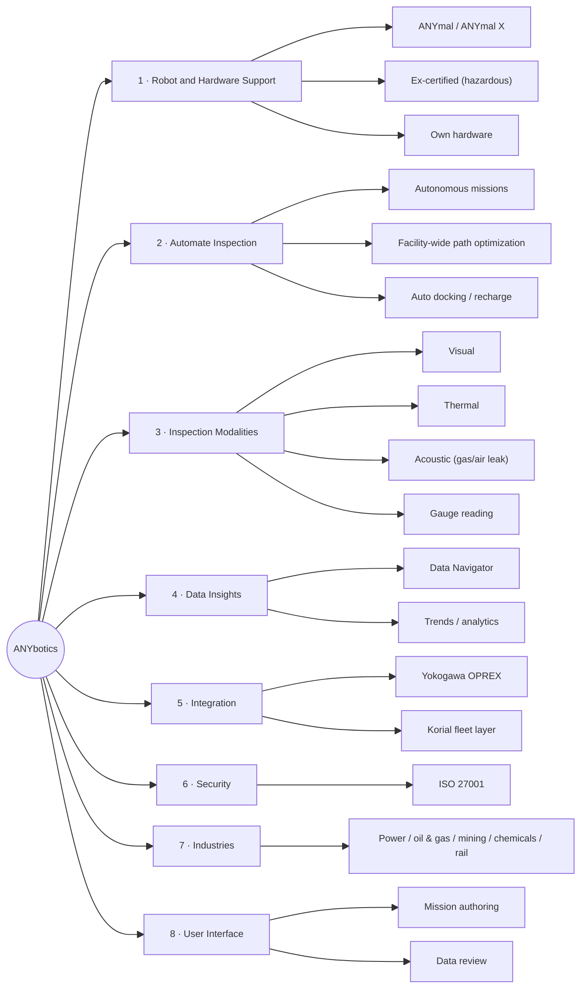

# ANYbotics — Feature Analysis

**Product:** ANYmal / ANYmal X (legged inspection robots) + inspection software (Automate Inspection, Data Navigator)
**Domain:** Inspection & field robotics (own hardware; integrates with 3rd-party fleet managers)
**Analysis date:** 2026-06-12
**Sources:** vendor website and public product materials.
**Evidence legend:** **[C] Confirmed** · **[L] Likely** · **[I] Inferred**.

---

## Research & Summary

ANYbotics (Switzerland, ETH spin-off) makes **ANYmal** and the Ex-certified **ANYmal X** four-legged inspection robots, plus the software that turns them into autonomous data-collection systems: **Automate Inspection** (autonomous missions, facility-wide path optimization, automatic docking/recharging for multiple missions) and **Data Navigator / Data Insights** (collect, process, analyze inspection data and trends). Inspection modalities include visual, thermal, acoustic (gas/air-leak), and gauge reading. It is **own-hardware**, but increasingly opens up: a partnership with **Yokogawa** integrates ANYmal with OPREX Robot Management Core, and **Korial (Energy Robotics)** provides a hardware-agnostic fleet layer over ANYmal. ISO 27001 certified; deployed in power & utilities, mining, oil & gas, chemicals, and rail (Outokumpu, Siemens Energy, Vale, Equinor, BP). Evidence is Confirmed at the capability level from the website; deep operator-UI and config detail is thinner.

**UI quality impression (subjective):** strong inspection-mission + data-analytics tooling; the operator UI specifics need a live look or datasheet — the public site emphasizes robot + outcomes over console screenshots.

---

## System Architecture

---

## Feature Map (top 2 levels)

### Alternative layout — grouped tree (cleaner)

---

## Feature List

### 1. Robot & Hardware Support
- **1.1 Legged inspection robots** — ANYmal, ANYmal X [C]
  - 1.1.1 ANYmal X is Ex-certified for hazardous (oil & gas) areas [C]
- **1.2 Vendor-agnostic?** — No; own hardware (but integrates with 3rd-party fleet mgmt) [C]

### 2. Automate Inspection (autonomous operations)
- **2.1 Autonomous mission execution** [C]
- **2.2 Facility-wide path optimization / fastest route** [C]
- **2.3 Automatic docking & recharging** for multiple/extended missions [C]
- **2.4 Remote control / teleoperation & monitoring** [C]

### 3. Inspection Modalities
- **3.1 Visual inspection** [C]
- **3.2 Thermal** [C]
- **3.3 Acoustic** — gas/air-leak detection [C]
- **3.4 Gauge / meter reading** [L]

### 4. Data Insights
- **4.1 Data Navigator / Data Insights** — collect, process, analyze [C]
- **4.2 Trend monitoring over time** [C]

### 5. Integration
- **5.1 Yokogawa OPREX Robot Management Core** [C]
- **5.2 Korial (Energy Robotics) hardware-agnostic fleet layer** [C]
- **5.3 API surface** — not detailed publicly [I]

### 6. Security & Compliance
- **6.1 ISO 27001 certified** [C]

### 7. Deployment & Architecture
- **7.1 Cloud + on-prem** options [I]
- **7.2 Customer support portal** [C]

### 8. User Interface & UX
- **8.1 Mission authoring** [C]
- **8.2 Inspection data review (Data Navigator)** [C]
- **8.3 Console screenshots** — not captured [I]

### 9. Industries
- **9.1 Power & utilities, mining/metals, oil & gas, chemicals, rail** [C]

#### UI Screenshots

**Data Navigator — web platform**

**Anomaly view (e.g. smoke/anomaly detection in data)**

*Data Navigator modules (from product page): Anomaly Dashboard, Comparison View, Trendline View, Mission Scheduler — web-based, deployable on-prem / cloud / air-gapped.*

---

> **Gaps / to verify:** operator-UI detail, mission scheduling/recurrence, API/protocol surface, cloud vs on-prem, and how much fleet management is native vs. delegated to Korial/OPREX. Confirm via anybotics.com whitepapers or a demo.

## Sources
- anybotics.com (home, solutions, robotics, news)
