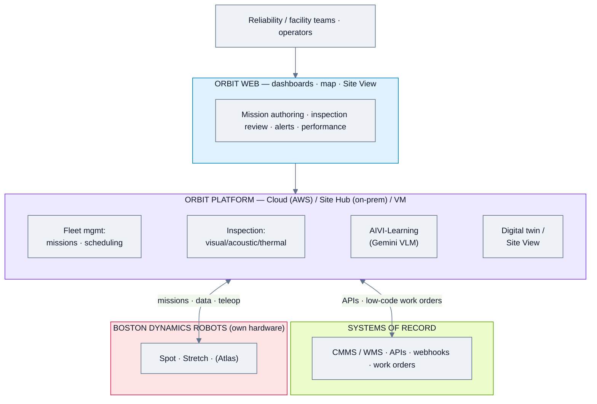
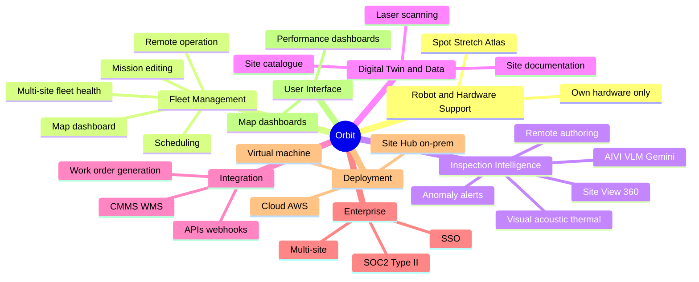
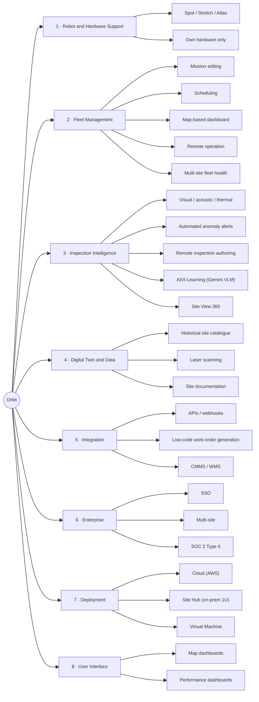

# Boston Dynamics — Orbit — Feature Analysis

**Product:** Orbit™ — orchestration & intelligence software for Boston Dynamics robots (Spot, Stretch, eventually Atlas)
**Domain:** Inspection & field robotics (own hardware)
**Analysis date:** 2026-06-12
**Sources:** vendor website and public product materials.
**Evidence legend:** **[C] Confirmed** · **[L] Likely** · **[I] Inferred**.

---

## Research & Summary

Orbit is Boston Dynamics' fleet-orchestration and facility-intelligence software for its **own** robots (Spot, Stretch, and eventually Atlas) — not vendor-agnostic. It combines classic FMS (mission editing/scheduling, map-based dashboard, remote operation, performance summaries, multi-site fleet health) with deep **inspection intelligence** (visual/acoustic/thermal data, automated in-product + email anomaly alerts, remote inspection authoring, an AI vision-language model "AIVI-Learning" now powered by Google Gemini Robotics, and a "Site View" of 360° imagery with mission authoring). It doubles as a digitalization layer (historical site catalogue, digital twin, laser scanning, CMMS/WMS integration via APIs, webhooks, and low-code work-order generation). Notably flexible on deployment: **Cloud (AWS-hosted), on-prem Site Hub (1U rack), or Virtual Machine**; enterprise-grade with SSO, multi-site, and SOC 2 Type II. Evidence is strongly Confirmed (detailed product page). The clear caveat: it manages BD hardware only.

**UI quality impression (subjective):** highly polished — map-based dashboards, performance dashboards, and a 360° Site View; among the most mature inspection UIs here. Real screenshots are on the product page.

---

## System Architecture

---

## Feature Map (top 2 levels)

### Alternative layout — grouped tree (cleaner)

---

## Feature List

### 1. Robot & Hardware Support
- **1.1 Boston Dynamics robots** — Spot, Stretch, eventually Atlas [C]
- **1.2 Vendor-agnostic?** — No; BD hardware only [C]

### 2. Fleet Management
- **2.1 Mission editing & scheduling** [C]
- **2.2 Map-based dashboard** [C]
- **2.3 Remote robot operation** [C]
- **2.4 Performance summaries** [C]
- **2.5 Multi-site centralized dashboards / fleet health** [C]

### 3. Inspection Intelligence
- **3.1 Inspection data types** [C]
  - 3.1.1 Visual [C]
  - 3.1.2 Acoustic (air-leak detection) [C]
  - 3.1.3 Thermal (hotspots/anomalies) [C]
- **3.2 Anomaly alerting** — automated in-product + email; trend tracking [C]
- **3.3 Remote inspection authoring/editing** [C]
- **3.4 AI vision-language model — AIVI-Learning** (Google Gemini Robotics) [C]
- **3.5 Site View** — 360° imagery, condition history, mission authoring from imagery [C]

### 4. Digital Twin & Data
- **4.1 Facility digitalization** — historical visual catalogue [C]
- **4.2 Laser scanning** [C]
- **4.3 Site documentation / construction progress** [C]

### 5. Integration
- **5.1 APIs** [C]
- **5.2 Webhooks** [C]
- **5.3 Low-code work-order generation (beta)** [C]
- **5.4 CMMS / WMS / systems of record** [C]

### 6. Enterprise & Security
- **6.1 Customizable user profiles** [C]
- **6.2 SSO** [C]
- **6.3 Multi-site view** [C]
- **6.4 SOC 2 Type II certified** [C]

### 7. Deployment & Architecture
- **7.1 Cloud** — AWS-hosted (WiFi/LTE to Spot) [C]
- **7.2 Site Hub** — 1U rack-mounted on-prem appliance [C]
- **7.3 Virtual Machine** — OVA for VMware/Hyper-V/Azure/GCP [C]

### 8. User Interface & UX
- **8.1 Map-based dashboards** [C]
- **8.2 Performance dashboards** [C]
- **8.3 Site View (360°)** [C]

### 9. Connectivity & Protocols
- **9.1 Spot SDK / developer APIs** [C]
- **9.2 VDA5050/ROS** — not the integration model (BD-native) [I]

#### UI Screenshots

**Inspection data trends (acoustic, with trend lines)**

**Stretch performance dashboard in Orbit**

---

> **Gaps / to verify:** scheduling recurrence specifics, exact API surface, and whether any third-party robot support is planned (currently BD-only). Strong inspection benchmark. Confirm via Orbit release notes / a demo.

## Sources
- bostondynamics.com/products/orbit; bostondynamics.com/whitepaper/* ; dev.bostondynamics.com
