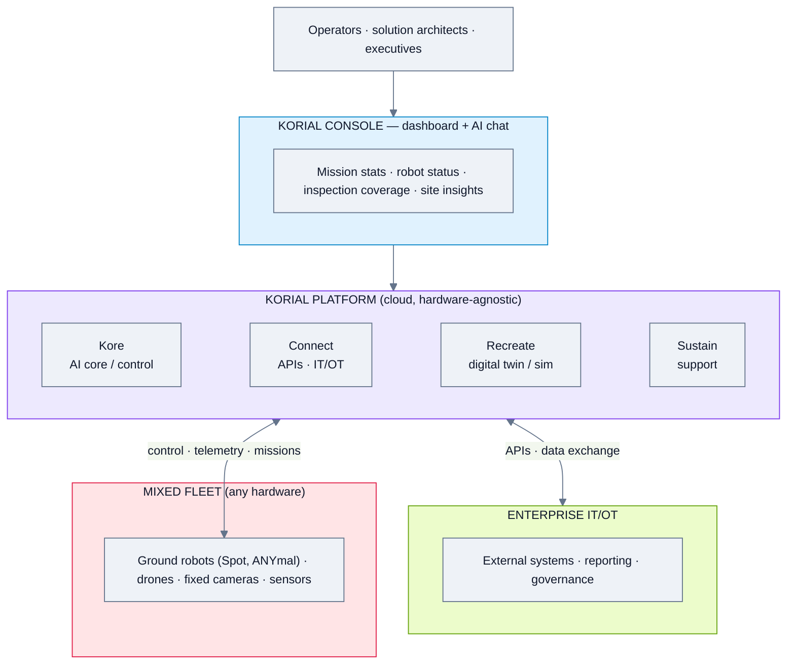
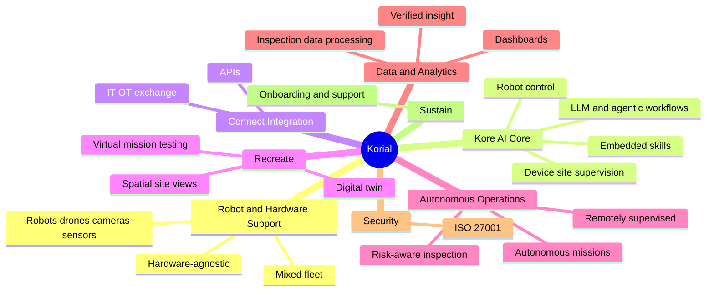
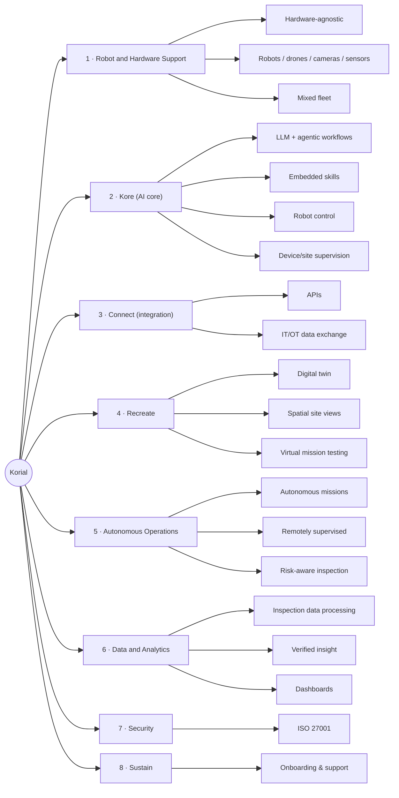

# Energy Robotics (now Korial) — Feature Analysis

**Product:** Korial enterprise AI platform (Kore · Connect · Recreate · Sustain) — formerly Energy Robotics
**Domain:** Inspection & field robotics — **hardware-agnostic** autonomous-operations platform
**Analysis date:** 2026-06-12
**Sources:** vendor website and public product materials.
**Evidence legend:** **[C] Confirmed** · **[L] Likely** · **[I] Inferred**.

---

## Research & Summary

Korial (the 2026 rebrand of Energy Robotics) is a **hardware-agnostic enterprise AI platform** that unifies robots, drones, cameras, and sensors into one operating layer for autonomous industrial inspection and operations — turning telemetry into verified insight and orchestrated action. Unlike the OEM-bound inspection tools, Korial explicitly manages **mixed fleets** (e.g., Boston Dynamics Spot + ANYmal + drones, as at Shell Rheinland). Its architecture has four named components: **Kore** (the AI core — LLM, agentic workflows, embedded skills, device/site supervision, robot control), **Connect** (integration backbone for APIs and IT/OT data exchange), **Recreate** (digital twins, spatial site views, virtual mission testing/simulation), and **Sustain** (onboarding & support). Proven at scale (1M+ inspections, 100+ global deployments; Shell, Evonik, E.ON, BP, Chevron, Merck) and ISO 27001 certified. This is one of the strongest **vendor-agnostic inspection** platforms in the survey. Evidence is Confirmed at the platform-architecture level; deep operator-config detail is thinner.

**UI quality impression (subjective):** the platform dashboard shows mission stats, robot status, inspection coverage, site insights, and an AI chat box — a modern, AI-forward ops console. A real dashboard image is on the platform page.

---

## System Architecture

---

## Feature Map (top 2 levels)

### Alternative layout — grouped tree (cleaner)

---

## Feature List

### 1. Robot & Hardware Support
- **1.1 Hardware-agnostic** — any asset, any device [C]
  - 1.1.1 Ground robots (Spot, ANYmal), drones, fixed cameras, sensors [C]
  - 1.1.2 Mixed/heterogeneous fleet coordination (e.g., robots + drone at Shell) [C]

### 2. Kore (AI core)
- **2.1 LLM + agentic workflows** [C]
- **2.2 Embedded skills** [C]
- **2.3 Robot control** [C]
- **2.4 Device & site supervision** [C]
- **2.5 Self-reinforcing intelligence** (live telemetry → action) [C]

### 3. Connect (integration backbone)
- **3.1 APIs** [C]
- **3.2 IT/OT data exchange** — stream inspection data/telemetry/insight to external systems [C]

### 4. Recreate (modeling & simulation)
- **4.1 Digital twins** [C]
- **4.2 Spatial site views** [C]
- **4.3 Virtual mission testing** before live deployment [C]

### 5. Autonomous Operations
- **5.1 Autonomous missions** [C]
- **5.2 Remotely-supervised missions** [C]
- **5.3 Risk-aware inspection / routine rounds** [C]

### 6. Data & Analytics
- **6.1 Inspection data collection, processing, analytics** [C]
- **6.2 Verified insight / orchestrated action** [C]
- **6.3 Dashboards** — mission stats, robot status, inspection coverage, site insights [C]

### 7. Security & Compliance
- **7.1 ISO 27001 certified** [C]

### 8. Sustain (service)
- **8.1 Structured onboarding, industrial-grade support, success partnership** [C]

### 9. Deployment & Architecture
- **9.1 Enterprise cloud AI platform** [C]
- **9.2 On-prem / edge split** — not fully specified [I]

### 10. User Interface & UX
- **10.1 Web dashboard + AI chat box** [C]
- **10.2 3D / spatial site views** (via Recreate) [C]

#### UI Screenshots

**Kore — operations dashboard** (mission stats, robot status, inspection coverage, AI chat)
.avif)

**Connect — mission report + inspection data + facility schematic**

**Recreate — immersive 3D / digital-twin feature view**

---

> **Gaps / to verify:** protocol list (ROS/VDA5050/MQTT), on-prem availability, RBAC/SSO specifics, exact supported-robot list, and pricing. Strong vendor-agnostic inspection peer — closest in spirit to a "generic" platform but inspection-focused. Confirm via korial.com/enterprise-ai-platform or a demo.

## Sources
- korial.com (home, enterprise-ai-platform, customer stories)
