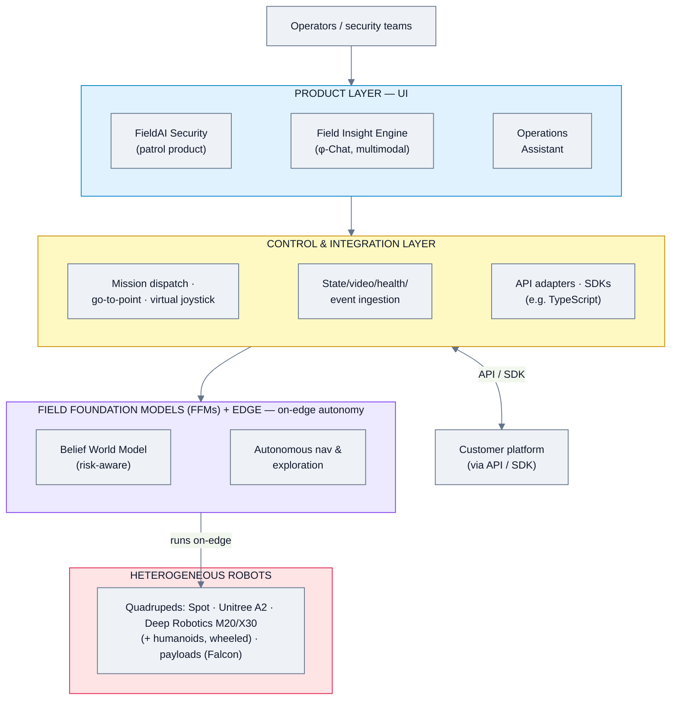
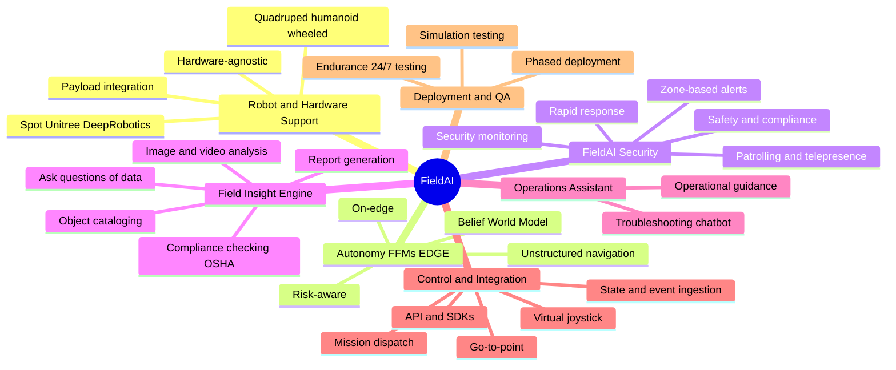
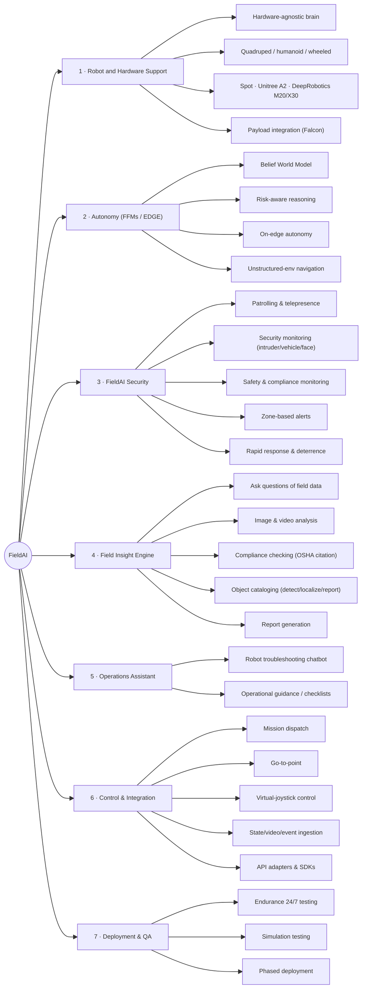
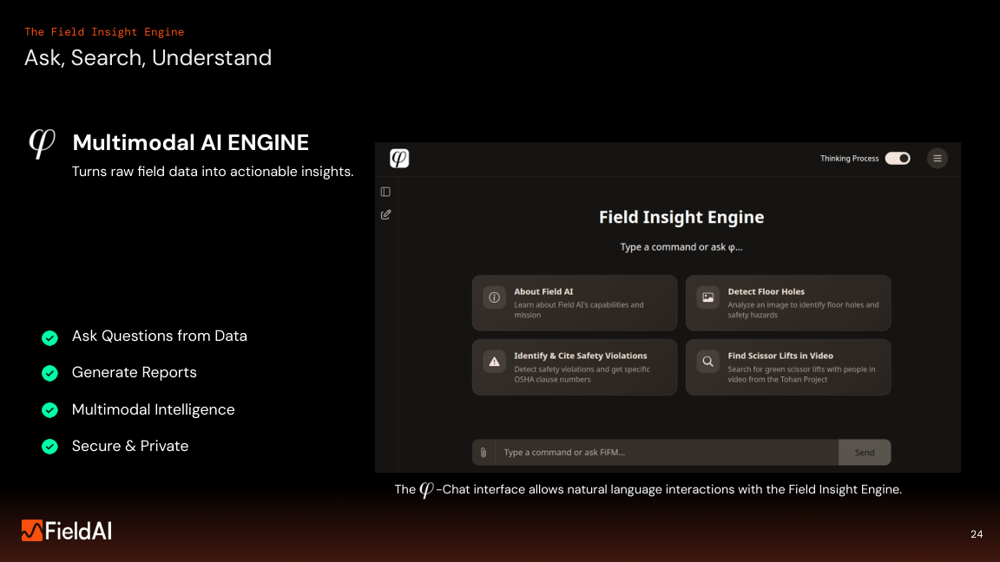
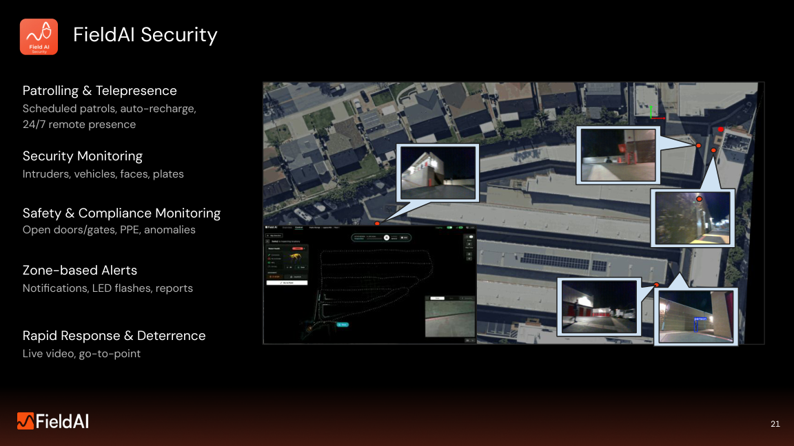
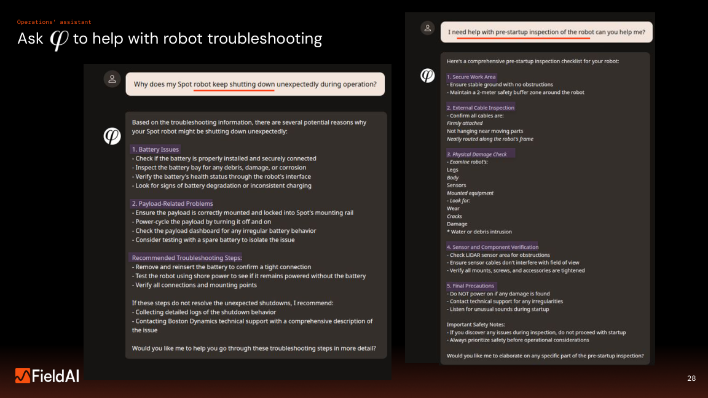
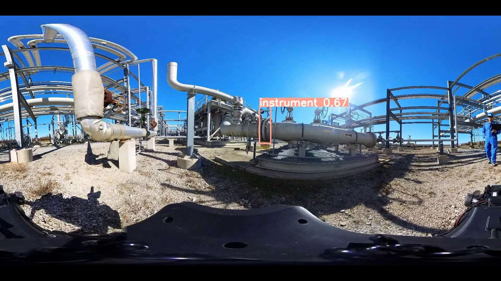

# FieldAI — Feature Analysis

**Product:** Field Foundation Models™ (FFMs) + EDGE™ autonomy, **FieldAI Security** (patrol product), **Field Insight Engine** (multimodal AI), **Operations Assistant**
**Domain:** Inspection & field robotics — autonomy + an emerging operations/security product layer
**Analysis date:** 2026-06-12
**Sources:** vendor website and public product materials.
**Evidence legend:** **[C] Confirmed** · **[L] Likely** · **[I] Inferred**.

---

## Research & Summary

FieldAI's foundation is its **Field Foundation Models (FFMs)** and **EDGE** on-edge autonomy — one risk-aware, hardware-agnostic "robot brain" (Belief World Model) that navigates unstructured/uncharted environments across quadrupeds, humanoids, wheeled robots, and vehicles. On top of that autonomy, vendor materials reveal a maturing **product layer**:
- **FieldAI Security** — scheduled patrols, auto-recharge, 24/7 telepresence, security monitoring (intruders/vehicles/faces), safety & compliance monitoring (open doors/gates, PPE anomalies), zone-based alerts (notifications, LED flashes, reports), and rapid response/deterrence (live video, go-to-alert).
- **Field Insight Engine** — a multimodal-AI **φ-Chat** that turns field data, images, and video into answers: ask questions of field data, detect hazards in images (e.g. floor holes), identify & cite safety violations (with OSHA clause numbers), search video for objects/people, and auto-generate reports; with object cataloging (detect/localize/report) and triage/prioritization by zone.
- **Operations Assistant** — an AI chatbot for robot troubleshooting and operational guidance (e.g. diagnosing a Spot shutting down; generating a pre-startup inspection checklist).
- A **control & integration layer** — mission dispatch, go-to-point, robot control via **virtual joystick**, fleet/robot-state ingestion, video/health/alert/event streams, plus API adapters and SDKs (e.g. TypeScript).

Supported robot platforms under consideration/integration include Boston Dynamics Spot, Unitree A2/A2W, and Deep Robotics M20/X30 (with a "Falcon" payload integration). Deployments cited show 24/7 coverage, 20–50% cost savings, and police-dispatch outcomes. FieldAI is best compared on **autonomy + AI-insight** axes, and now also has credible patrol-operations features.

**UI quality impression (subjective):** the φ-Chat / Field Insight Engine is a modern dark chat console with suggestion cards and a "Thinking Process" toggle; FieldAI Security shows camera feeds with object-detection overlays. Operationally more product-like than the website conveys.

---

## System Architecture

---

## Feature Map (top 2 levels)

### Alternative layout — grouped tree (cleaner)

---

## Feature List

### 1. Robot & Hardware Support
- **1.1 Hardware-agnostic autonomy** across embodiments [C]
  - 1.1.1 Quadrupeds, humanoids, wheeled, vehicles [C]
- **1.2 Supported/under-integration platforms** [C]
  - 1.2.1 Boston Dynamics Spot [C]
  - 1.2.2 Unitree A2 / A2W [C]
  - 1.2.3 Deep Robotics M20 / X30 [C]
- **1.3 Payload integration** — e.g. Deep Robotics X30 with "Falcon" payload [C]

### 2. Autonomy — Field Foundation Models / EDGE
- **2.1 Belief World Model (BWM)** — risk-aware reasoning under uncertainty [C]
- **2.2 On-edge autonomy** [C]
- **2.3 Navigation in unstructured / uncharted environments; exploration** [C]
- **2.4 Reliability & grounding** infrastructure for persistent operations [C]

### 3. FieldAI Security (patrol product)
- **3.1 Patrolling & telepresence** [C]
  - 3.1.1 Scheduled patrols [C]
  - 3.1.2 Auto-recharge [C]
  - 3.1.3 24/7 remote presence (telepresence) [C]
- **3.2 Security monitoring** — intruders, vehicles, faces [C]
- **3.3 Safety & compliance monitoring** — open doors/gates, PPE anomalies [C]
- **3.4 Zone-based alerts** — notifications, on-robot LED flashes, reports [C]
- **3.5 Rapid response & deterrence** — live video, go-to-alert [C]

### 4. Field Insight Engine (multimodal AI / φ-Chat)
- **4.1 Natural-language chat over field data** [C]
  - 4.1.1 Ask questions of field data; "Thinking Process" view [C]
- **4.2 Image analysis** — e.g. detect floor holes / safety hazards from an image [C]
- **4.3 Video search** — find objects/people in video (e.g. "scissor lifts with people") [C]
- **4.4 Compliance checking** — detect safety violations and cite specific OSHA clause numbers [C]
- **4.5 Object cataloging** — detect → localize → report [C]
- **4.6 Automated report generation** [C]
- **4.7 Triage / prioritization** with contextual operations, by zone [C]
- **4.8 Secure & private** [C]

### 5. Operations Assistant
- **5.1 Robot troubleshooting chatbot** — structured, robot-specific diagnostics (e.g. Spot unexpected shutdowns) [C]
- **5.2 Operational guidance** — e.g. generate pre-startup inspection checklist [C]

### 6. Control & Integration Layer
- **6.1 Action/control** [C]
  - 6.1.1 Mission dispatch [C]
  - 6.1.2 Go-to-point [C]
  - 6.1.3 Robot control via virtual joystick [C]
- **6.2 Information access layer** — fleet & robot-state ingestion; video, health, alerts, event streams; mission config [C]
- **6.3 API adapters & SDKs** (e.g. TypeScript) [C]
- **6.4 Telemetry, health data, connection-security protocols** [C]

### 7. Deployment & QA
- **7.1 Phased deployment** (Pre-deployment → integration → productization) [C]
- **7.2 Endurance testing** — 24/7 patrolling, stability/continuity [C]
- **7.3 Software-release testing** — 1000+ hours simulation/physical [C]

### 8. Safety
- **8.1 Emergency stop**; command robot to sit/stop; cut all power to motors [C]

### 9. Simulation
- **9.1 NVIDIA Omniverse** sim / digital twin [C]

### 10. User Interface & UX
- **10.1 Field Insight Engine φ-Chat** — dark chat UI, suggestion cards, Thinking-Process toggle [C]
- **10.2 FieldAI Security** — camera feeds with object-detection overlays [C]
- **10.3 Operations Assistant** — chat UI with structured answers [C]

#### UI Screenshots

**Field Insight Engine (φ-Chat)**

**FieldAI Security (camera feeds with detection overlays)**

**Operations Assistant**

**Anomaly detection on instruments**

---

> **Gaps / to verify:** which product features (FieldAI Security, Field Insight Engine, Operations Assistant) are GA vs. roadmap; licensing; multi-vendor fleet-management depth; on-prem vs cloud; pricing.

## Sources
- fieldai.com (technology, solutions, news)
