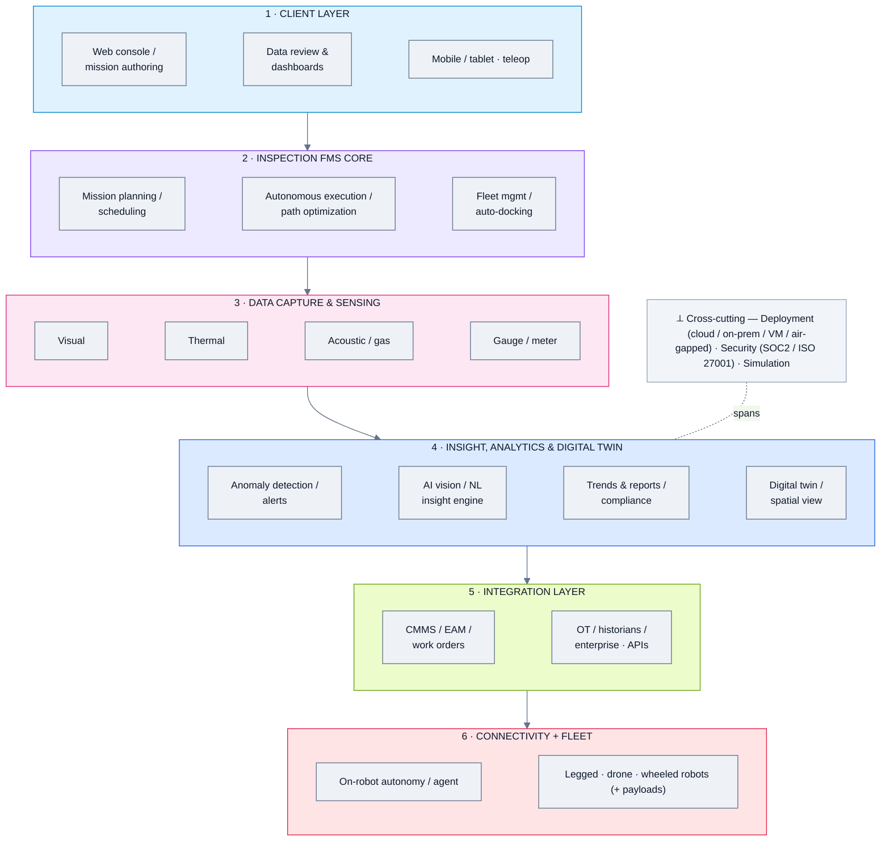
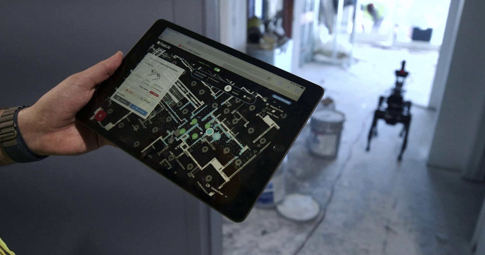
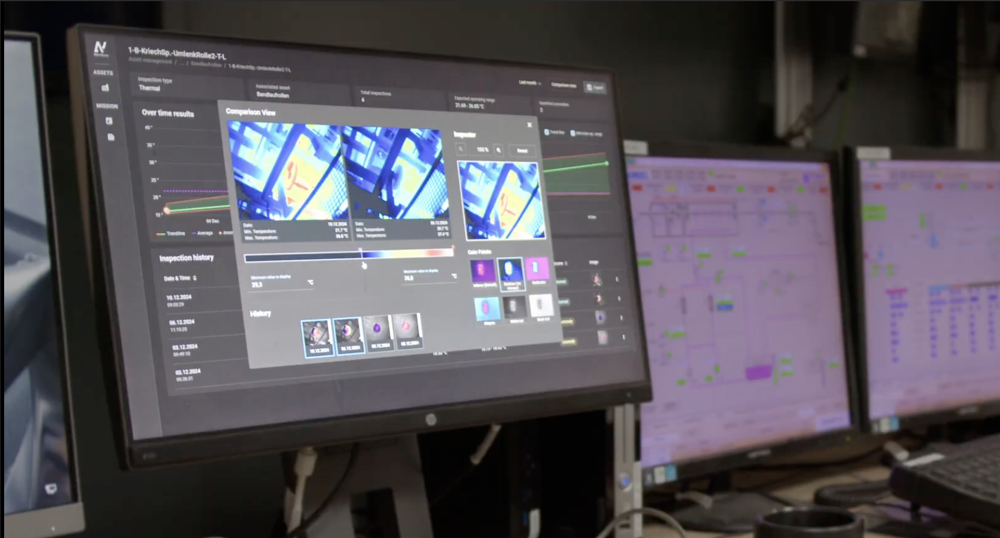

# Inspection & Field-Robotics FMS - Domain Analysis

*Domain summary for the four "Inspection" platforms. For per-product depth, open each product's analysis below.*

**Analysis date:** 2026-06-12

**Products in this domain (top 4):**

| Product | Feature analysis | Folder | One-line positioning |
|---|---|---|---|
| **Boston Dynamics Orbit** | [📄 Feature_Analysis](./Boston%20Dynamics%20Orbit/Feature_Analysis.md) | [📁 Orbit](./Boston%20Dynamics%20Orbit/) | Orchestration + facility-intelligence for BD robots (Spot/Stretch) |
| **FieldAI** | [📄 Feature_Analysis](./FieldAI/Feature_Analysis.md) | [📁 FieldAI](./FieldAI/) | Hardware-agnostic autonomy "brain" + emerging security/insight product |
| **ANYbotics** | [📄 Feature_Analysis](./ANYbotics/Feature_Analysis.md) | [📁 ANYbotics](./ANYbotics/) | ANYmal legged inspection robots + Data Navigator analytics |
| **Energy Robotics (Korial)** | [📄 Feature_Analysis](./Energy%20Robotics/Feature_Analysis.md) | [📁 Korial](./Energy%20Robotics/) | Hardware-agnostic platform unifying robots, drones & cameras |

---

## 1. Domain overview

Inspection FMS are **mission + data + insight** platforms. The robot runs **autonomous inspection missions**, captures **multi-modal data** (visual, thermal, acoustic/gas, gauge/meter, sometimes partial-discharge), and the software turns that into **anomaly alerts, trends, and reports** — increasingly via AI (vision-language models, natural-language "insight engines"). A **digital-twin / spatial-site** view and integration with maintenance systems (CMMS/EAM) and OT historians are common. Targets are industrial plants: energy, oil & gas, utilities, mining, manufacturing.

Centres of gravity:
- **Boston Dynamics Orbit** — orchestration + **facility intelligence** over its own robots; AIVI vision-language model; flexible deployment (cloud / on-prem Site Hub / VM).
- **FieldAI** — **autonomy-first** ("one brain" for any robot) now growing a product layer (**FieldAI Security**, **Field Insight Engine**, ops assistant, control/SDK layer).
- **ANYbotics** — own **ANYmal** legged robots + **Data Navigator** analytics; opens up via partners (Korial, Yokogawa).
- **Korial (Energy Robotics)** — the most **hardware-agnostic**: unifies ground robots + drones + fixed cameras; Kore/Connect/Recreate/Sustain; strong digital twin.

---

## 2. Domain reference architecture (reference pattern)

---

## 3. Architecture differences (major approaches)

| Axis | Boston Dynamics Orbit | FieldAI | ANYbotics | Korial |
|---|---|---|---|---|
| **Hardware model** | Own (Spot/Stretch) | **Hardware-agnostic** | Own (ANYmal) | **Hardware-agnostic** |
| **Centre of gravity** | Orchestration + facility intel | **Autonomy** (+ new product) | Robot + data analytics | Platform + mixed fleet + twin |
| **AI** | AIVI VLM (Gemini) | FFMs + Field Insight Engine | Data Navigator analytics | Kore (LLM/agentic) |
| **Mixed fleet** | BD robots only | Many embodiments | ANYmal (+3rd-party via Korial) | Robots + drones + cameras |
| **Deployment** | Cloud / on-prem Site Hub / VM | On-edge autonomy | Cloud / on-prem | Enterprise cloud |
| **Distinctive** | Deployment flexibility + CMMS | Navigation in unstructured envs | Ex-certified legged inspection | True multi-source unification + digital twin |

Notable variations:
- **FieldAI** is architecturally different — an **autonomy layer** that other robots run, with a thin product/UI layer on top; it pairs with an FMS rather than being a full dashboard FMS (though that's changing).
- **Korial** is the most **vendor-agnostic** and the only one explicitly unifying **drones + ground robots + fixed cameras**.
- **Boston Dynamics** uniquely offers **three deployment form factors** (cloud, on-prem appliance, VM) — important for air-gapped/secure sites.
- **ANYbotics** is hardware-led but increasingly delegates fleet management to partners (Korial / Yokogawa OPREX).

---

## 4. Aggregated feature list (domain superset + commonality)

Legend: **✓** present · **◑** partial / implied · **✗** not evident. "Common core" = present (✓/◑) across all four.

| Feature group / sub-feature | Orbit | FieldAI | ANYbotics | Korial | Common core? |
|---|:--:|:--:|:--:|:--:|:--:|
| **Robot & hardware support** | | | | | |
| &nbsp;&nbsp;— Hardware-agnostic / mixed fleet | ✗ | ✓ | ◑ | ✓ | — |
| &nbsp;&nbsp;— Legged / quadruped | ✓ | ✓ | ✓ | ✓ | ✅ |
| &nbsp;&nbsp;— Drones | ✗ | ✓ | ✗ | ✓ | — |
| &nbsp;&nbsp;— On-robot agent / autonomy | ✓ | ✓ | ✓ | ✓ | ✅ |
| **Mission management** | | | | | |
| &nbsp;&nbsp;— Autonomous inspection missions | ✓ | ✓ | ✓ | ✓ | ✅ |
| &nbsp;&nbsp;— Scheduling / recurring | ✓ | ✓ | ◑ | ✓ | ✅ |
| &nbsp;&nbsp;— Path optimization | ✓ | ✓ | ✓ | ◑ | ✅ |
| &nbsp;&nbsp;— Auto-docking / recharge | ✓ | ✓ | ✓ | ◑ | ✅ |
| **Data capture (modalities)** | | | | | |
| &nbsp;&nbsp;— Visual | ✓ | ✓ | ✓ | ✓ | ✅ |
| &nbsp;&nbsp;— Thermal | ✓ | ◑ | ✓ | ✓ | ✅ |
| &nbsp;&nbsp;— Acoustic / gas-leak | ✓ | ◑ | ✓ | ◑ | ✅ |
| &nbsp;&nbsp;— Gauge / meter reading | ✓ | ◑ | ✓ | ✓ | ✅ |
| **Insight & analytics** | | | | | |
| &nbsp;&nbsp;— Anomaly detection / alerts | ✓ | ✓ | ✓ | ✓ | ✅ |
| &nbsp;&nbsp;— AI vision / VLM | ✓ | ✓ | ◑ | ✓ | ✅ |
| &nbsp;&nbsp;— NL "insight engine" / query | ◑ | ✓ | ✗ | ✓ | — |
| &nbsp;&nbsp;— Trend analysis | ✓ | ◑ | ✓ | ✓ | ✅ |
| &nbsp;&nbsp;— Automated report generation | ✓ | ✓ | ✓ | ✓ | ✅ |
| &nbsp;&nbsp;— Compliance checking | ◑ | ✓ | ◑ | ◑ | ✅ |
| **Digital twin & simulation** | | | | | |
| &nbsp;&nbsp;— Digital twin / spatial site view | ✓ | ◑ | ◑ | ✓ | ✅ |
| &nbsp;&nbsp;— Simulation / virtual mission test | ◑ | ✓ | ✗ | ✓ | — |
| **Monitoring & teleop** | | | | | |
| &nbsp;&nbsp;— Dashboards | ✓ | ✓ | ✓ | ✓ | ✅ |
| &nbsp;&nbsp;— Remote operation / teleop | ✓ | ✓ | ✓ | ✓ | ✅ |
| &nbsp;&nbsp;— Ops assistant / chatbot | ◑ | ✓ | ✗ | ✓ | — |
| **Integration** | | | | | |
| &nbsp;&nbsp;— CMMS / EAM / work orders | ✓ | ◑ | ◑ | ◑ | ✅ |
| &nbsp;&nbsp;— OT / historians / enterprise | ✓ | ◑ | ◑ | ✓ | ✅ |
| &nbsp;&nbsp;— APIs / SDK | ✓ | ✓ | ◑ | ✓ | ✅ |
| **UI & UX** | | | | | |
| &nbsp;&nbsp;— Web console + mission authoring | ✓ | ✓ | ✓ | ✓ | ✅ |
| &nbsp;&nbsp;— Mobile / tablet | ✓ | ✓ | ✓ | ◑ | ✅ |
| **Deployment** | | | | | |
| &nbsp;&nbsp;— Cloud | ✓ | ◑ | ✓ | ✓ | ✅ |
| &nbsp;&nbsp;— On-prem / VM / air-gapped | ✓ | ◑ | ✓ | ◑ | ✅ |
| **Security & compliance** | | | | | |
| &nbsp;&nbsp;— SOC 2 / ISO 27001 | ✓ | ✓ | ✓ | ✓ | ✅ |

**Differentiators:** NL insight engine + ops assistant (FieldAI, Korial), true multi-source unification incl. drones (Korial), three deployment form factors + AIVI VLM (Orbit), autonomy-in-unstructured-environments (FieldAI), Ex-certified legged inspection (ANYbotics).

---

## 5. Representative UI (one per product)

| Boston Dynamics Orbit — map/console | FieldAI — robot dashboard |
|---|---|
|  |  |

| ANYbotics — Data Navigator | Korial — command center |
|---|---|
|  |  |

*(More per-product screenshots in each product's analysis.)*

---

## 6. Takeaways

- For **facility/asset inspection** (data centers, plants, tunnels), this domain is the fit; all four do autonomous missions + multi-modal capture + AI insight.
- **Korial** and **FieldAI** are the most relevant for a **hardware-agnostic** layer over a mixed inspection fleet (incl. drones for Korial).
- **Boston Dynamics Orbit** is the most **enterprise-ready** (deployment flexibility, CMMS, SOC2) but tied to BD robots.
- **FieldAI** uniquely targets **unstructured/uncharted environments** and is also building **security** features — an overlap with guarding use cases.
- **ANYbotics** is the premier **legged inspection** hardware, increasingly paired with a 3rd-party fleet layer.

---

*Sources: each product's feature analysis and the vendor materials cited therein.*
