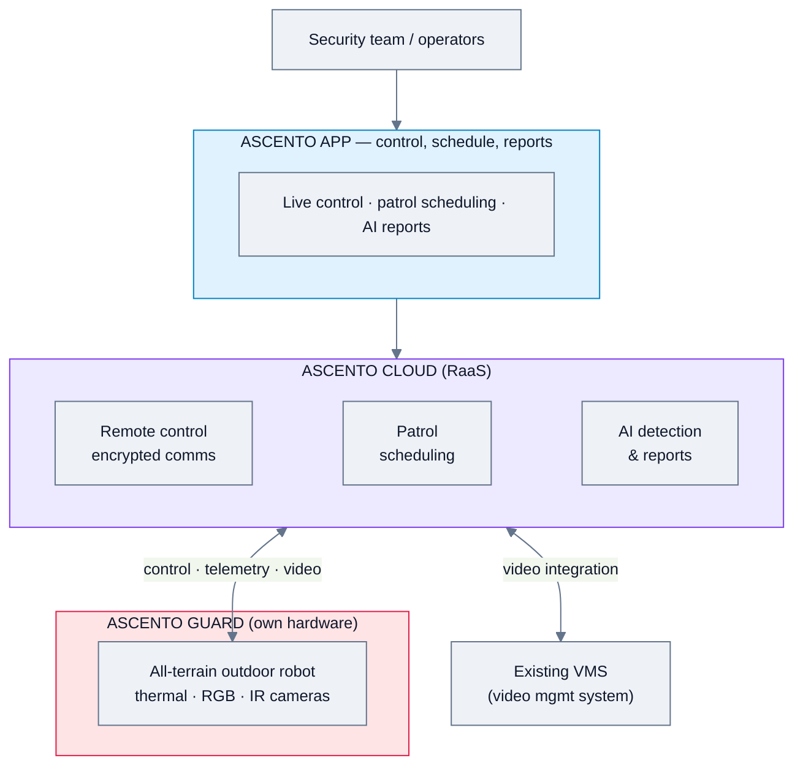
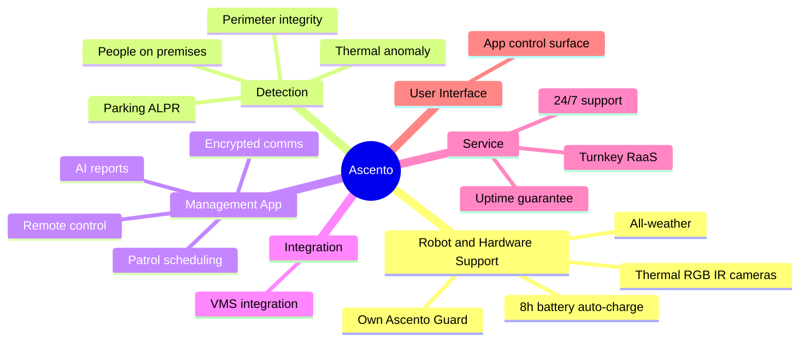
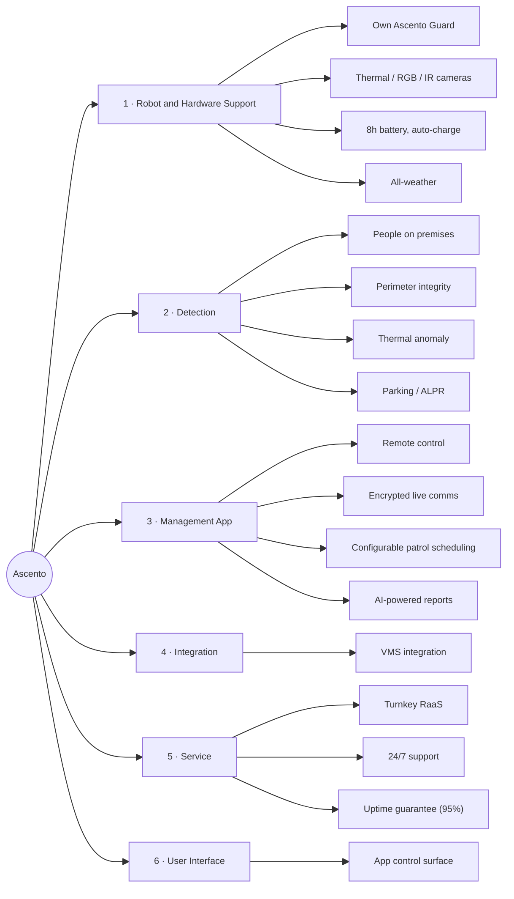
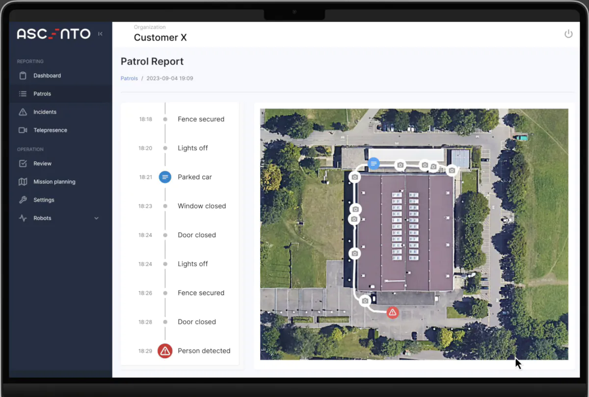
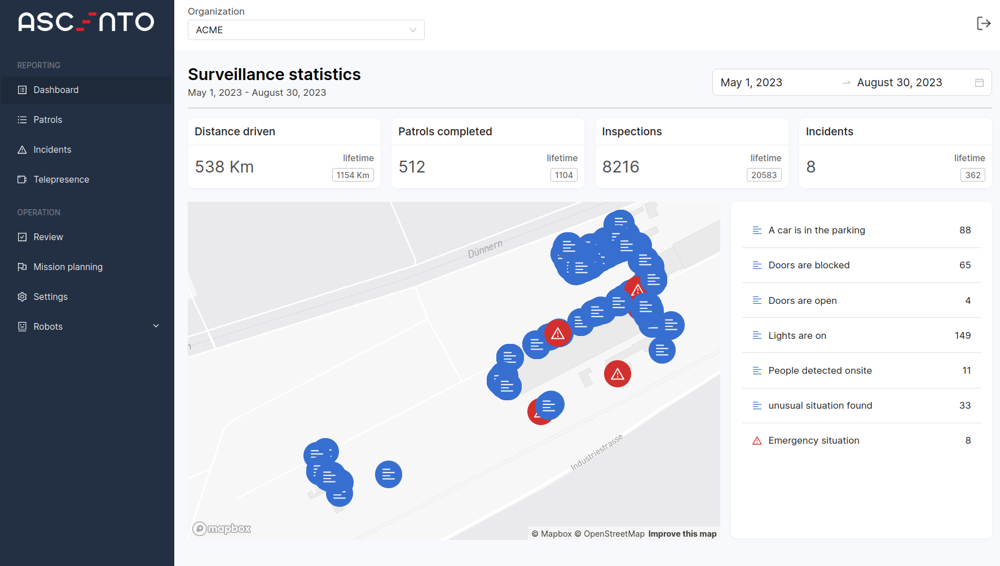

# Ascento — Feature Analysis

**Product:** Ascento Guard (outdoor security robot) + Ascento management app, delivered as RaaS
**Domain:** Security & patrol (own hardware; outdoor)
**Analysis date:** 2026-06-12
**Sources:** vendor website and public product materials.
**Evidence legend:** **[C] Confirmed** · **[L] Likely** · **[I] Inferred**.

---

## Research & Summary

Ascento (Switzerland) provides an autonomous, all-terrain **outdoor security guard robot** ("Ascento Guard") plus a management/monitoring **app**, sold as a turnkey **Robotics-as-a-Service**. The robot carries thermal/RGB/infrared cameras, runs ~8h on battery with autonomous charging, is all-weather, and performs the classic outdoor-guarding detections: people on premises, perimeter integrity, thermal anomalies, parking/ALPR, doors & windows, and property lights (10,000+ AI detections/day quoted). The FMS-relevant layer is the app: control anytime/anywhere, encrypted live communication, **configurable patrol scheduling**, AI-powered reports, and **integration with existing video management systems (VMS)**. Service is turnkey (install in hours, training, 24/7 support, 95% uptime guarantee). Evidence is Confirmed at the capability level from the website; deep config (recurrence options, API, multi-vendor) isn't published. Single-robot-type vendor (own hardware) — not a multi-vendor orchestration layer, but a close fit to the outdoor-guarding use case.

**UI quality impression (subjective):** clean mobile/app-style control surface ("control your robot anytime, anywhere") with AI reports and VMS hand-off; consumer-grade polish.

---

## System Architecture

---

## Feature Map (top 2 levels)

### Alternative layout — grouped tree (cleaner)

---

## Feature List

### 1. Robot & Hardware Support
- **1.1 Own Ascento Guard** — autonomous all-terrain outdoor robot [C]
- **1.2 Payload** — thermal, RGB, infrared cameras [C]
- **1.3 Endurance** — 8h+ battery, autonomous charging [C]
- **1.4 All-weather** — rain/snow/wind, safe autonomous speed [C]
- **1.5 Vendor-agnostic?** — No; single own robot [I]

### 2. Detection
- **2.1 Detect people on premises** [C]
- **2.2 Verify perimeter integrity** [C]
- **2.3 Thermal anomaly scanning** [C]
- **2.4 Parking control / ALPR** [C]
- **2.5 Check doors & windows; record property lights** [C]
- **2.6 ~10,000 AI detections/day** (scale) [C]

### 3. Management App (FMS layer)
- **3.1 Remote control** — anytime, anywhere [C]
- **3.2 Encrypted live communication** [C]
- **3.3 Configurable patrol scheduling** [C]
  - 3.3.1 Recurrence/calendar options [I]
- **3.4 AI-powered reports** [C]

### 4. Integration
- **4.1 VMS integration** — works with existing video management systems [C]
- **4.2 API / other integrations** — not stated [I]

### 5. Service & Commercial
- **5.1 Turnkey RaaS** — hired by the hour [C]
- **5.2 Install in hours** [C]
- **5.3 Training & onboarding** [C]
- **5.4 24/7 support; 95% uptime guarantee; fast replacements** [C]

### 6. User Interface & UX
- **6.1 App control surface** — "control your robot anytime, anywhere" [C]
- **6.2 3D/map operator view** — not detailed [I]

### 7. Deployment & Architecture
- **7.1 Cloud app + robot** [C]
- **7.2 On-prem option** — not stated [I]

#### UI Screenshots

**Control your robot**

**Web interface analytics**

---

> **Gaps / to verify:** API/integration breadth beyond VMS, scheduling recurrence detail, multi-robot fleet scaling, RBAC/SSO, on-prem, pricing specifics. Confirm via ascento.ai/resources or a demo. Outdoor single-robot focus; not a multi-vendor orchestration platform.

## Sources
- ascento.ai (home, resources)
