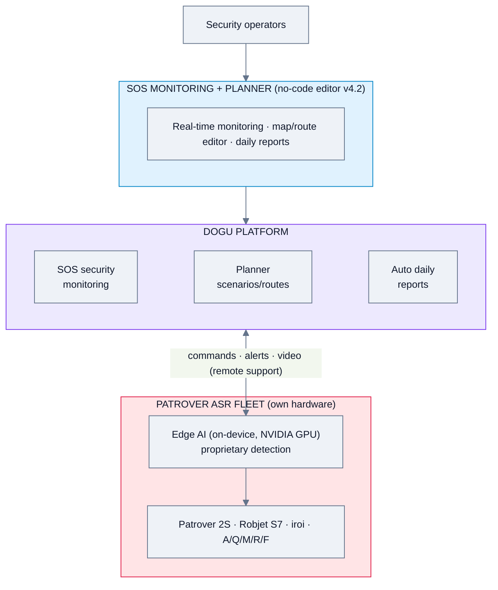
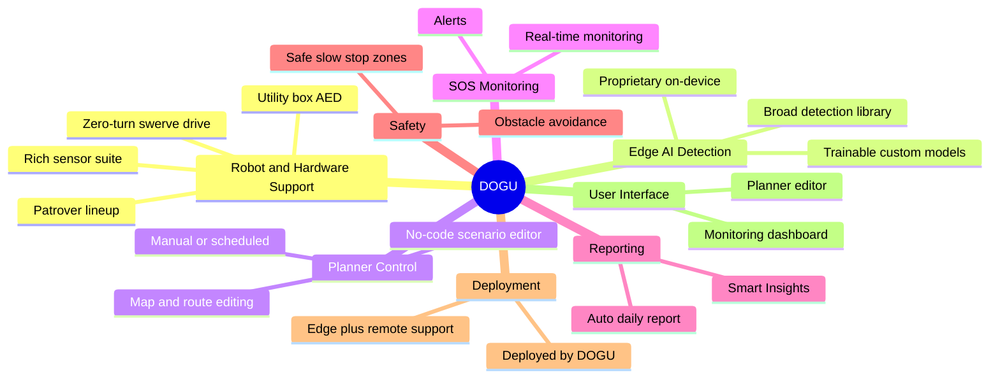
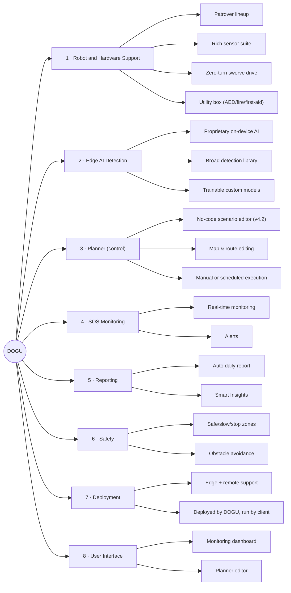
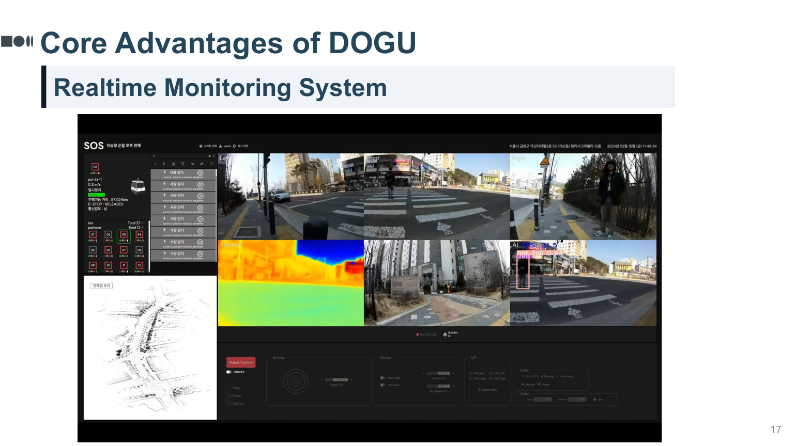
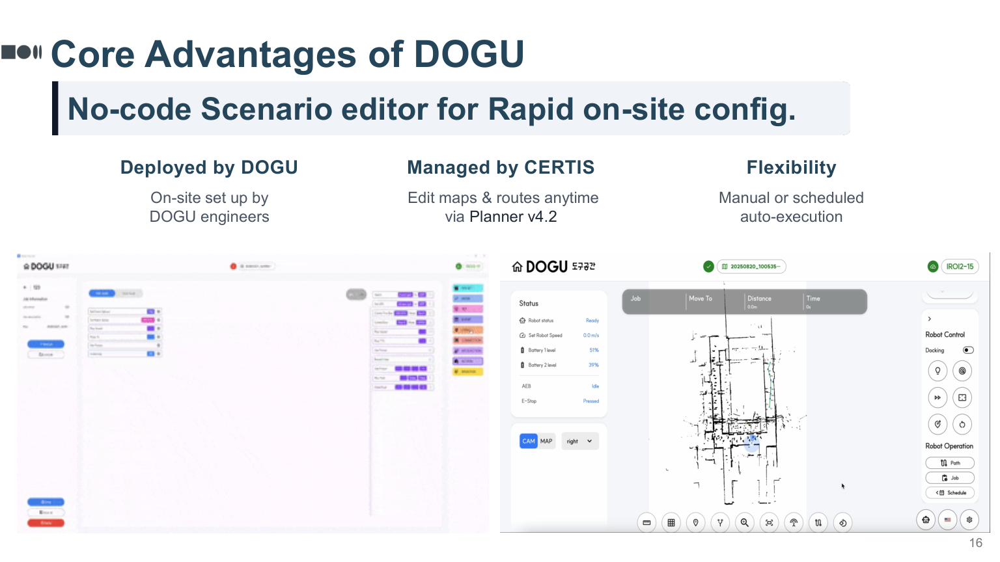
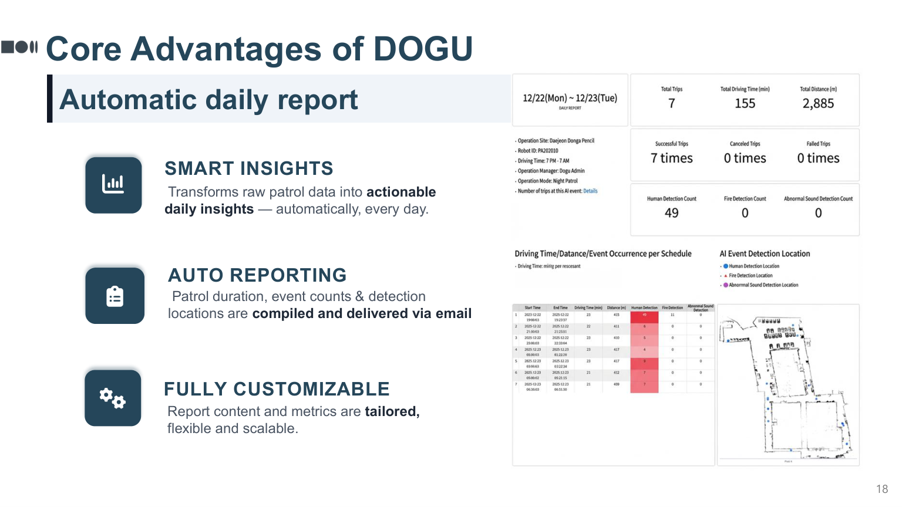

# DOGU — Feature Analysis

**Product:** Patrover ASRs + DOGU AI + SOS (monitoring) + Planner (control software)
**Domain:** Security & patrol (own hardware; edge-AI)
**Analysis date:** 2026-06-12
**Sources:** vendor website and public product materials.
**Evidence legend:** **[C] Confirmed** = stated in official or vendor materials · **[L] Likely** · **[I] Inferred**.

---

## Research & Summary

DOGU (South Korea) offers an integrated AI security-robot solution: **Patrover** autonomous patrol robots (a lineup incl. Patrover 2S, Robjet S7, iroi, and A/Q/M/R/F models), the **DOGU AI** detection stack, a **SOS** security-monitoring platform, and **Planner** — a no-code scenario/route editor (v4.2). Vendor materials document the sensor suite (3D + 2D LiDAR, four-side cameras, thermal, fire sensor, microphone, 14 ultrasonic sensors, bumper), safe/slow/stop safety zones, a swerve "zero-turn" drive, IP55 durability, an emergency utility box (first-aid kit, AED, fire extinguisher), and **proprietary on-device (edge) AI** running on NVIDIA GPUs with no third-party licensing. The AI detection library is broad (intruder, abnormal sound, fall, fire, gas/air, helmet, face, ALPR) and **trainable on demand** with an extensible PoC set (unattended bags, loitering, bicycles, e-scooters, smoking). Operations are run through SOS real-time monitoring + automatic daily reports ("SMART INSIGHTS"). This is a strong, security-specific peer; gaps are around protocols/APIs and multi-vendor support (own-hardware).

**UI quality impression (subjective):** a real-time monitoring system and a no-code Planner editor with auto daily reporting — operationally mature for guarding.

---

## System Architecture

---

## Feature Map (top 2 levels)

### Alternative layout — grouped tree (cleaner)

---

## Feature List

### 1. Robot & Hardware Support
- **1.1 Patrover ASR lineup** — Patrover 2S, Robjet S7, iroi, A/Q/M/R/F (2025–2026) [C]
- **1.2 Sensor suite** [C]
  - 1.2.1 3D LiDAR (50 m radius) + front/back 2D LiDAR [C]
  - 1.2.2 Four-side cameras, thermal camera, fire sensor, microphone [C]
  - 1.2.3 14 ultrasonic sensors, bumper, head/rear lights [C]
- **1.3 Drive system** — swerve "zero-turn" (no floor damage) [C]
- **1.4 Durability** — IP55-rated, proven 4+ years [C]
- **1.5 Emergency utility box** — first-aid kit, AED, fire extinguisher [C]
- **1.6 Vendor-agnostic?** — No; own Patrover hardware [I]

### 2. Edge AI Detection
- **2.1 Proprietary, on-device (edge) AI** — NVIDIA GPU, low-latency, no 3rd-party licensing [C]
- **2.2 Detection library (basic)** [C]
  - 2.2.1 Intruder, abnormal sound, falling/fallen [C]
  - 2.2.2 Fire, gas/air, safety helmet [C]
  - 2.2.3 Face recognition, license-plate recognition [C]
- **2.3 Extended detections (PoC)** [C]
  - 2.3.1 Unattended bags, people loitering [C]
  - 2.3.2 Bicycles, e-scooters in restricted zones [C]
  - 2.3.3 Smoking detection [C]
- **2.4 Trainable on demand** — custom models for client needs [C]

### 3. Planner (Control Software)
- **3.1 No-code scenario editor (v4.2)** [C]
  - 3.1.1 **Node-based visual flow/scenario builder** — behaviors composed as connected blocks (visual programming) [C]
- **3.2 Map & route editor ("DOGU START")** — edit maps/routes anytime; robot status list overlaid [C]
- **3.3 Execution modes** — manual or scheduled auto-execution [C]
  - 3.3.1 **Manual teleop drive controls** (on-screen control pad) [C]
  - 3.3.2 Scheduled recurrence [L]
- **3.4 On-site setup by DOGU engineers; managed by client** [C]

### 4. SOS Monitoring
- **4.1 Real-time monitoring console** [C]
  - 4.1.1 **Multi-camera live video wall** — four-side RGB feeds in a grid [C]
  - 4.1.2 **Live thermal / infrared feed** in the wall [C]
  - 4.1.3 **2D site map with live robot localization & path** [C]
  - 4.1.4 Left status sidebar (robot vitals/status) + bottom control & timeline bar [C]
- **4.2 Real-time alerts** (fire, abnormal sound, falls, intrusion) [C]

### 5. Reporting
- **5.1 Automatic daily report ("SMART INSIGHTS")** [C]
  - 5.1.1 **Metric tiles** — total patrols, patrol duration, event counts [C]
  - 5.1.2 **Per-schedule table** — driving time / distance / event occurrence per schedule (with anomaly highlighting) [C]
  - 5.1.3 **Event-detection location map** — spatial mapping of where events occurred [C]
  - 5.1.4 Delivered via email; fully customizable content/metrics [C]

### 6. Safety
- **6.1 Safety zones** — safe / slow-down / stop zones by time-to-collision [C]
- **6.2 Multi-sensor obstacle avoidance** [C]

### 7. Deployment & Architecture
- **7.1 Edge (on-device) processing + remote support** [C]
- **7.2 Deployed by DOGU, operated by client** [C]
- **7.3 Cloud/on-prem split** — not fully specified [I]

### 8. User Interface & UX
- **8.1 SOS monitoring console** — dark-theme video-wall + map + status sidebar + control bar [C]
- **8.2 Planner** — node-based flow editor + map/route editor + teleop control pad [C]
- **8.3 Report view** — metric tiles, schedule table, event-location map [C]
- **8.4 3D map view** — LiDAR 3D mapping implies spatial view (monitoring map shown is 2D) [L]

#### UI Screenshots

**SOS real-time monitoring console**

**Planner — no-code scenario / route editor**

**Automatic daily report (SMART INSIGHTS)**

---

> **Gaps / to verify:** protocol/API & VMS integration, cloud vs on-prem architecture, multi-vendor support (appears own-hardware only), RBAC/SSO, and pricing.

#
