# Knightscope — Feature Analysis

**Product:** KSOC (Knightscope Security Operations Center) + Autonomous Security Robots (ASRs)
**Domain:** Security & patrol (own-hardware RaaS)
**Analysis date:** 2026-06-12
**Sources:** vendor website and public product materials.
**Evidence legend:** **[C] Confirmed** = stated in official or vendor materials · **[L] Likely** = vendor marketing or strongly implied · **[I] Inferred** = deduced / not stated.

---

## Research & Summary

Knightscope is a US-listed (NASDAQ: KSCP) pure-play physical-security company whose fleet/operations layer is **KSOC — the Knightscope Security Operations Center**, a browser-based console included with every Autonomous Security Robot (ASR) subscription (a RaaS model). KSOC manages Knightscope's **own hardware** — K1 (stationary), K5 (outdoor mobile), K7 (multi-terrain) ASRs plus blue-light emergency devices and Automated Gunshot Detection — so it is *not* vendor-agnostic. Its strength is detection + investigation: live 360° HD video, people detection, facial recognition, thermal (fire/heat/concealed persons), and ALPR, all surfaced through a responsive desktop/tablet/mobile UI with time/location/detection filters across 240M+ delivered detections. It is a directly comparable Western peer for guarding use cases; depth is Confirmed for the KSOC feature set (official product page) but configuration-level details (alert rules, scheduling) aren't enumerated publicly and are tagged Likely/Inferred.

**UI quality impression (subjective):** polished, security-operations-center styling; responsive across devices with strong evidence/video review tooling. Real KSOC screenshots are available on the product page.

---

## System Architecture

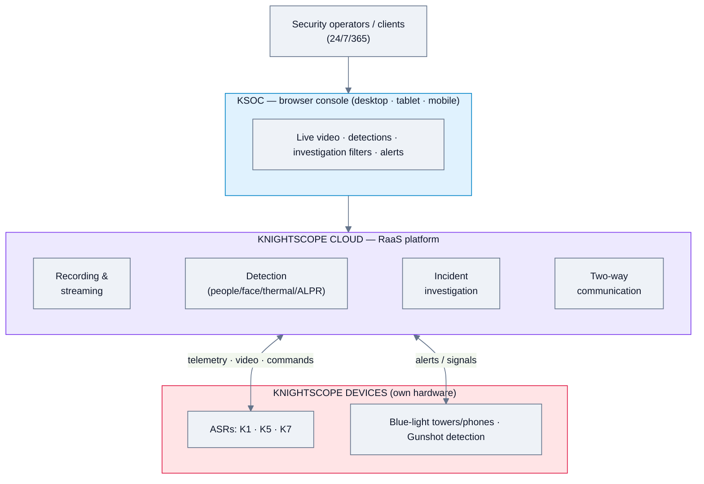

---

## Feature Map (top 2 levels)

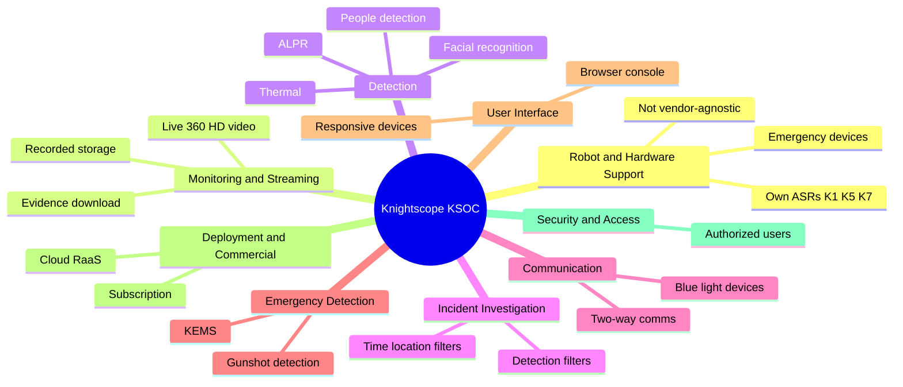

### Alternative layout — grouped tree (cleaner)

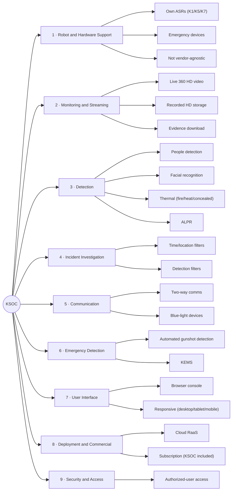

---

## Feature List

### 1. Robot & Hardware Support
- **1.1 Own Autonomous Security Robots** [C]
  - 1.1.1 K1 Hemisphere (stationary) [C]
  - 1.1.2 K5 (outdoor mobile) [C]
  - 1.1.3 K7 (multi-terrain) [C]
- **1.2 Emergency communication devices** — blue-light towers, e-phones, call boxes [C]
- **1.3 Vendor-agnostic?** — No; KSOC manages Knightscope hardware only [C]

### 2. Monitoring & Streaming
- **2.1 Live video** — 360° HD [C]
- **2.2 Recorded HD video storage** [C]
- **2.3 Evidence export** — downloadable files [C]

### 3. Detection
- **3.1 People detection** [C]
  - 3.1.1 Off-hours detection [C]
  - 3.1.2 Restricted-area alerts [C]
- **3.2 Facial recognition** [C]
  - 3.2.1 VIP / key-person alerts [C]
  - 3.2.2 User-generated watchlists [C]
- **3.3 Thermal** [C]
  - 3.3.1 Fire detection [C]
  - 3.3.2 Vehicle heat blooms [C]
  - 3.3.3 People concealed in darkness [C]
- **3.4 ALPR (license plate recognition)** [C]
  - 3.4.1 Approved/denied plate lists [C]
  - 3.4.2 Parking monitoring [C]

### 4. Incident Investigation
- **4.1 Investigation tooling** [C]
  - 4.1.1 Filter by time / location / detection type [C]
  - 4.1.2 240M+ detections delivered (scale) [C]

### 5. Communication
- **5.1 Two-way communication** via ASR [C]
- **5.2 Blue-light emergency integration** [C]

### 6. Emergency Detection (related modules)
- **6.1 Automated Gunshot Detection (AGD)** [C]
- **6.2 Knightscope Emergency Management System (KEMS)** [C]
- **6.3 Risk & Threat Exposure (RTX) monitoring** [C]

### 7. User Interface & UX
- **7.1 Browser-based console** [C]
- **7.2 Responsive** — desktop / tablet / mobile [C]
- **7.3 3D/map operator view** — not detailed [I]

### 8. Deployment & Commercial
- **8.1 Cloud (RaaS)** — KSOC included with every subscription [C]
- **8.2 Hourly/subscription pricing** [L]

### 9. Security & Governance
- **9.1 Authorized-user access** [C]
- **9.2 SSO / RBAC specifics** — not stated [I]

#### UI Screenshots

**Agd screenshot**
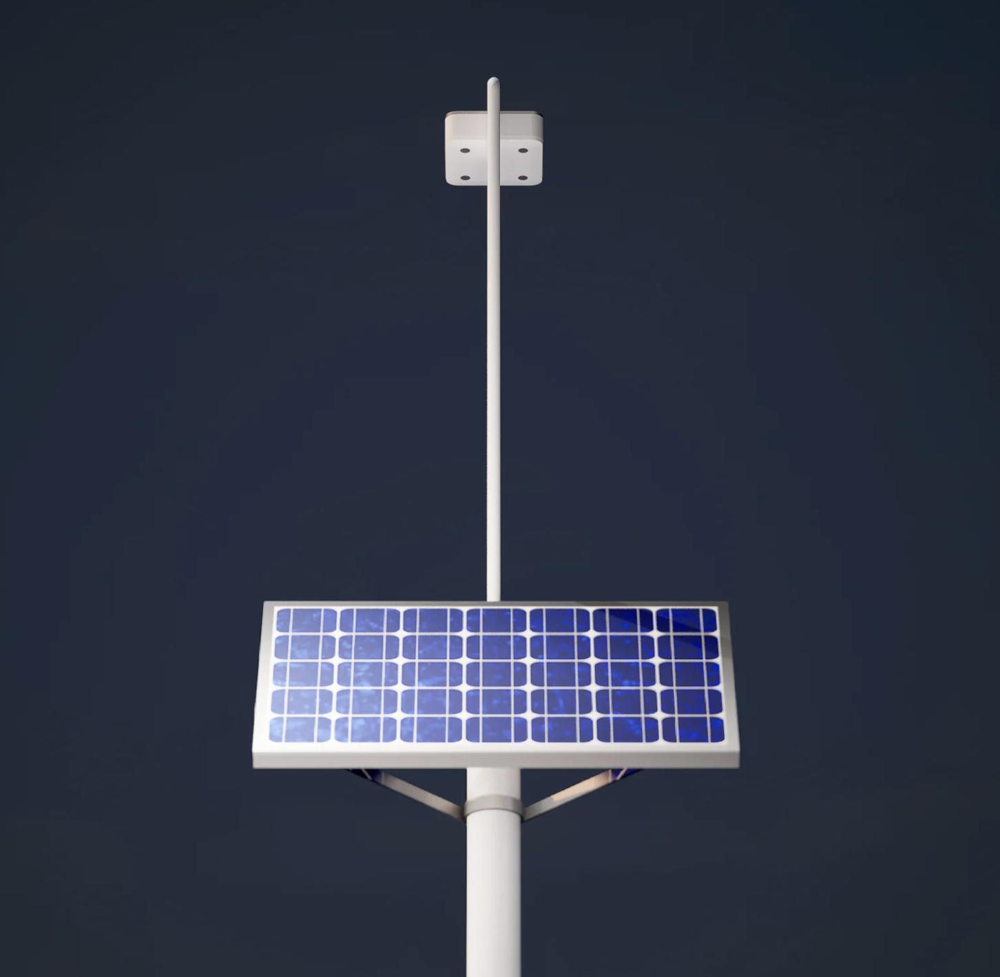

**Kems console**
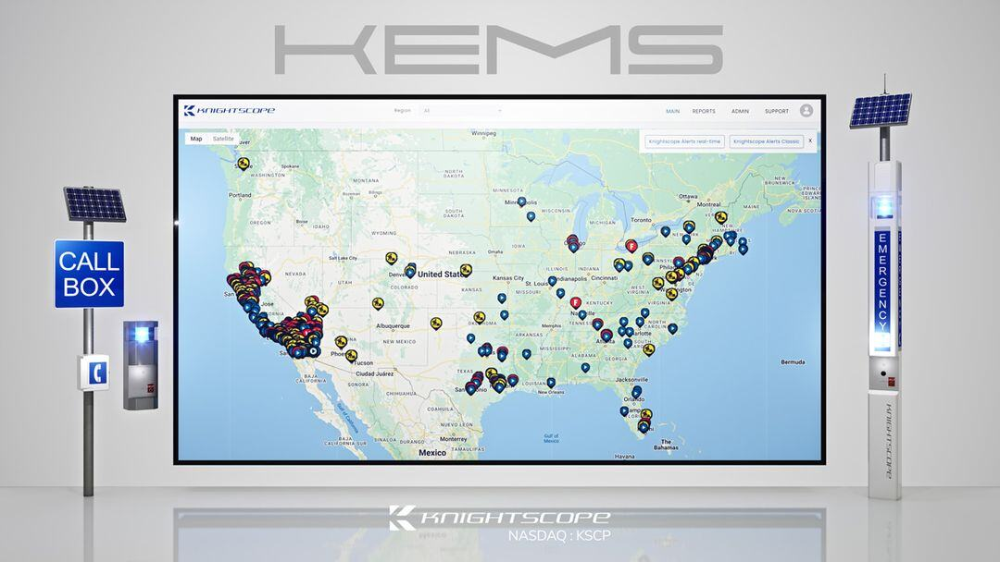

**Kems laptop mockup**
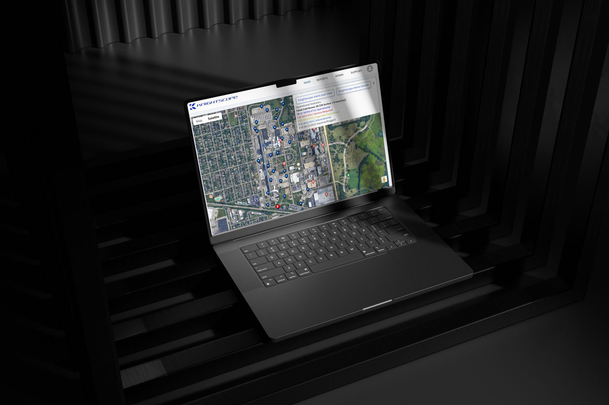

**Ksoc desktop laptop**

**Ksoc section**
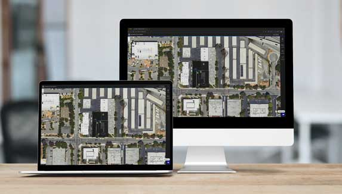

**Msp platform screenshot**
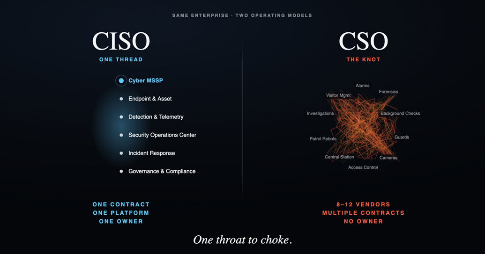

**Rtx security center**
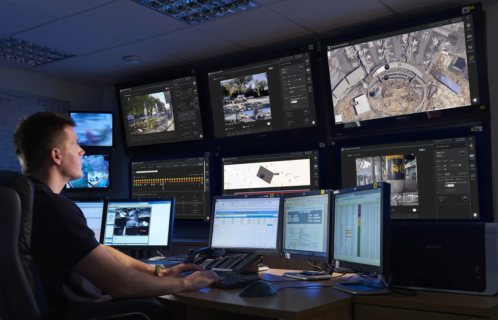

**Tech spec screenshot**
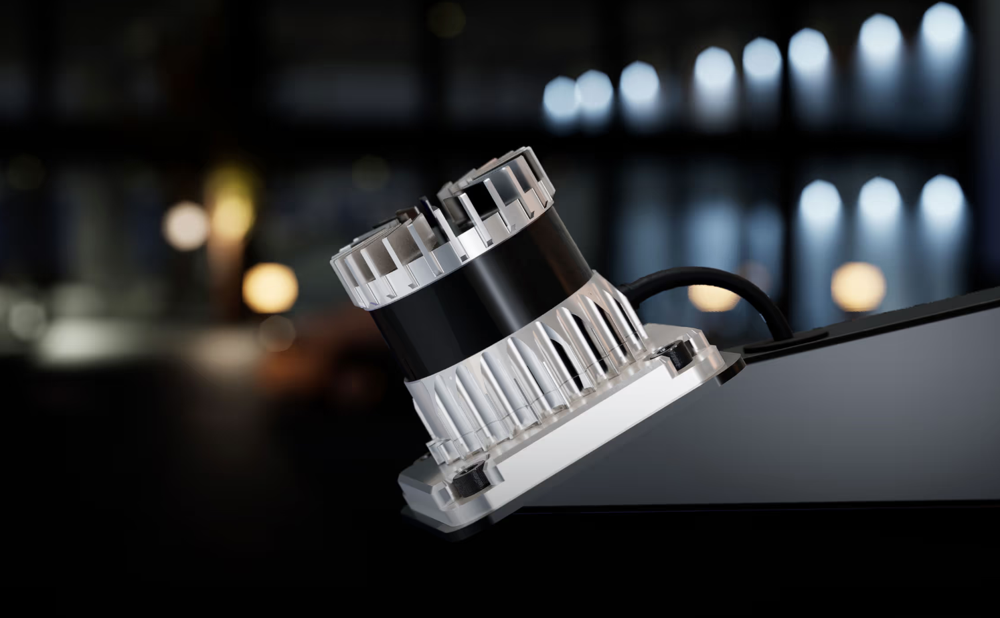

**Asf escalation model**
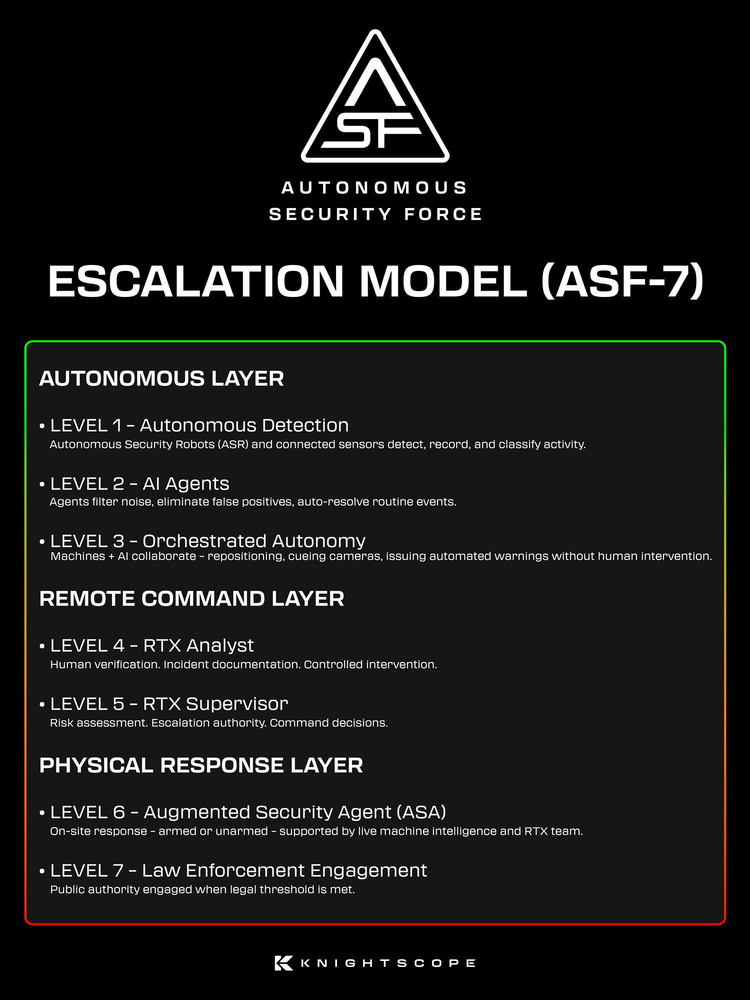

**Asf graphic**
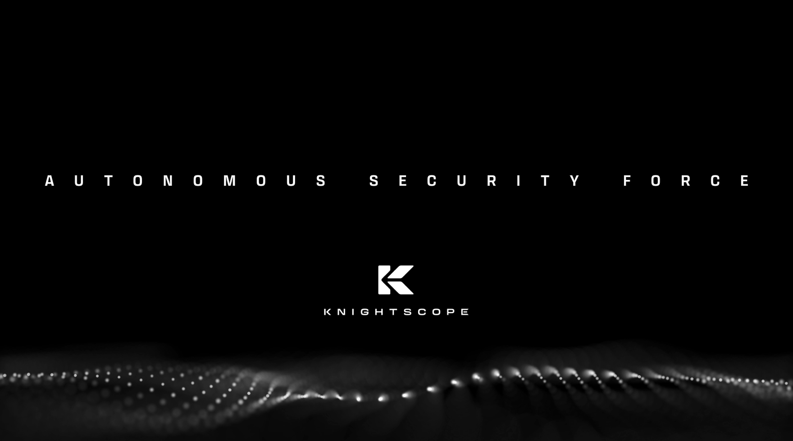

**Msp one throat**
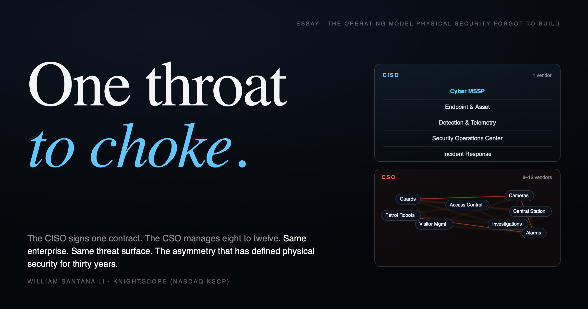

---

> **Gaps / to verify:** patrol-route scheduling/recurrence, alert-rule configuration, VMS/third-party integration, API availability, SSO/RBAC, and pricing specifics. Confirm via Knightscope spec sheets (knightscope.com/tech) or a demo. Note: own-hardware only — no multi-vendor management.

## Sources
- knightscope.com/products/ksoc, knightscope.com/tech (spec sheets)
