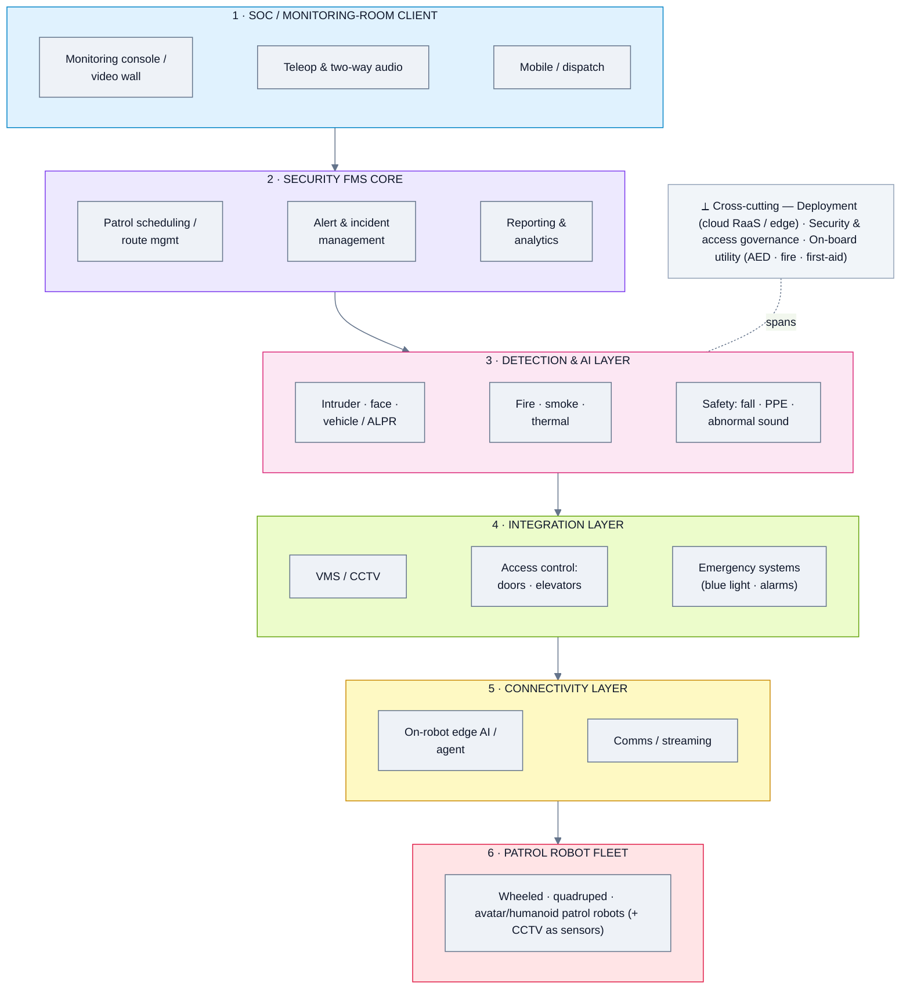
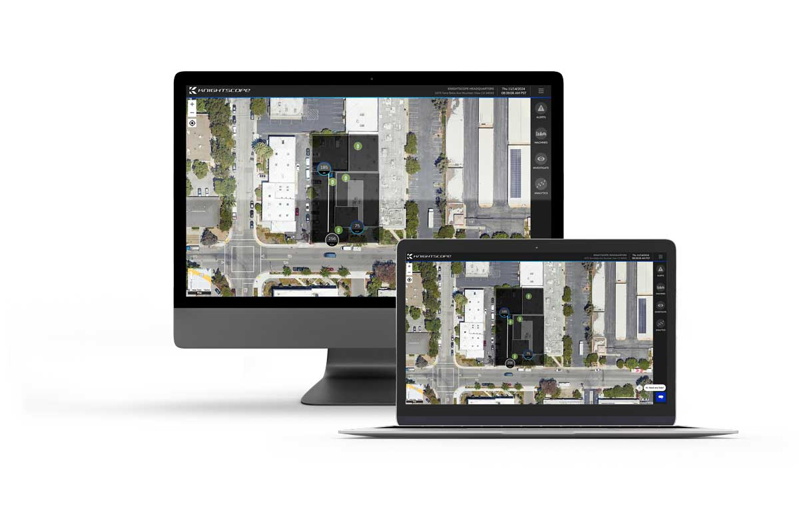
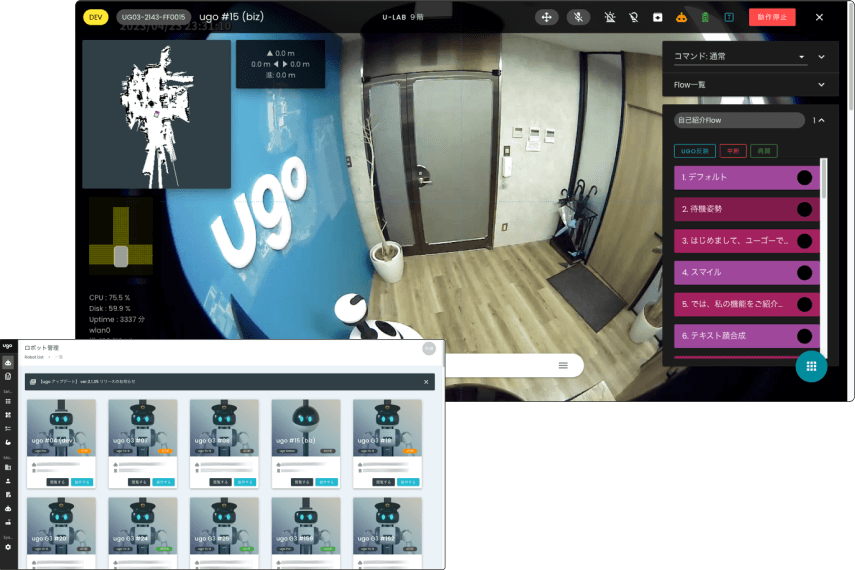
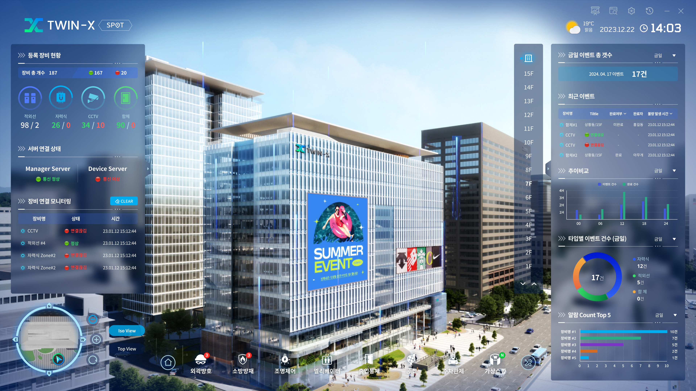

# Security & Patrol FMS — Domain Analysis

*Domain summary for the four "Security" fleet-management platforms. For per-product depth, open each product's analysis below.*

**Analysis date:** 2026-06-12

**Products in this domain (top 4):**

| Product | Feature analysis | Folder | One-line positioning |
|---|---|---|---|
| **Knightscope** | [📄 Feature_Analysis](./Knightscope/Feature_Analysis.md) | [📁 Knightscope](./Knightscope/) | Autonomous Security Robots + KSOC console (RaaS, own hardware) |
| **ugo** | [📄 Feature_Analysis](./ugo/Feature_Analysis.md) | [📁 ugo](./ugo/) | Avatar/DX robots + platform that also manages 3rd-party robots & CCTV |
| **DOGU** | [📄 Feature_Analysis](./DOGU/Feature_Analysis.md) | [📁 DOGU](./DOGU/) | Patrover patrol robots + edge-AI + SOS monitoring + Planner |
| **Ascento** | [📄 Feature_Analysis](./Ascento/Feature_Analysis.md) | [📁 Ascento](./Ascento/) | Outdoor guard robot + app, turnkey RaaS, VMS-integrated |

---

## 1. Domain overview

Security & patrol FMS are **detection-centric, mostly own-hardware** platforms: each vendor pairs autonomous patrol robots with a monitoring console (a security-operations-center view) and an AI detection stack. The job isn't just moving robots — it's **detecting threats and safety events** (intruders, fire/smoke, falls, abnormal sounds, unauthorized vehicles, PPE/compliance) and routing **alerts** to a monitoring room, often with two-way audio and live video. This is the domain closest to a core guarding mission.

Centres of gravity differ:
- **Knightscope** — mature **SOC console (KSOC)** + cloud AI over its own ASRs; strong recording/streaming, facial recognition, ALPR, thermal.
- **ugo** — the most **vendor-agnostic** here: its platform manages ugo robots **plus third-party robots and CCTV**, blends teleoperation + autonomy, and adds **inspection** (meter reading).
- **DOGU** — **edge-AI on-device** (NVIDIA), proprietary trainable detection, a node-based **Planner** scenario editor, and auto daily reports.
- **Ascento** — single **outdoor** guard robot delivered as turnkey RaaS, with patrol scheduling and **VMS integration**.

---

## 2. Domain reference architecture (reference pattern)

*Reference pattern of the stable layers a security/patrol FMS needs — note the added **detection/alerting** layer and the **SOC / monitoring-room** client vs. the generic pattern.*

**Key difference from the generic pattern:** 
- a dedicated **detection & AI layer** (3) is the heart of the product, 
- the client (1) is a **monitoring-room / SOC** experience (video wall, alerts, two-way audio) rather than a logistics console.

---

## 3. Architecture differences (major approaches)

| Axis | Knightscope | ugo | DOGU | Ascento |
|---|---|---|---|---|
| **Hardware model** | Own ASRs only | Own + **3rd-party robots & CCTV** | Own Patrover | Own outdoor robot |
| **AI location** | Cloud | Cloud + teleop | **Edge (on-device, NVIDIA)** | On-robot + cloud app |
| **Autonomy vs teleop** | Autonomous | **Hybrid teleop + autonomy** | Autonomous | Autonomous |
| **Environment** | Indoor + outdoor | Indoor (buildings) | Indoor + outdoor | **Outdoor** |
| **Distinctive** | Mature SOC (KSOC), ALPR/face | Manages mixed estate + inspection | Edge AI, node Planner, daily reports | Turnkey RaaS, VMS integration |

Notable variations:
- **ugo** is structurally different — it's the only one acting as a **partial generic FMS** (manages other robots + CCTV), pushing it toward the "Generic" domain.
- **DOGU** pushes AI to the **edge** (low-latency, privacy) rather than cloud, and exposes a **node-based scenario editor** — an unusually flexible behaviour-authoring layer.
- **Knightscope** is the most **SOC-mature** but the most **closed** (own hardware only).
- **Ascento** is the narrowest (one outdoor robot) but cleanly **VMS-integrated** into existing security stacks.

---

## 4. Aggregated feature list (domain superset + commonality)

Legend: **✓** present · **◑** partial / implied · **✗** not evident. "Common core" = present (✓/◑) across all four.

| Feature group / sub-feature | Knightscope | ugo | DOGU | Ascento | Common core? |
|---|:--:|:--:|:--:|:--:|:--:|
| **Robot & hardware support** | | | | | |
| &nbsp;&nbsp;— Own patrol robot(s) | ✓ | ✓ | ✓ | ✓ | ✅ |
| &nbsp;&nbsp;— Manages 3rd-party robots / CCTV | ✗ | ✓ | ✗ | ◑ | — |
| &nbsp;&nbsp;— Manipulation / robot arm | ✗ | ✓ | ✗ | ✗ | — |
| **Patrol & mission management** | | | | | |
| &nbsp;&nbsp;— Scheduled patrols | ✓ | ✓ | ✓ | ✓ | ✅ |
| &nbsp;&nbsp;— Route / map editor | ◑ | ✓ | ✓ | ◑ | ✅ |
| &nbsp;&nbsp;— Scenario / behaviour editor (no-code) | ✗ | ◑ | ✓ | ✗ | — |
| &nbsp;&nbsp;— Auto-recharge | ◑ | ✓ | ✓ | ✓ | ✅ |
| **Detection & AI** | | | | | |
| &nbsp;&nbsp;— Intruder / people detection | ✓ | ✓ | ✓ | ✓ | ✅ |
| &nbsp;&nbsp;— Facial recognition | ✓ | ◑ | ✓ | ◑ | ✅ |
| &nbsp;&nbsp;— ALPR (license plate) | ✓ | ◑ | ✓ | ✓ | ✅ |
| &nbsp;&nbsp;— Fire / smoke | ✓ | ✓ | ✓ | ◑ | ✅ |
| &nbsp;&nbsp;— Thermal anomaly | ✓ | ✓ | ✓ | ✓ | ✅ |
| &nbsp;&nbsp;— Safety: fall / PPE / abnormal sound | ◑ | ◑ | ✓ | ◑ | ✅ |
| &nbsp;&nbsp;— Trainable custom models | ◑ | ◑ | ✓ | ◑ | ✅ |
| &nbsp;&nbsp;— Edge (on-device) AI | ◑ | ◑ | ✓ | ◑ | ✅ |
| **Monitoring & SOC** | | | | | |
| &nbsp;&nbsp;— Real-time monitoring console | ✓ | ✓ | ✓ | ✓ | ✅ |
| &nbsp;&nbsp;— Multi-camera video wall | ✓ | ◑ | ✓ | ◑ | ✅ |
| &nbsp;&nbsp;— Live video streaming + recording | ✓ | ✓ | ✓ | ✓ | ✅ |
| &nbsp;&nbsp;— Alerts (real-time) | ✓ | ✓ | ✓ | ✓ | ✅ |
| &nbsp;&nbsp;— Incident investigation | ✓ | ◑ | ✓ | ◑ | ✅ |
| **Teleop & comms** | | | | | |
| &nbsp;&nbsp;— Teleoperation / remote control | ◑ | ✓ | ◑ | ✓ | ✅ |
| &nbsp;&nbsp;— Two-way audio / live calls | ✓ | ✓ | ◑ | ◑ | ✅ |
| **Reporting & analytics** | | | | | |
| &nbsp;&nbsp;— Automated reports | ◑ | ✓ | ✓ | ✓ | ✅ |
| &nbsp;&nbsp;— Event-location maps / KPIs | ◑ | ◑ | ✓ | ✓ | ✅ |
| **Integration** | | | | | |
| &nbsp;&nbsp;— VMS / CCTV | ◑ | ✓ | ◑ | ✓ | ✅ |
| &nbsp;&nbsp;— Access control (doors / elevators) | ✗ | ✓ | ◑ | ◑ | — |
| &nbsp;&nbsp;— Emergency devices (blue light / alarms) | ✓ | ◑ | ◑ | ◑ | ✅ |
| **Inspection (cross-over)** | | | | | |
| &nbsp;&nbsp;— Meter reading / asset inspection | ✗ | ✓ | ◑ | ✗ | — |
| **UI & UX** | | | | | |
| &nbsp;&nbsp;— Web / browser console | ✓ | ✓ | ✓ | ✓ | ✅ |
| &nbsp;&nbsp;— Mobile / responsive | ✓ | ◑ | ◑ | ✓ | ✅ |
| **Deployment** | | | | | |
| &nbsp;&nbsp;— Cloud / RaaS | ✓ | ✓ | ◑ | ✓ | ✅ |
| &nbsp;&nbsp;— Edge / on-prem | ◑ | ◑ | ✓ | ◑ | ✅ |
| **Safety** | | | | | |
| &nbsp;&nbsp;— E-stop / safety zones | ◑ | ◑ | ✓ | ◑ | ✅ |
| &nbsp;&nbsp;— On-board utility (AED / fire / first-aid) | ✗ | ✗ | ✓ | ✗ | — |

**Domain "common core":** scheduled patrols, intruder/people + thermal + ALPR + fire detection, a real-time monitoring console with live video + alerts, teleop/two-way audio, automated reports, and cloud-or-edge deployment.

**Differentiators:** managing 3rd-party robots + CCTV and meter-reading inspection (ugo), edge on-device AI + no-code Planner + on-board AED/utility (DOGU), SOC maturity + facial/ALPR depth (Knightscope), outdoor-RaaS + clean VMS integration (Ascento).

---

## 5. Representative UI (one per product)

| Knightscope — KSOC console | ugo — platform |
|---|---|
|  |  |

| DOGU — monitoring dashboard | Ascento — web analytics |
|---|---|
|  |  |

*(More per-product screenshots in each product's analysis.)*

---

## 6. Takeaways

- This domain maps most directly onto the **guarding** mission; all four do patrol + detect + alert.
- **DOGU** is strongly deployment-oriented (edge AI, custom-trainable detections, on-board AED) — a strong fit for a turnkey patrol robot + console.
- **ugo** is the most **platform-like** (manages mixed robots + CCTV, adds inspection) — closest to a guarding *and* facilities play, and the bridge to the Generic domain.
- **Knightscope** offers the most mature SOC tooling but is **closed hardware** and US-centric.
- **Ascento** suits a **specific outdoor-perimeter** need with existing VMS.
- Unlike Generic FMS, most of these are **own-hardware RaaS** — a robot+software service rather than a brand-agnostic console (except ugo's partial agnosticism).

---

*Sources: each product's `Feature_Analysis.md` (and the vendor pages / decks / images cited therein).*
