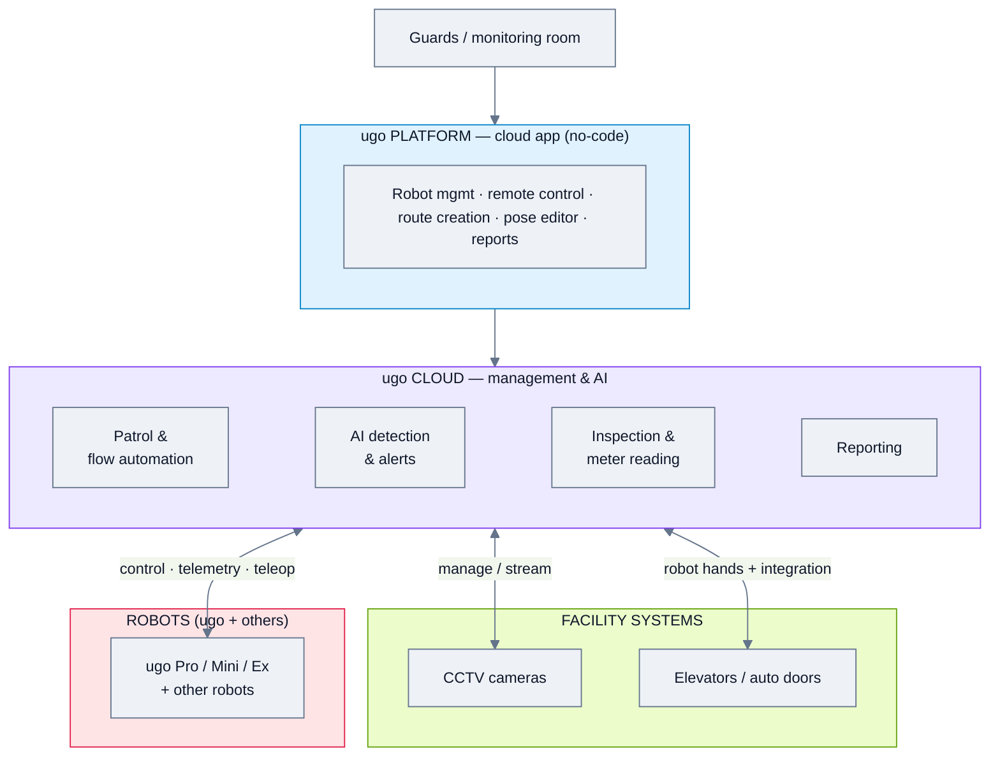
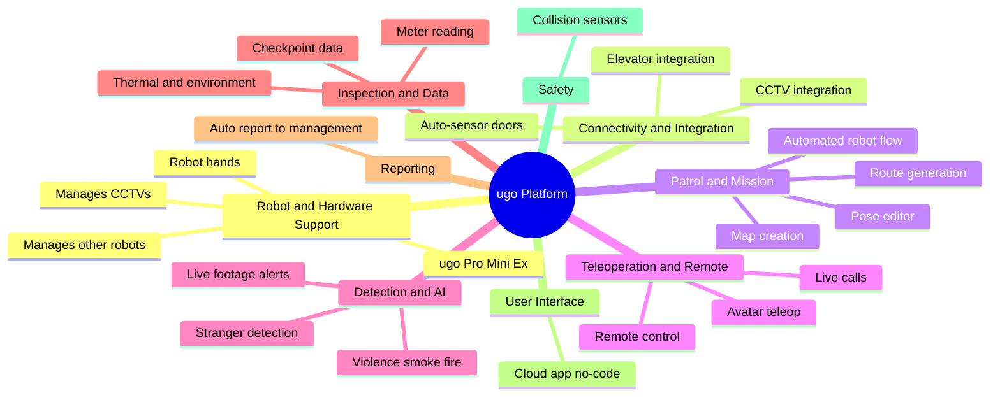
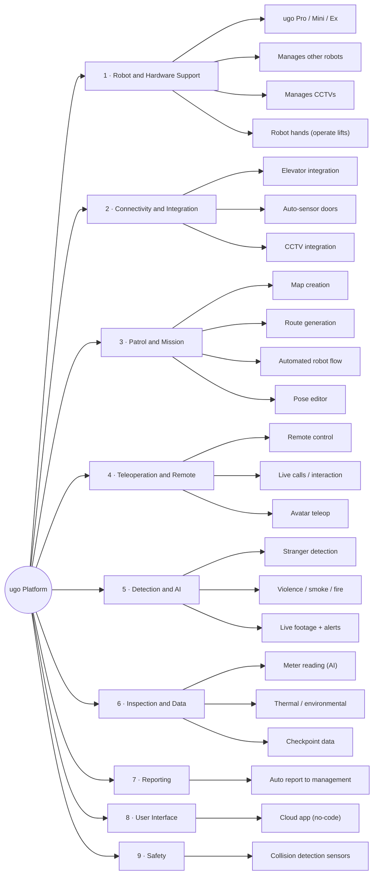

# ugo — Feature Analysis

**Product:** ugo robots (Pro / Mini / Ex) + ugo Platform (integrated robot management)
**Domain:** Security & patrol + inspection (own hardware, but platform manages 3rd-party robots & CCTV)
**Analysis date:** 2026-06-12
**Sources:** vendor website and public product materials.
**Evidence legend:** **[C] Confirmed** = stated in official or vendor materials · **[L] Likely** = vendor marketing or strongly implied · **[I] Inferred** = deduced / not stated.

---

## Research & Summary

ugo (Japan) builds avatar/DX robots (ugo Pro, ugo Mini, ugo Ex) that act as security + inspection assistants, plus the **ugo Platform** — a cloud application for integrated robot management. A distinctive trait is that the platform manages **ugo robots AND other robots, including CCTVs**, giving it partial vendor-agnostic reach, and the robots are a **hybrid of teleoperation and autonomy** (human-like, with robot hands that can operate lifts and trigger auto-sensor doors). For security it patrols, detects strangers/violence/smoke/fire, streams live footage to a monitoring room, and supports live two-way calls; for inspection it reads analog/digital meters (AI-converted to data), captures thermal/environmental readings, and auto-compiles checkpoint reports. The platform offers map creation + route generation, automated robot "flows," a pose editor, scheduling, and no-code usability. Evidence is Confirmed at the capability level (distributor product page + notes) but deep configuration (recurrence rules, protocol list) is not enumerated. Combines patrol + inspection + CCTV under one console — a strong security-plus-facilities fit.

**UI quality impression (subjective):** the ugo Platform shows dedicated screens for robot management/remote control, automated flow setup, map creation, and a pose editor — operationally complete; real screenshots exist on the distributor page.

---

## System Architecture

---

## Feature Map (top 2 levels)

### Alternative layout — grouped tree (cleaner)

---

## Feature List

### 1. Robot & Hardware Support
- **1.1 Own robot models** — ugo Pro (full), ugo Mini (compact), ugo Ex [C]
- **1.2 Manages third-party robots** [C]
- **1.3 Manages CCTVs** [C]
- **1.4 Robot hands / manipulation** — operate lifts, wave at auto-sensor doors [C]
- **1.5 LiDAR mapping** [C]

### 2. Connectivity & Integration
- **2.1 Elevator / lift integration** (physical + system) [C]
- **2.2 Auto-sensor door operation** [C]
- **2.3 CCTV integration** [C]
- **2.4 Protocol list** — not stated [I]

### 3. Patrol & Mission
- **3.1 Map creation** — LiDAR-based building mapping [C]
- **3.2 Route generation** — create pre-set patrol routes [C]
- **3.3 Automated robot flow** — set up automated sequences [C]
- **3.4 Pose editor** [C]
- **3.5 Scheduling** [L]
  - 3.5.1 Recurrence rules [I]

### 4. Teleoperation & Remote
- **4.1 Remote management & control** [C]
- **4.2 Live communication (calls)** [C]
- **4.3 Avatar teleop + autonomy hybrid** [C]
- **4.4 Multi-screen remote monitoring** [C]

### 5. Detection & AI
- **5.1 Threat detection** [C]
  - 5.1.1 Strangers / intruders [C]
  - 5.1.2 Violent behavior [C]
  - 5.1.3 Smoke / fire [C]
- **5.2 Live footage to monitoring room + alerts** [C]
- **5.3 Image/video capture for records** [C]

### 6. Inspection & Data
- **6.1 Meter reading** — analog/digital → digital data via AI [C]
- **6.2 Thermal camera data capture** [C]
- **6.3 Environmental sensor data** [C]
- **6.4 Checkpoint data along route** [C]

### 7. Reporting
- **7.1 Automatic report compilation** — sent to management [C]

### 8. User Interface & UX
- **8.1 Cloud-based app** [C]
- **8.2 No-code / intuitive (no programming)** [C]
- **8.3 Modules** — robot mgmt, remote control, flow automation, map creation, pose editor, reports [C]

### 9. Safety
- **9.1 Collision detection sensors** [C]

### 10. Deployment & Commercial
- **10.1 Cloud-based platform** [C]
- **10.2 Hybrid robot + human operations; scalable** [C]
- **10.3 Cost reduction >50%** claim [C]

#### UI Screenshots

**Pose editor**

**Create patrol route**

---

> **Gaps / to verify:** protocol/integration list (ROS/VDA5050/REST/API), exact scheduling/recurrence options, which third-party robots are supported, on-prem vs cloud, security/RBAC, pricing. Confirm via ugo.plus or a vendor demo.

## Sources
- ourglass.com.sg/ugo-robot (distributor), ugo.plus
