# BlueBotics — Feature Analysis

**Product:** ANT navigation technology + ANT server (fleet manager) + ANT lab (config)
**Domain:** Warehouse & intralogistics — navigation tech + fleet management (vendor-agnostic via VDA5050)
**Analysis date:** 2026-06-12
**Sources:** vendor website and public product materials.
**Evidence legend:** **[C] Confirmed** · **[L] Likely** · **[I] Inferred**.

---

## Research & Summary

BlueBotics (Switzerland, a ZAPI Group company) is a **vehicle-navigation partner**: it provides **ANT** (Autonomous Navigation Technology) and **ANT server**, its mission/fleet-management software, for AGVs, automated forklifts, AMRs, and service robots. Its scale is notable — 6,000+ ANT-driven vehicles, 2,000+ installations, 150+ vehicle types automated — and ANT server adds **VDA5050** support so it can manage not only ANT-driven vehicles but also VDA5050-compliant AGVs/AMRs from non-ANT brands (vendor-agnostic reach). The ANT stack spans navigation (natural-feature, ±1 cm/±1°, minimal infrastructure, fast commissioning), configuration/mapping (**ANT lab**), localization variants (ANT lite+, localization/+, locator, outdoor GNSS), and fleet orchestration (mission/order management, traffic control, routing). It is primarily a navigation+fleet layer that integrators embed into vehicles, not a turnkey security/inspection product. Evidence is Confirmed at the capability level (website); deep operator-UI specifics are thinner.

---

## System Architecture

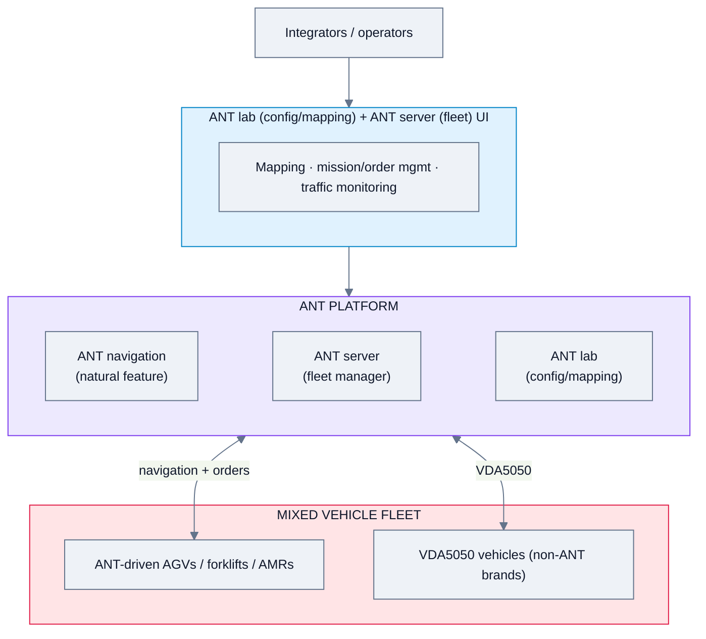

---

## Feature Map (top 2 levels)

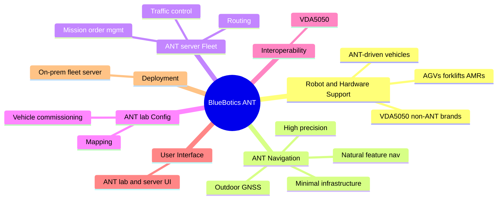

### Alternative layout — grouped tree (cleaner)

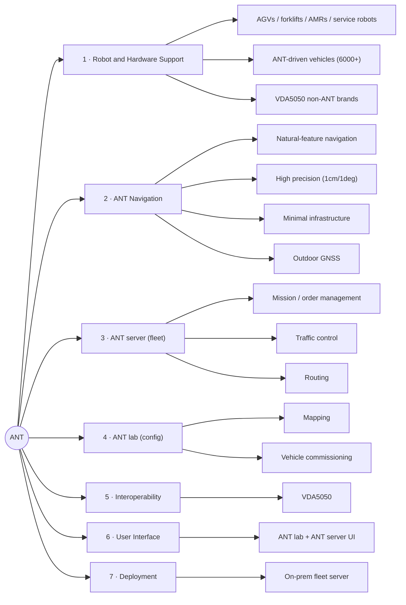

---

## Feature List

### 1. Robot & Hardware Support
- **1.1 Vehicle types** — AGVs, automated forklifts, AMRs, service robots [C]
- **1.2 ANT-driven vehicles** — 6,000+ in operation, 150+ vehicle types [C]
- **1.3 Vendor-agnostic via VDA5050** — manage non-ANT brands [C]

### 2. ANT Navigation
- **2.1 Natural-feature navigation** [C]
  - 2.1.1 Accuracy ±1 cm / ±1° [C]
  - 2.1.2 Minimal infrastructure changes [C]
  - 2.1.3 Fast commissioning (days) [C]
- **2.2 Localization variants** — ANT lite+, ANT localization/+, ANT locator [C]
- **2.3 Outdoor GNSS navigation** [C]

### 3. ANT server (Fleet Manager)
- **3.1 Mission / order management** [C]
- **3.2 Traffic control** [C]
- **3.3 Routing across mixed vehicles** [C]

### 4. ANT lab (Configuration)
- **4.1 Mapping / routing setup** [C]
- **4.2 Vehicle commissioning** [C]

### 5. Interoperability
- **5.1 VDA5050 support** — manage ANT + non-ANT VDA5050 vehicles [C]

### 6. User Interface & UX
- **6.1 ANT lab (config) + ANT server (fleet) interfaces** [C]
- **6.2 Map-based** [L]

### 7. Deployment & Architecture
- **7.1 On-prem fleet server** [L]
- **7.2 Cloud option** — not confirmed [I]

### 8. Connectivity & Protocols
- **8.1 VDA5050** [C]
- **8.2 API / integration** [L]

### 9. Commercial Model
- **9.1 Navigation technology + fleet software licensing** (for OEMs/integrators) [L]

#### UI Screenshots

**Ant lab software overview**

**Ant lab step1 configure vehicle**
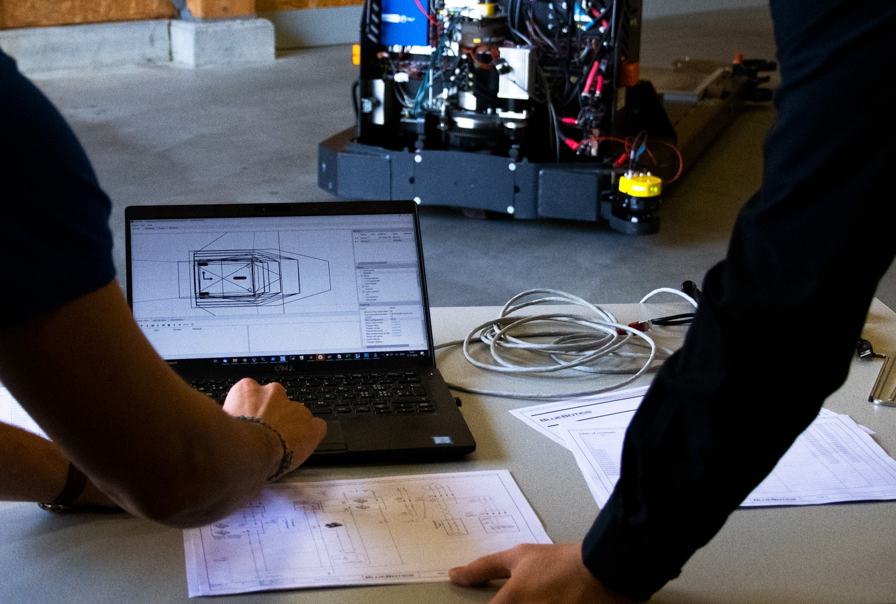

**Ant lab step2 calibrate laser**
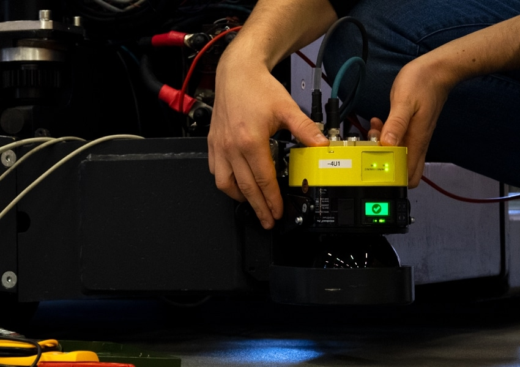

**Ant lab step3 create map**
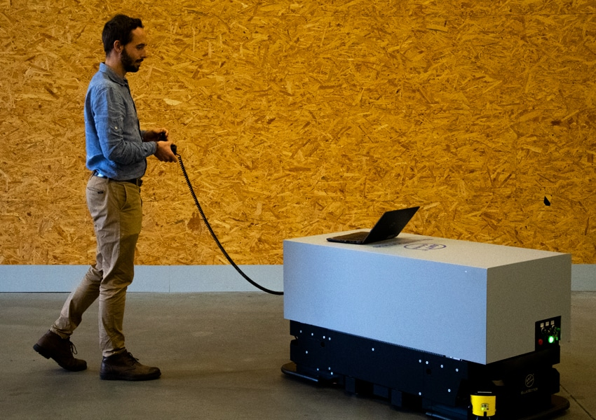

**Ant lab step4 define routes**
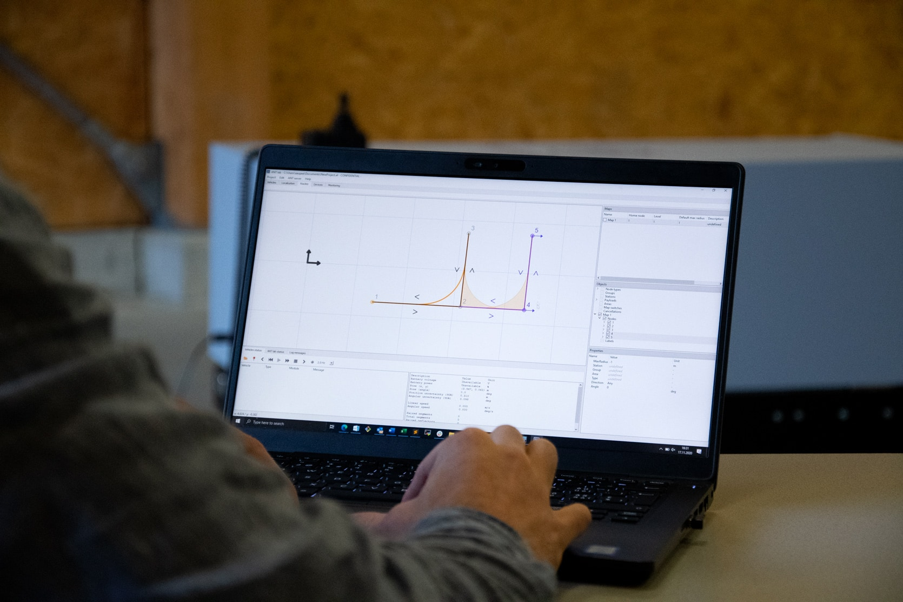

**Ant lab step5 define actions**
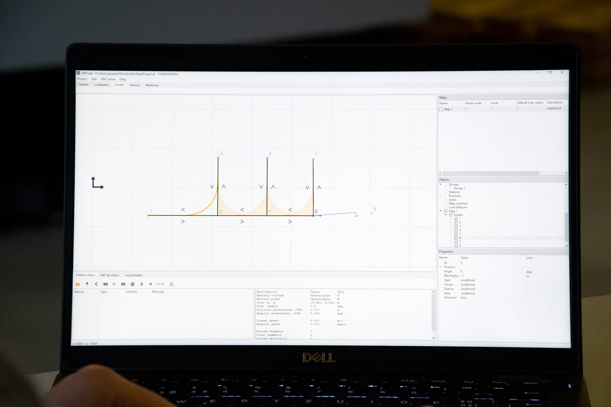

**Ant lab step6 test project**
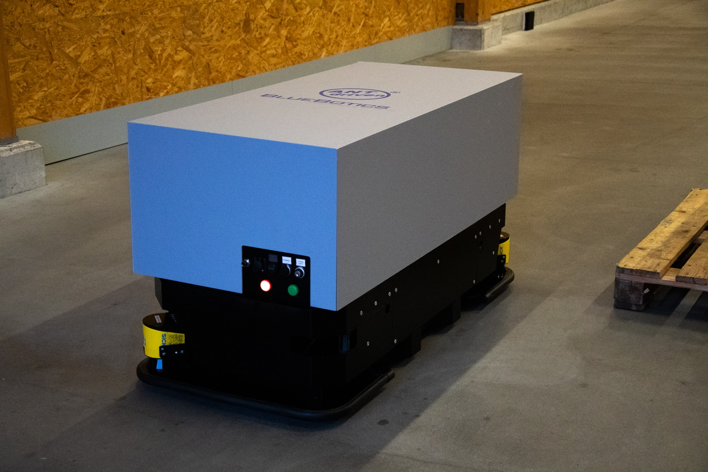

**Ant lab2 actions**
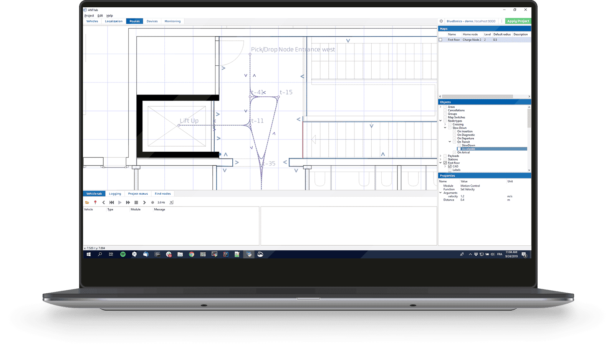

**Agv control system**
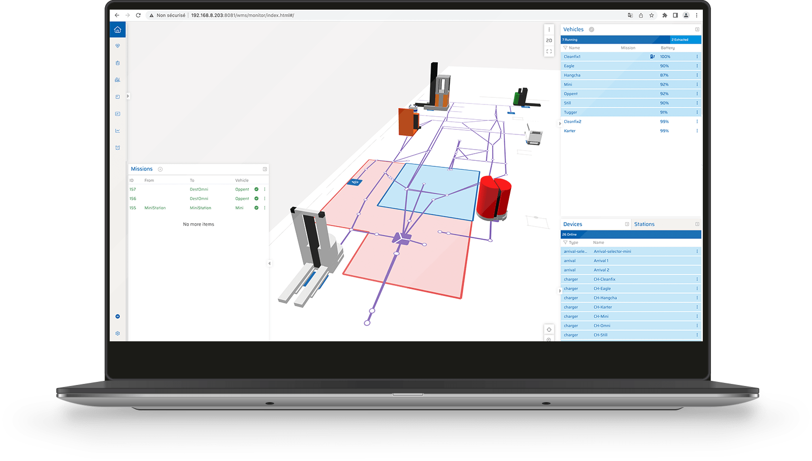

**Ant compatibility**
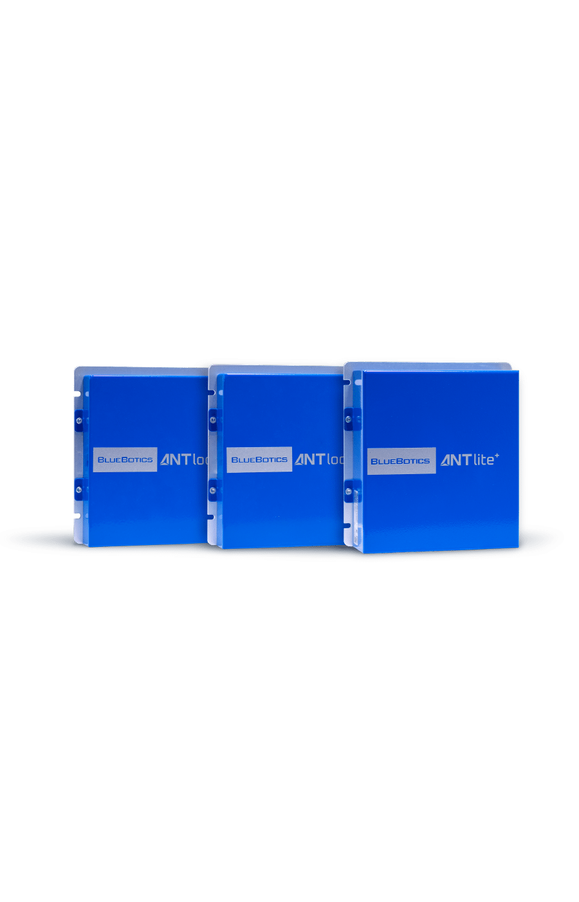

**Ant lite system integration**
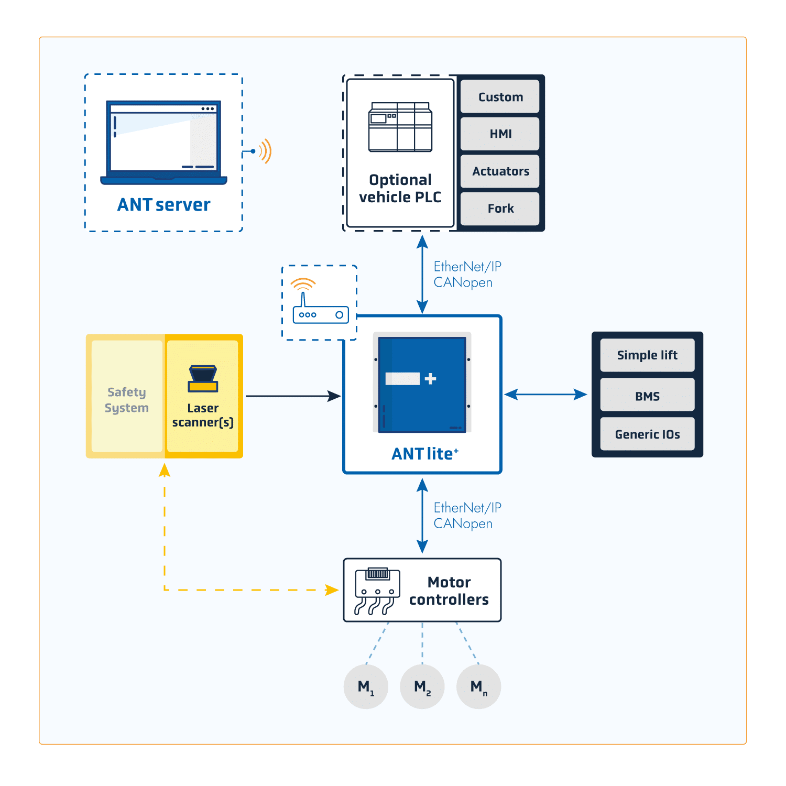

---

> **Gaps / to verify:** ANT server operator-UI/scheduling detail, cloud vs on-prem, charging management, security/RBAC, and pricing. Confirm via the ANT server datasheet or a demo. Integrator-oriented navigation+fleet layer, not turnkey security/inspection.

## Sources
- bluebotics.com (home, ANT server, ANT navigation)
