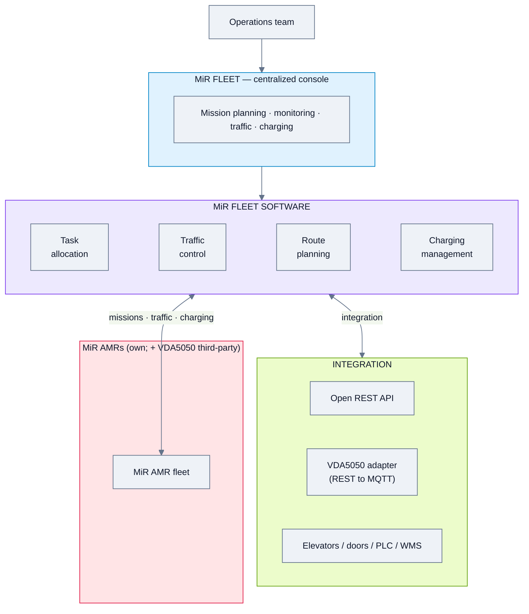
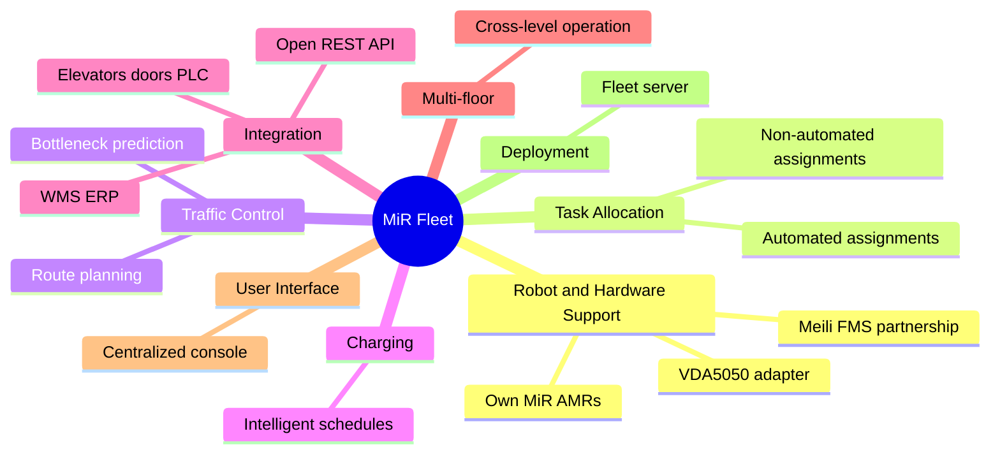
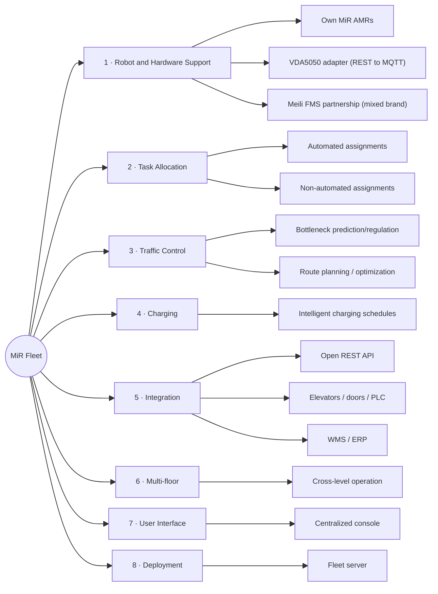
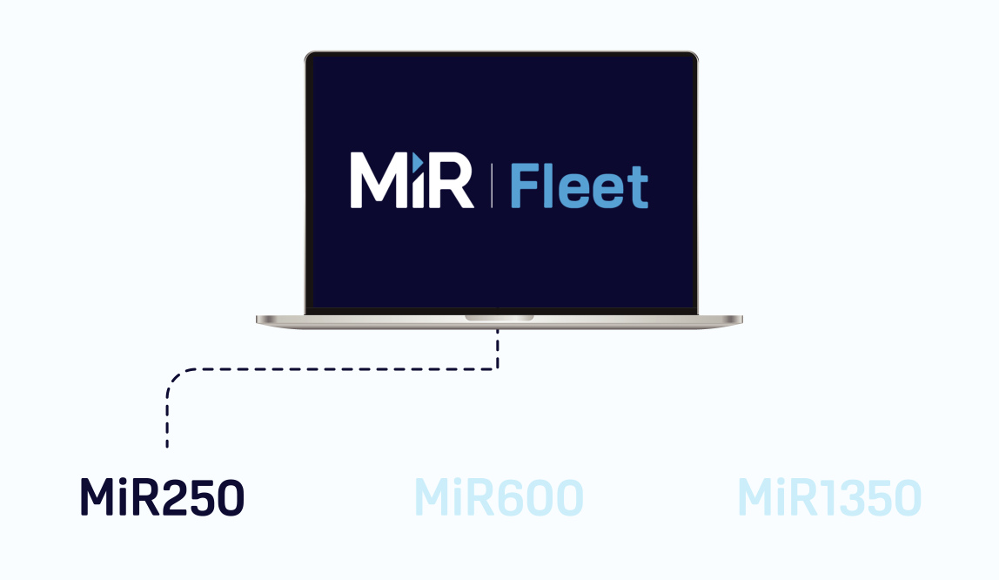
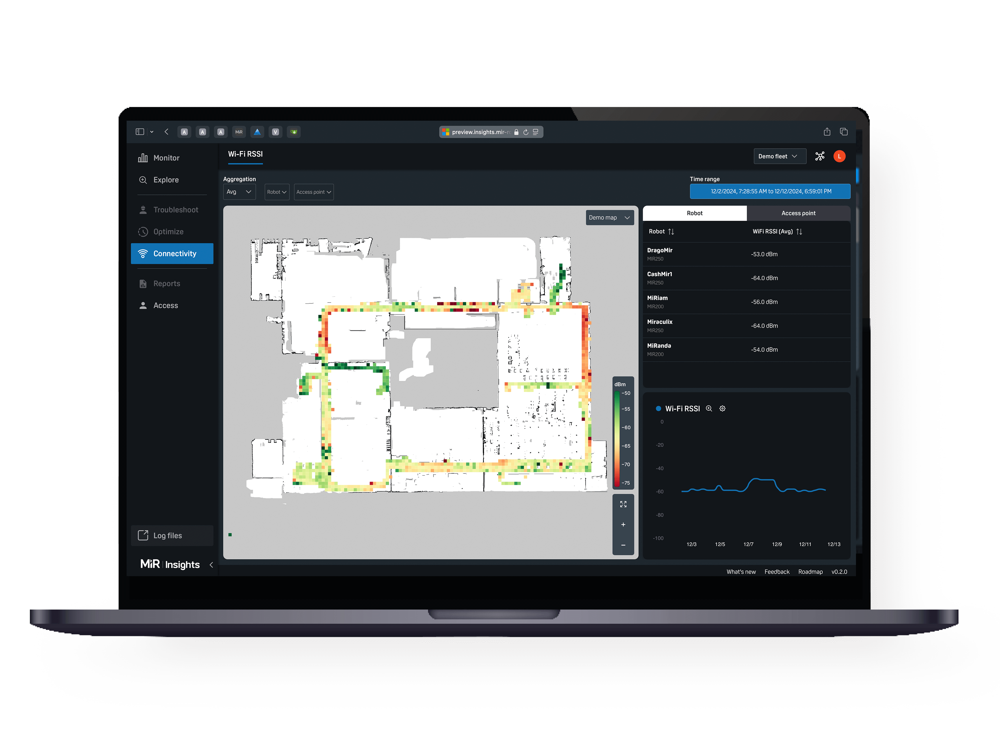
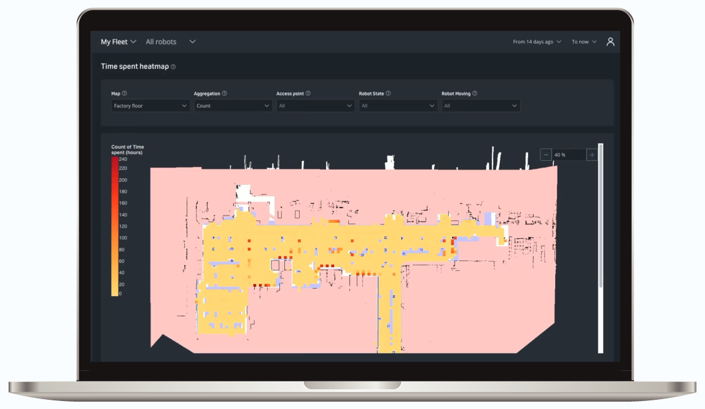
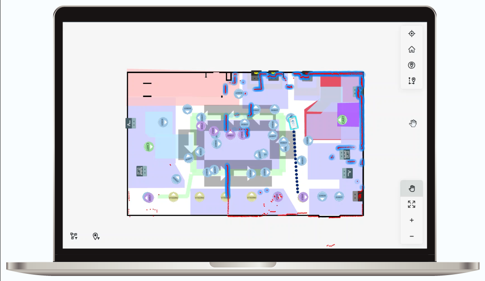
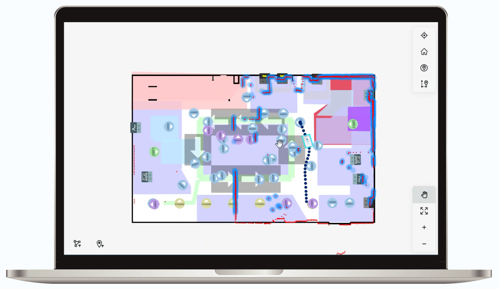

# MiR Fleet (Mobile Industrial Robots) — Feature Analysis

**Product:** MiR Fleet — centralized fleet management for MiR AMRs (+ VDA5050 adapter, Meili FMS partnership)
**Domain:** Warehouse & intralogistics (own hardware; VDA5050 interop)
**Analysis date:** 2026-06-12
**Sources:** vendor website and public product materials.
**Evidence legend:** **[C] Confirmed** · **[L] Likely** · **[I] Inferred**.

---

## Research & Summary

MiR Fleet (Mobile Industrial Robots, part of Teradyne) is centralized fleet-management software that controls a fleet of **MiR AMRs** from a single station across a facility, of any size. Core capabilities are the logistics staples: **task allocation** (automated and non-automated assignments), **traffic control** (predict/regulate bottlenecks), **route planning/optimization**, and **intelligent charging schedules** to maximize availability. It exposes an **open REST API** for third-party integration and adds **VDA5050** interoperability via an open adapter "starter kit" that bridges its REST API to the MQTT messages the standard requires — and MiR also partners with **Meili FMS** to unify mixed-brand fleets. It's own-hardware-first but increasingly interoperable. Evidence is Confirmed at the capability level (product page + VDA5050 articles); detailed operator-config (recurrence, zone editors) is in the Enterprise documentation, not fully captured here. Intralogistics orientation.

---

## System Architecture

---

## Feature Map (top 2 levels)

### Alternative layout — grouped tree (cleaner)

---

## Feature List

### 1. Robot & Hardware Support
- **1.1 Own MiR AMRs** — fleets of any size [C]
- **1.2 VDA5050 adapter** — open "starter-kit" bridging REST API ↔ MQTT [C]
- **1.3 Meili FMS partnership** — unify mixed-brand fleets [C]

### 2. Task Allocation
- **2.1 Automated assignments** [C]
- **2.2 Non-automated assignments** [C]
- **2.3 Dispatch most-suitable robot** [L]

### 3. Traffic Control & Routing
- **3.1 Bottleneck prediction & regulation** [C]
- **3.2 Route planning / optimization** [C]

### 4. Charging
- **4.1 Intelligent charging schedules** — maximize availability, reduce downtime [C]

### 5. Integration
- **5.1 Open REST API** for third-party integration [C]
- **5.2 Elevators / doors / PLC** [L]
- **5.3 WMS / ERP** [L]

### 6. Multi-floor
- **6.1 Cross-level operation** [L]

### 7. User Interface & UX
- **7.1 Centralized console** (MiR Fleet / MiR Fleet Enterprise) [C]
- **7.2 Map-based view** [L]

### 8. Deployment & Architecture
- **8.1 Fleet server** (dedicated host) [L]
- **8.2 Cloud option** — not confirmed [I]

### 9. Connectivity & Protocols
- **9.1 REST API** [C]
- **9.2 VDA5050 (via adapter, MQTT)** [C]
- **9.3 OPC-UA / others** — not confirmed [I]

#### UI Screenshots

**Mir fleet choose robot**

**Mir insights screens**

**Mir insights**

**Robot software driving**

**Robot software relocating**

---

> **Gaps / to verify:** scheduling recurrence, zone/map editor specifics, cloud vs on-prem, RBAC/SSO, and exact WMS/elevator integrations. Confirm via MiR Fleet Enterprise documentation or a demo. Logistics-only orientation.

## Sources
- mobile-industrial-robots.com (MiR Fleet, VDA5050 articles), MiR Fleet Enterprise Documentation (PDF)
