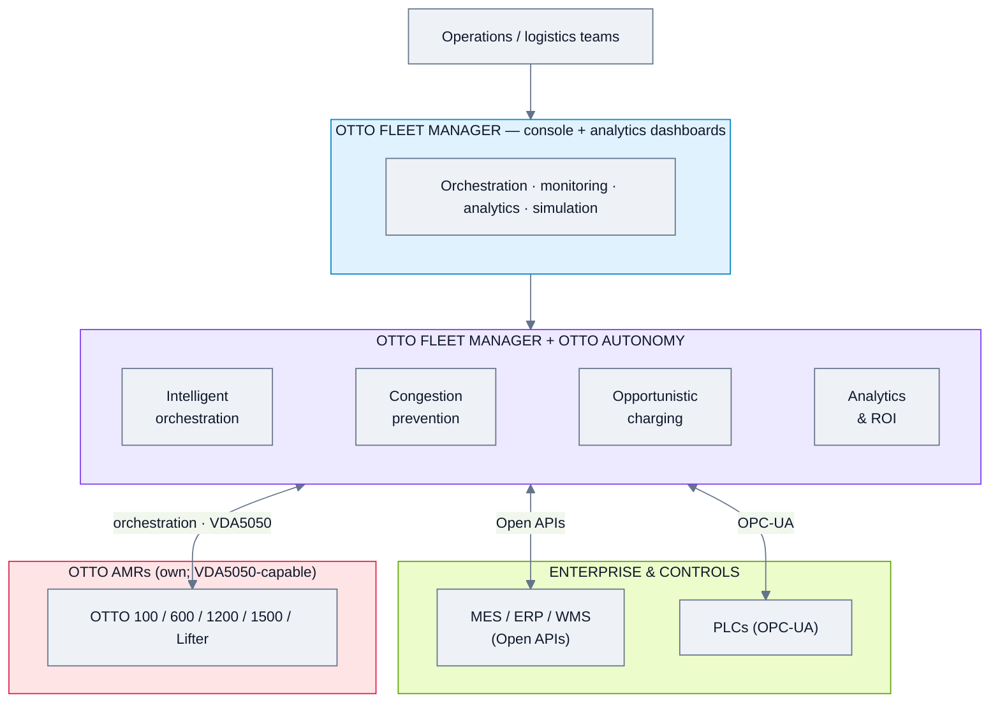
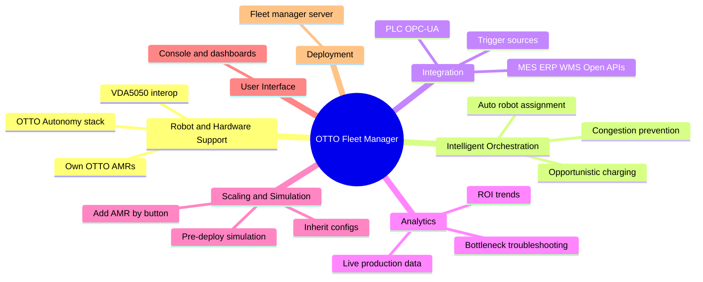
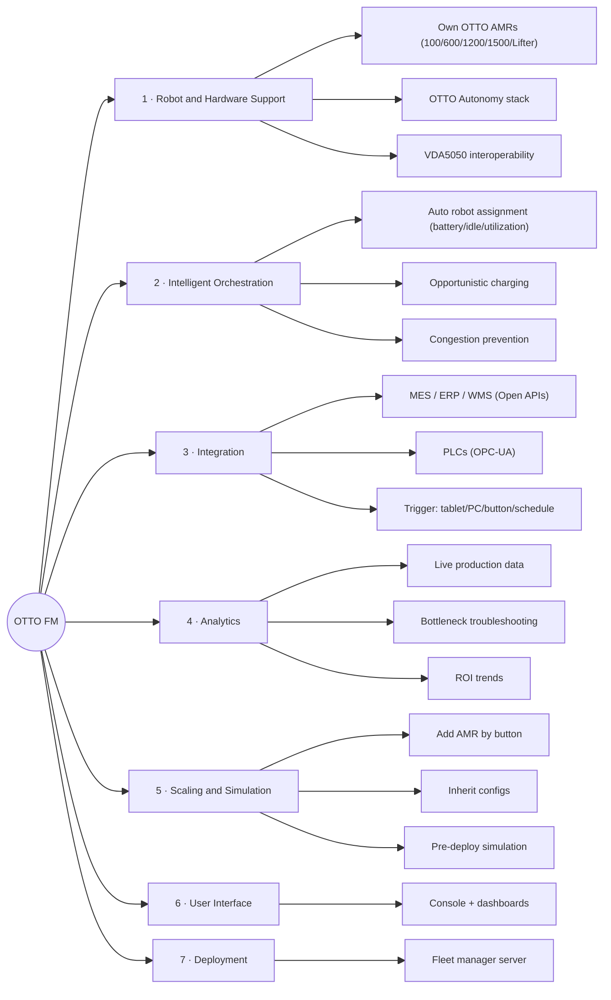
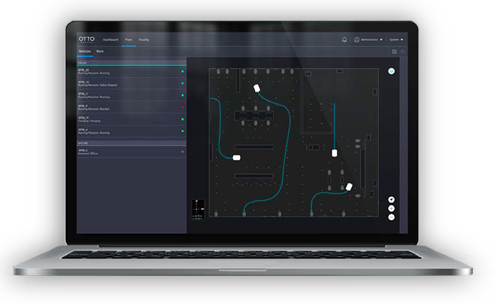
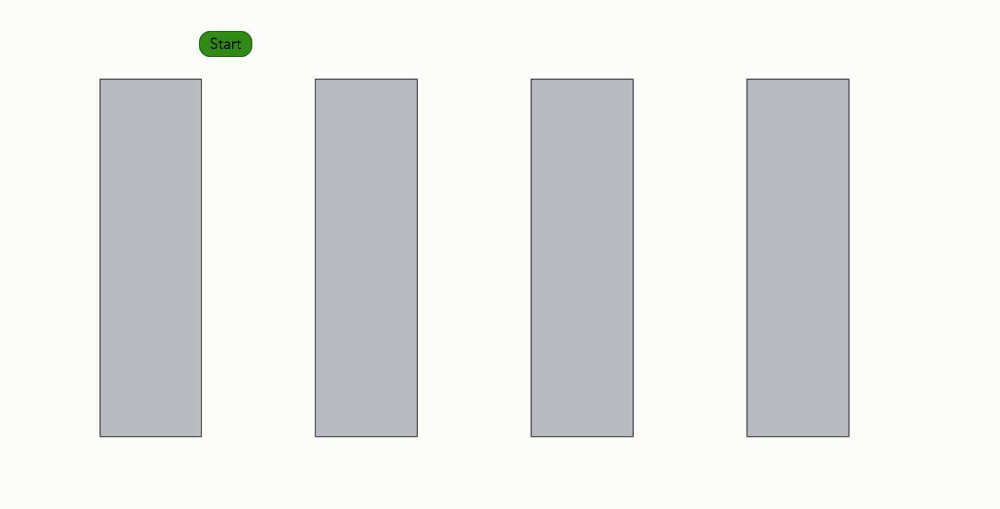
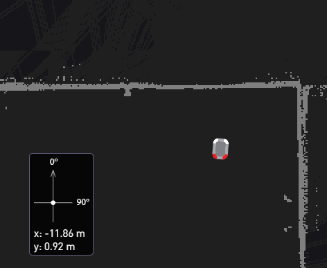
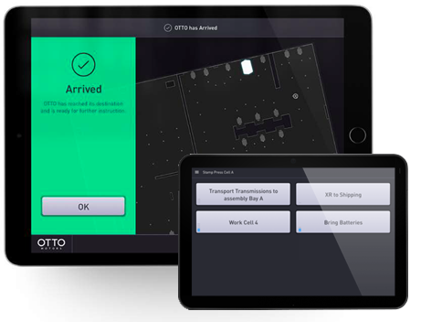
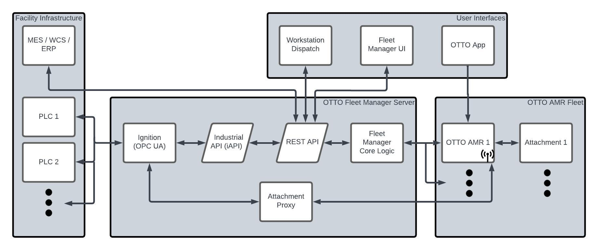
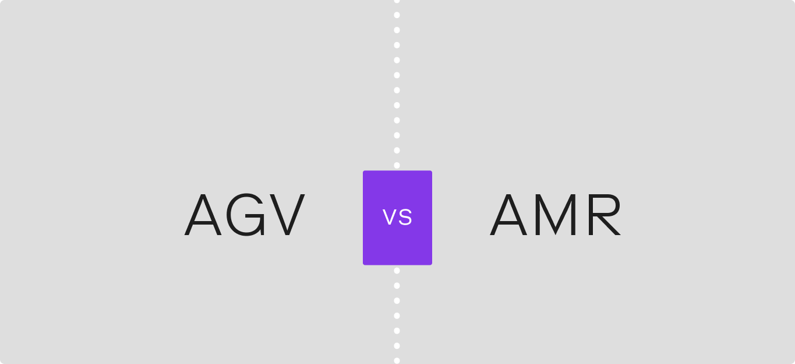

# OTTO Motors (Rockwell Automation) — Feature Analysis

**Product:** OTTO Fleet Manager (+ OTTO Autonomy) for OTTO AMRs
**Domain:** Warehouse & intralogistics (own hardware; VDA5050 interop)
**Analysis date:** 2026-06-12
**Sources:** vendor website and public product materials.
**Evidence legend:** **[C] Confirmed** · **[L] Likely** · **[I] Inferred**.

---

## Research & Summary

OTTO (by Rockwell Automation) offers **OTTO Fleet Manager**, an award-winning AMR fleet-management software that scales from 1 to 100+ robots, paired with the **OTTO Autonomy** navigation stack. It manages OTTO's **own AMRs** (100/600/1200/1500/Lifter) but supports **VDA5050** so OTTO AMRs can take orders from third-party controllers. Core strengths are logistics orchestration: it auto-assigns the right robot by battery level / idle time / utilization, charges opportunistically, prevents congestion by predicting intersections, integrates centrally with MES/ERP/WMS (Open APIs) and PLCs (OPC-UA), and provides analytics dashboards (live production data, bottleneck troubleshooting, ROI trends). It also offers pre-deployment **simulation** and quick scaling (add an AMR via button, inheriting configs). Used by Fortune 500 manufacturers (Caterpillar, Ford, GE, Dell). Evidence is strongly Confirmed (detailed product page). Domain is intralogistics, not security/inspection.

---

## System Architecture

---

## Feature Map (top 2 levels)

### Alternative layout — grouped tree (cleaner)

---

## Feature List

### 1. Robot & Hardware Support
- **1.1 Own OTTO AMRs** — 100, 600, 1200, 1500, Lifter [C]
- **1.2 OTTO Autonomy** navigation stack [C]
- **1.3 VDA5050 interoperability** — OTTO AMRs accept move/charge/dock/attachment orders from 3rd-party controllers [C]

### 2. Intelligent Orchestration
- **2.1 Auto robot assignment** — by battery level, minimized idle, max utilization; live job↔robot pairing [C]
- **2.2 Opportunistic charging** — AMRs self-maintain battery between jobs [C]
- **2.3 Congestion prevention** — exchange info to predict intersections & avoid blockages [C]

### 3. Integration
- **3.1 Enterprise systems** — MES, ERP, WMS via Open APIs [C]
- **3.2 PLC communication** — via OPC-UA, no extra sensors [C]
- **3.3 Job triggers** — tablet, computer, button, or schedule [C]

### 4. Analytics
- **4.1 Live production data** [C]
- **4.2 Bottleneck troubleshooting** [C]
- **4.3 Trends / ROI dashboards** [C]

### 5. Scaling & Simulation
- **5.1 Add AMR via button, inherit fleet configs (no custom code)** [C]
- **5.2 Maintains traffic flow from 5 to 100 AMRs** [C]
- **5.3 Pre-deployment simulation** [C]

### 6. User Interface & UX
- **6.1 Fleet console + interactive analytics dashboards** [C]
- **6.2 3D/map view** — map-based likely [L]

### 7. Deployment & Architecture
- **7.1 Fleet-manager server** (on-prem typical) [L]
- **7.2 Cloud option** — not explicitly stated [I]

### 8. Connectivity & Protocols
- **8.1 VDA5050** [C]
- **8.2 Open APIs (REST)** [C]
- **8.3 OPC-UA** [C]

#### UI Screenshots

**Fleet manager laptop**

**Mapping closed loop**

**Mapping starting position**

**Otto app**

**Network architecture**

**Agv vs amr**

---

> **Gaps / to verify:** cloud vs on-prem, scheduling recurrence detail, security/RBAC, and breadth of non-OTTO robot management beyond VDA5050. Confirm via docs.ottomotors.com or a demo. Logistics-only orientation.

## Sources
- ottomotors.com/fleet-manager, docs.ottomotors.com
