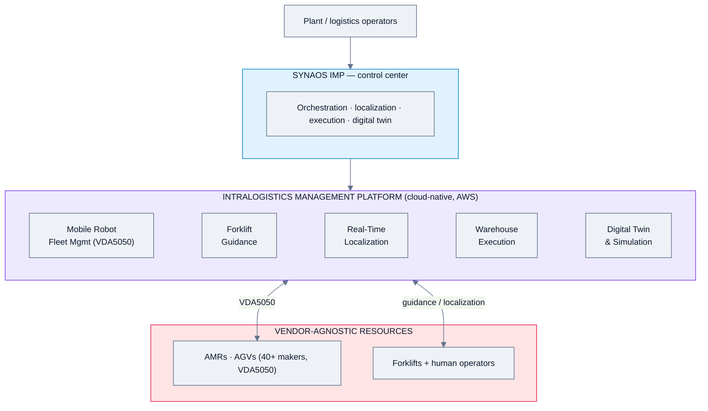
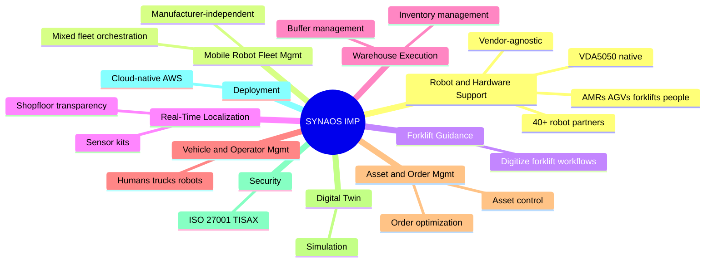
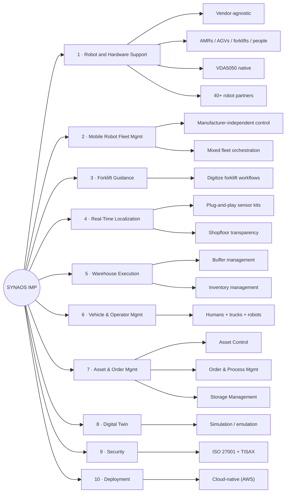

# SYNAOS — Feature Analysis

**Product:** SYNAOS Intralogistics Management Platform (IMP) — incl. Mobile Robot Fleet Management
**Domain:** Warehouse & intralogistics — **vendor-agnostic** material-flow orchestration
**Analysis date:** 2026-06-12
**Sources:** vendor website and public product materials.
**Evidence legend:** **[C] Confirmed** · **[L] Likely** · **[I] Inferred**.

---

## Research & Summary

SYNAOS (Germany) offers the **Intralogistics Management Platform (IMP)** — an "all-in-one / one-for-all" control center that orchestrates **every transport resource** (AMRs, AGVs, forklifts, and people) from one cloud-native, **vendor-agnostic** platform built natively on **VDA5050**. Its headline module is **Mobile Robot Fleet Management** (manufacturer-independent control of mixed AMR/AGV fleets via VDA5050, with the industry's largest partner network — 40+ robot makers), surrounded by **Forklift Guidance**, **Real-Time Localization**, **Warehouse Execution** (buffer/inventory), **Vehicle & Operator Management**, **Asset Control**, **Order & Process Management**, **Storage Management**, and **Digital Twin & Simulation**. Smart algorithms always assign the best resource per job; it's cloud-native (on AWS), highly available, and **ISO 27001 + TISAX** certified. Proof points: the largest VDA5050 fleet in industry (130+, at VW Commercial Vehicles), 50+ live installs, 10k+ daily orders. Among the strongest *truly* vendor-agnostic, standards-based fleet managers in the survey — but oriented to intralogistics/material flow, not security/inspection. Evidence is strongly Confirmed (detailed platform site).

**UI quality impression (subjective):** enterprise "control center" with a clean platform UI (IMP); a real laptop/dashboard image is on the site.

---

## System Architecture

---

## Feature Map (top 2 levels)

### Alternative layout — grouped tree (cleaner)

---

## Feature List

### 1. Robot & Hardware Support
- **1.1 Vendor-agnostic / manufacturer-independent** [C]
- **1.2 Resource types** — AMRs, AGVs, forklifts, and human operators [C]
- **1.3 VDA5050 native** [C]
- **1.4 Largest partner network** — 40+ mobile-robot makers [C]

### 2. Mobile Robot Fleet Management (MRFM)
- **2.1 Centralize & orchestrate mixed AMR/AGV fleets** [C]
- **2.2 Manufacturer-independent control via VDA5050** [C]
- **2.3 Holistic resource optimization** — assign best resource per job; cut idle/bottlenecks [C]

### 3. Forklift Guidance
- **3.1 Digitize manual forklift workflows** [C]
- **3.2 Reduce empty runs / idle time** [C]

### 4. Real-Time Localization
- **4.1 Plug-and-play sensor kits** — track every forklift/robot/pallet [C]
- **4.2 Shopfloor transparency** — detect delays, optimize routes [C]

### 5. Warehouse Execution
- **5.1 Buffer management** [C]
- **5.2 Inventory / load tracking** [C]

### 6. Vehicle & Operator Management
- **6.1 Combine human operators, industrial trucks, mobile robots (manufacturer-independent)** [C]

### 7. Asset, Order & Storage Management
- **7.1 Asset Control** — status + control of assets [C]
- **7.2 Order & Process Management** — order optimization [C]
- **7.3 Storage Management** — inventory/compliance [C]

### 8. Digital Twin & Simulation
- **8.1 Cloud-based facility replica** — model workflows, traffic, layout [C]
- **8.2 Test robot paths / buffer strategies before deployment** [C]

### 9. Security & Compliance
- **9.1 ISO 27001:2017 certified** [C]
- **9.2 TISAX assessment** [C]

### 10. Deployment & Architecture
- **10.1 Cloud-native (AWS), highly available** [C]
- **10.2 On-prem option** — not stated [I]

### 11. User Interface & UX
- **11.1 IMP control-center UI** [C]
- **11.2 Map / digital-twin views** [L]

### 12. Connectivity & Protocols
- **12.1 VDA5050** [C]
- **12.2 AWS-based integration; enterprise IT** [C]
- **12.3 REST/MQTT/OPC-UA specifics** — not enumerated [I]

#### UI Screenshots

**IMP control center (laptop)**

**Fleet management software screenshot**

**Desktop console (traffic / tracking)**

**Solutions / route-planning screen**

---

> **Gaps / to verify:** detailed protocol surface beyond VDA5050, on-prem availability, scheduling/recurrence, RBAC/SSO, and pricing. Strong vendor-agnostic, standards-based benchmark. Confirm via synaos.com/platform or the on-demand demo. Intralogistics orientation (not security/inspection).

## Sources
- synaos.com/en (home, platform, MRFM)
