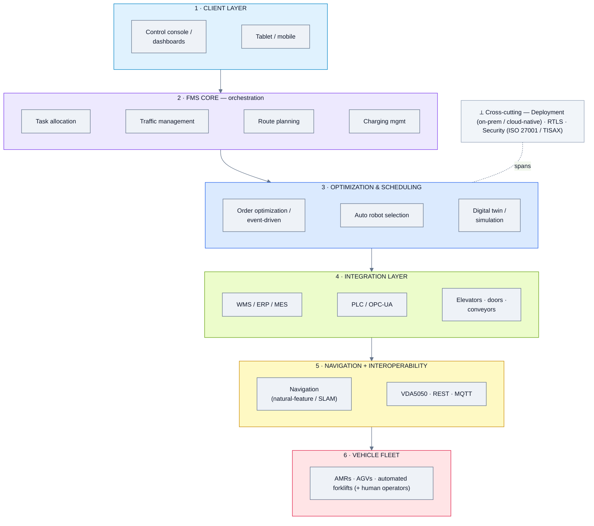
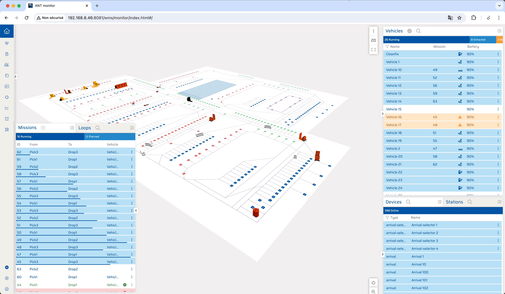
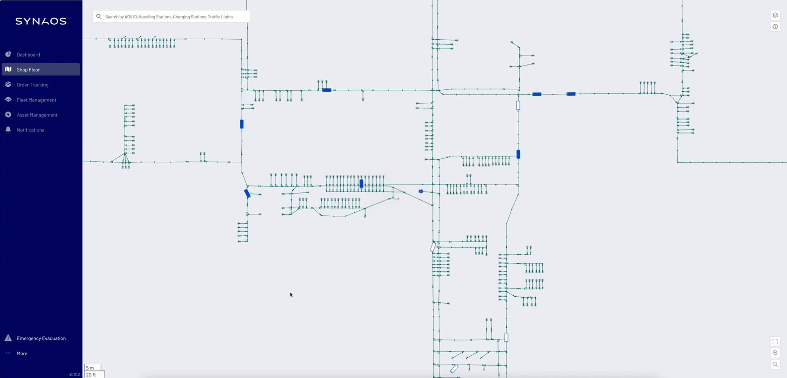

# Warehouse & Intralogistics FMS — Domain Analysis

*Domain summary for the four "Warehouse" platforms. For per-product depth, open each product's analysis below.*

**Analysis date:** 2026-06-12

**Products in this domain (top 4):**

| Product | Feature analysis | Folder | One-line positioning |
|---|---|---|---|
| **OTTO Motors (Rockwell)** | [📄 Feature_Analysis](./OTTO%20Motors/Feature_Analysis.md) | [📁 OTTO](./OTTO%20Motors/) | Award-winning AMR fleet manager for material handling |
| **MiR Fleet** | [📄 Feature_Analysis](./MiR%20Fleet/Feature_Analysis.md) | [📁 MiR Fleet](./MiR%20Fleet/) | Centralized fleet control for MiR AMRs (+ VDA5050 adapter) |
| **BlueBotics** | [📄 Feature_Analysis](./BlueBotics/Feature_Analysis.md) | [📁 BlueBotics](./BlueBotics/) | ANT navigation + ANT server fleet (vendor-agnostic via VDA5050) |
| **SYNAOS** | [📄 Feature_Analysis](./SYNAOS/Feature_Analysis.md) | [📁 SYNAOS](./SYNAOS/) | Cloud-native, vendor-agnostic intralogistics platform (VDA5050-native) |

---

## 1. Domain overview

Warehouse / intralogistics FMS are the **most mature** fleet managers — refined over years of material-flow deployments. Their job is **orchestrating transport**: allocating tasks to the right vehicle, managing **traffic** to avoid deadlocks, optimizing **routes**, handling **charging**, and integrating tightly with **WMS/ERP/MES and PLCs**. **VDA5050** is the dominant interoperability standard here, so even own-hardware products increasingly manage mixed fleets. Orientation is logistics throughput, not security/inspection — but the **traffic-management, task-allocation, charging, and interoperability** patterns are the reference for the whole survey.

Centres of gravity:
- **OTTO (Rockwell)** — orchestration + analytics over its own AMRs; deep **MES/ERP/WMS (API) + PLC (OPC-UA)** integration; VDA5050 interop.
- **MiR Fleet** — centralized control of MiR AMRs; **open REST API + VDA5050 adapter**; Meili partnership for mixed brands.
- **BlueBotics** — a **navigation-tech** layer (ANT) + ANT server fleet; **vendor-agnostic** for ANT and VDA5050 vehicles; integrator-oriented.
- **SYNAOS** — the most **vendor-agnostic & cloud-native**: VDA5050-native, modular (fleet, forklift guidance, RTLS, warehouse execution, digital twin), 40+ robot partners.

---

## 2. Domain reference architecture (reference pattern)

*Reference pattern — note the explicit **optimization/scheduling** layer and the **navigation + interoperability** connectivity layer vs. the generic pattern.*

**Key difference from generic:** 
- an explicit **optimization/scheduling** layer (order optimization, auto robot selection, simulation) 
-  a **navigation + VDA5050 interoperability** connectivity layer
- the maturity of traffic/route/charging logic is what sets this domain apart.

---

## 3. Architecture differences (major approaches)

| Axis | OTTO | MiR Fleet | BlueBotics | SYNAOS |
|---|---|---|---|---|
| **Hardware model** | Own AMRs (+VDA5050) | Own AMRs (+VDA5050 adapter) | **Navigation for many vehicles** | **Vendor-agnostic** |
| **Interoperability** | VDA5050 | VDA5050 adapter (REST↔MQTT) | ANT + VDA5050 | **VDA5050-native** |
| **Deployment** | On-prem fleet server | On-prem fleet server | On-prem | **Cloud-native (AWS)** |
| **Breadth** | AMR orchestration + analytics | AMR fleet + charging | Navigation + fleet | **Modular suite** (fleet/forklift/RTLS/WES/twin) |
| **Integration depth** | MES/ERP/WMS API + **PLC OPC-UA** | Open REST API | VDA5050 | WMS/ERP + AWS-native |
| **Distinctive** | Rockwell ecosystem, simulation | Teradyne ecosystem, simple | Precision nav, integrator play | Largest VDA5050 fleet, modular, cloud |

Notable variations:
- **BlueBotics** is structurally different — it sells **navigation technology** that integrators embed into vehicles, plus a fleet server; it's a layer-5 specialist with a fleet layer on top.
- **SYNAOS** is the only **cloud-native, fully vendor-agnostic** platform, and the broadest (forklift guidance, RTLS, warehouse execution, digital twin) — closest to a "generic" platform but logistics-scoped.
- **OTTO** and **MiR** are **own-hardware-first** but both expose VDA5050 to manage mixed fleets; OTTO goes deepest on **PLC/OPC-UA** factory integration.

---

## 4. Aggregated feature list (domain superset + commonality)

Legend: **✓** present · **◑** partial / implied · **✗** not evident. "Common core" = present (✓/◑) across all four.

| Feature group / sub-feature | OTTO | MiR | BlueBotics | SYNAOS | Common core? |
|---|:--:|:--:|:--:|:--:|:--:|
| **Robot & hardware support** | | | | | |
| &nbsp;&nbsp;— Own AMRs | ✓ | ✓ | ✗ | ✗ | — |
| &nbsp;&nbsp;— Vendor-agnostic / mixed fleet | ◑ | ◑ | ✓ | ✓ | ✅ |
| &nbsp;&nbsp;— Forklifts / AGVs | ✓ | ◑ | ✓ | ✓ | ✅ |
| &nbsp;&nbsp;— Human operators in scope | ✗ | ✗ | ✗ | ✓ | — |
| **Task & mission management** | | | | | |
| &nbsp;&nbsp;— Task allocation | ✓ | ✓ | ✓ | ✓ | ✅ |
| &nbsp;&nbsp;— Mission dispatch / scheduling | ✓ | ✓ | ✓ | ✓ | ✅ |
| &nbsp;&nbsp;— Auto robot selection | ✓ | ✓ | ◑ | ✓ | ✅ |
| **Traffic & routing** | | | | | |
| &nbsp;&nbsp;— Traffic control / congestion | ✓ | ✓ | ✓ | ✓ | ✅ |
| &nbsp;&nbsp;— Route optimization | ✓ | ✓ | ✓ | ✓ | ✅ |
| &nbsp;&nbsp;— Multi-floor | ◑ | ✓ | ◑ | ◑ | ✅ |
| **Charging & energy** | | | | | |
| &nbsp;&nbsp;— Opportunistic / intelligent charging | ✓ | ✓ | ◑ | ◑ | ✅ |
| **Optimization** | | | | | |
| &nbsp;&nbsp;— Order / process optimization | ✓ | ◑ | ◑ | ✓ | ✅ |
| &nbsp;&nbsp;— Event-driven optimization | ◑ | ◑ | ◑ | ✓ | ✅ |
| **Navigation** | | | | | |
| &nbsp;&nbsp;— Natural-feature / SLAM navigation | ◑ | ✓ | ✓ | ◑ | ✅ |
| &nbsp;&nbsp;— High-precision (±1 cm) | ◑ | ◑ | ✓ | ◑ | ✅ |
| **Interoperability** | | | | | |
| &nbsp;&nbsp;— VDA5050 | ✓ | ✓ | ✓ | ✓ | ✅ |
| &nbsp;&nbsp;— Manages non-own brands | ◑ | ◑ | ✓ | ✓ | ✅ |
| **Integration** | | | | | |
| &nbsp;&nbsp;— WMS / ERP / MES | ✓ | ✓ | ◑ | ✓ | ✅ |
| &nbsp;&nbsp;— PLC / OPC-UA | ✓ | ◑ | ◑ | ◑ | ✅ |
| &nbsp;&nbsp;— REST API / SDK | ✓ | ✓ | ◑ | ✓ | ✅ |
| &nbsp;&nbsp;— Elevators / doors / conveyors | ◑ | ✓ | ◑ | ✓ | ✅ |
| **Monitoring & analytics** | | | | | |
| &nbsp;&nbsp;— Dashboards / live production data | ✓ | ✓ | ✓ | ✓ | ✅ |
| &nbsp;&nbsp;— KPIs / ROI analytics | ✓ | ✓ | ◑ | ✓ | ✅ |
| **Digital twin & simulation** | | | | | |
| &nbsp;&nbsp;— Pre-deployment simulation | ✓ | ◑ | ◑ | ✓ | ✅ |
| &nbsp;&nbsp;— Digital twin | ◑ | ✗ | ✗ | ✓ | — |
| **RTLS** | | | | | |
| &nbsp;&nbsp;— Real-time localization (forklifts/assets) | ✗ | ✗ | ◑ | ✓ | — |
| **UI & UX** | | | | | |
| &nbsp;&nbsp;— Control console | ✓ | ✓ | ✓ | ✓ | ✅ |
| &nbsp;&nbsp;— Tablet / mobile | ◑ | ◑ | ◑ | ✓ | ✅ |
| **Deployment** | | | | | |
| &nbsp;&nbsp;— On-prem | ✓ | ✓ | ✓ | ◑ | ✅ |
| &nbsp;&nbsp;— Cloud-native | ◑ | ◑ | ✗ | ✓ | — |
| **Security & compliance** | | | | | |
| &nbsp;&nbsp;— ISO 27001 / TISAX | ◑ | ◑ | ◑ | ✓ | ✅ |

**Domain "common core":** task allocation + mission scheduling, traffic control + route optimization, charging, VDA5050 interoperability, WMS/ERP + REST API integration, dashboards + KPIs, simulation, and on-prem deployment.

**Differentiators:** cloud-native + full modular suite + RTLS + digital twin + human-operator scope (SYNAOS), PLC/OPC-UA depth + Rockwell ecosystem (OTTO), precision navigation-tech for any vehicle (BlueBotics), simplicity + Teradyne ecosystem (MiR).

---

## 5. Representative UI (one per product)

| OTTO — Fleet Manager | MiR — Insights |
|---|---|
|  |  |

| BlueBotics — ANT server | SYNAOS — IMP dashboard |
|---|---|
|  |  |

*(More per-product screenshots in each product's analysis.)*

---

## 6. Takeaways

- This domain is **logistics-scoped** — least directly aligned with guarding/inspection use cases, but the **reference benchmark** for mature traffic-management, task-allocation, charging, and VDA5050 interoperability.
- **SYNAOS** is the most transferable pattern (cloud-native, vendor-agnostic, modular) for a brand-agnostic transport layer.
- **OTTO** and **MiR** are tightly coupled to their own AMRs; relevant mainly when those robots are adopted for material movement.
- **BlueBotics** matters if precision **navigation** is the gap rather than orchestration.
- Worth borrowing: **VDA5050 as the interoperability standard**, opportunistic charging, and event-driven traffic optimization — useful design references even for security/inspection fleets.

---

*Sources: each product's `Feature_Analysis.md` (and the vendor pages / decks / images cited therein).*
